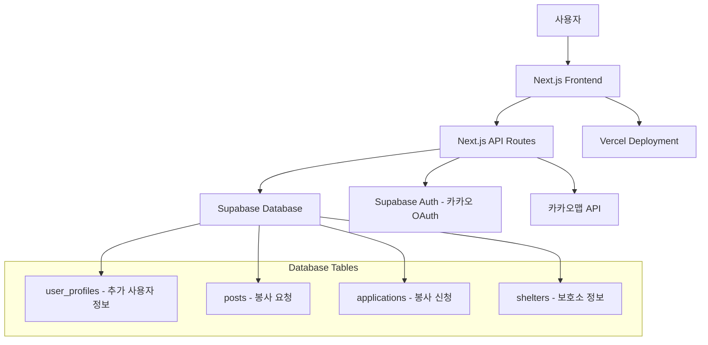
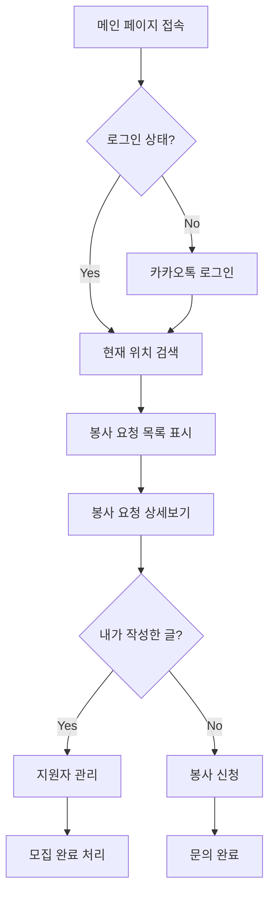
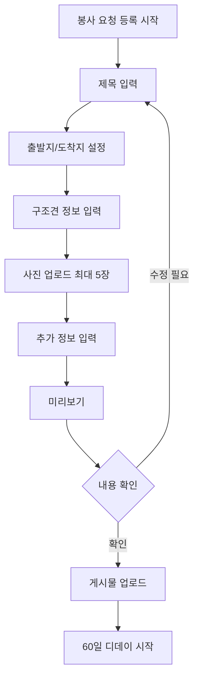

# 유기견 이동봉사 매칭 플랫폼 PRD

## 📋 프로젝트 개요

### 프로젝트명
유기견 이동봉사 매칭 플랫폼

### 목적
입양 예정인 유기견들이 새로운 가족에게 안전하게 이동할 수 있도록 봉사자와 보호소/개인 구조자를 연결하는 매칭 플랫폼

### 기술 스택
- **Frontend**: Next.js, TypeScript, Tailwind CSS, shadcn/ui
- **Backend**: Next.js API Routes
- **Database**: Supabase
- **Authentication**: Supabase Auth (카카오톡 OAuth Provider)
- **Map API**: 카카오맵 API
- **Deployment**: Vercel

## 🎯 핵심 기능

### 1. 메인 페이지
- 현재 위치 기반 봉사 요청 검색
- 긴급도별 표시 (D-3, D-19, D-80 등)
- 로그인/회원가입 (카카오톡 연동)

### 2. 봉사 요청 등록
- 이동 정보 (출발지/도착지)
- 구조견 정보 (이름, 크기, 견종, 사진)
- 추가 정보 (관련 게시물 링크)

### 3. 봉사 신청
- 봉사자 정보 입력
- 메시지 전달 (500자 이내)
- 연락처 공개

### 4. 마이페이지
- 내 정보 관리
- 작성한 게시물 관리
- 지원한 봉사 내역

## 🏗️ 시스템 아키텍처



## 📊 데이터베이스 스키마

> **Note**: 사용자 기본 정보 및 인증은 Supabase의 내장 `auth.users` 테이블을 사용합니다.

### User Profiles Table (추가 사용자 정보)
```sql
CREATE TABLE user_profiles (
  id UUID REFERENCES auth.users(id) PRIMARY KEY,
  display_name VARCHAR,
  phone VARCHAR,
  phone_visible BOOLEAN DEFAULT false,
  bio TEXT,
  instagram VARCHAR,
  naver_cafe VARCHAR,
  kakao_openchat VARCHAR,
  created_at TIMESTAMP DEFAULT NOW(),
  updated_at TIMESTAMP DEFAULT NOW()
);

-- RLS (Row Level Security) 정책 설정
ALTER TABLE user_profiles ENABLE ROW LEVEL SECURITY;

CREATE POLICY "사용자는 자신의 프로필만 조회 가능" ON user_profiles
  FOR SELECT USING (auth.uid() = id);

CREATE POLICY "사용자는 자신의 프로필만 수정 가능" ON user_profiles
  FOR ALL USING (auth.uid() = id);
```

### Posts Table (봉사 요청)
```sql
CREATE TABLE posts (
  id UUID DEFAULT gen_random_uuid() PRIMARY KEY,
  user_id UUID REFERENCES auth.users(id),
  title VARCHAR NOT NULL,
  description TEXT NOT NULL,
  departure_address VARCHAR NOT NULL,
  departure_lat DECIMAL,
  departure_lng DECIMAL,
  arrival_address VARCHAR NOT NULL,
  arrival_lat DECIMAL,
  arrival_lng DECIMAL,
  dog_name VARCHAR NOT NULL,
  dog_size VARCHAR NOT NULL, -- 소형, 중소형, 중형, 대형
  dog_breed VARCHAR NOT NULL,
  images TEXT[], -- Supabase Storage URL 배열
  related_link VARCHAR,
  deadline DATE NOT NULL,
  status VARCHAR DEFAULT 'active', -- active, completed, expired
  created_at TIMESTAMP DEFAULT NOW(),
  updated_at TIMESTAMP DEFAULT NOW()
);

-- RLS 정책 설정
ALTER TABLE posts ENABLE ROW LEVEL SECURITY;

CREATE POLICY "모든 사용자가 활성 게시물 조회 가능" ON posts
  FOR SELECT USING (status = 'active');

CREATE POLICY "작성자만 자신의 게시물 수정 가능" ON posts
  FOR ALL USING (auth.uid() = user_id);
```

### Applications Table (봉사 신청)
```sql
CREATE TABLE applications (
  id UUID DEFAULT gen_random_uuid() PRIMARY KEY,
  post_id UUID REFERENCES posts(id) ON DELETE CASCADE,
  user_id UUID REFERENCES auth.users(id),
  message TEXT NOT NULL,
  status VARCHAR DEFAULT 'pending', -- pending, accepted, rejected
  created_at TIMESTAMP DEFAULT NOW(),
  
  -- 중복 신청 방지를 위한 유니크 제약
  UNIQUE(post_id, user_id)
);

-- RLS 정책 설정
ALTER TABLE applications ENABLE ROW LEVEL SECURITY;

CREATE POLICY "게시물 작성자와 신청자만 조회 가능" ON applications
  FOR SELECT USING (
    auth.uid() = user_id OR 
    auth.uid() IN (SELECT user_id FROM posts WHERE id = post_id)
  );

CREATE POLICY "로그인한 사용자만 신청 가능" ON applications
  FOR INSERT WITH CHECK (auth.uid() = user_id);
```

### Shelters Table (보호소 정보)
```sql
CREATE TABLE shelters (
  id UUID DEFAULT gen_random_uuid() PRIMARY KEY,
  user_id UUID REFERENCES auth.users(id),
  name VARCHAR NOT NULL,
  description TEXT,
  phone VARCHAR,
  instagram VARCHAR,
  naver_cafe VARCHAR,
  kakao_openchat VARCHAR,
  verified BOOLEAN DEFAULT false, -- 보호소 인증 여부
  created_at TIMESTAMP DEFAULT NOW(),
  updated_at TIMESTAMP DEFAULT NOW()
);

-- RLS 정책 설정
ALTER TABLE shelters ENABLE ROW LEVEL SECURITY;

CREATE POLICY "모든 사용자가 인증된 보호소 조회 가능" ON shelters
  FOR SELECT USING (verified = true);

CREATE POLICY "보호소 관리자만 수정 가능" ON shelters
  FOR ALL USING (auth.uid() = user_id);
```

## 🖥️ 화면 정의서

### 1. 메인 페이지 (`/`)

#### 1-1. 헤더 영역
- **로고**: 좌측 상단
- **전국 배너**: 소개 또는 광고 영역 (1/5 페이지네이션)
- **현재 위치 찾기**: GPS 기반 위치 검색
- **로그인**: 카카오톡 로그인 버튼

#### 1-2. 검색 영역
- **위치 검색 input**: "현재 위치를 검색해 주세요"
- **봉사 신청 버튼**: 로그인 후 활성화

#### 1-3. 게시물 리스트
- **카드 형태**: 3개씩 그리드 레이아웃
- **각 카드 정보**:
  - 제목 (말줄임 처리)
  - 강아지 이름, 크기, 견종 (예: "호치 ㋀ 소형견 ㋀ 믹스")
  - 디데이 표시 (D-3, D-19, D-80)
  - 이미지 (1/5 슬라이더)
  - "문의하기" 버튼

### 2. 게시물 상세 페이지 (`/posts/[id]`)

#### 2-1. 게시물 정보
- **제목**: "서울에서 대구까지 입양 예정인 강아지 호치의 이동 봉사자를 구합니다!"
- **디데이**: "60일 남았습니다"
- **이동 경로**:
  - 출발지: "서울특별시 중구 을지로 281"
  - 도착지: "대구광역시 남구 대명9동"
  - 네이버/카카오 길찾기 연동 버튼
- **강아지 정보**: 이름, 크기, 견종
- **이미지 갤러리**: 최대 5장 슬라이더

#### 2-2. 상세 설명
- **본문**: 강아지 특성, 준비물 등 상세 정보
- **작성일**: "25.01.01 작성"

#### 2-3. 보호소/작성자 정보
- **보호소명**: "부천 OOOOO 보호소"
- **소개글**: "부천에 있는 OOOOO 보호소입니다. 아이들이 행복을 찾을 수 있도록 도와주세요."
- **연락처**: "010㉂0000㉂0000"
- **SNS 링크**: 인스타그램, 네이버 카페
- **문의하기 버튼**

### 3. 봉사 신청 모달

#### 3-1. 신청자 정보 (자동 입력)
- **이름**: "김떙땡"
- **연락처**: "010㉂0000㉂0000"
- **연락처 공개 안내**: "빠른 컨택을 위해 지원자의 연락처가 공개되며, 구인 완료 시 지원자의 정보를 확인할 수 없습니다."

#### 3-2. 메시지 입력
- **입력창**: 500자 이내 제한
- **안내문**: "봉사 가능 일정, 이동 수단(자차/대중교통 등), 추가로 전달할 사항을 적어주세요. 개인 SNS로 미리 연락을 취하셨을 경우 연락한 채널과 아이디를 적어주시면 소통에 도움이 됩니다."
- **문의하기 버튼**

#### 3-3. 완료 상태
- **완료 메시지**: "문의를 남겼습니다"
- **수정하기 버튼**

### 4. 작성자용 게시물 관리 페이지

#### 4-1. 게시물 상태 관리
- **모집 완료 버튼**: 모집 종료 시 사용
- **지원자 수 표시**: "게시물 지원자 2"

#### 4-2. 지원자 목록
- **지원자 정보 카드**:
  - 이름, 연락처
  - 신청일시: "25.01.01 18㈬25"
  - 메시지 내용 (전체 표시)
  - **전화하기/문자하기** 버튼

#### 4-3. 모집 완료 후
- **안내 메시지**: "모집이 종료되어 신청자 정보를 확인하실 수 없습니다."

### 5. 게시물 작성 페이지 (`/posts/new`)

#### 5-1. 탭 구조
- **이동 봉사 정보**: 기본 정보 입력
- **구조견 정보**: 강아지 상세 정보
- **추가 정보**: 관련 링크 등

#### 5-2. 이동 봉사 정보 탭
- **제목**: 필수 입력 (0/50자)
- **이동 경로**:
  - 출발지 검색 (카카오 주소 API)
  - 도착지 검색 (카카오 주소 API)
- **설명**: 필수 입력 (0/1000자)
  - 플레이스홀더: "희망 일정, 켄넬 지원 여부, 구조견에 대한 설명, 봉사자님께 전하는 말 등"

#### 5-3. 구조견 정보 탭
- **이름**: 필수 입력 (0/15자)
- **사진**: 최대 5장 업로드
- **크기**: 라디오 버튼 선택
  - 소형 (㎨5kg)
  - 중소형 (5.1kg㎍8kg) 
  - 중형 (8.1kg㎍20kg)
  - 대형 (20.1kg㎍)
- **견종**: 필수 입력 (0/20자)

#### 5-4. 추가 정보 탭
- **관련 게시물 링크**: 선택 입력
- **미리보기 기능**

#### 5-5. 미리보기 및 업로드
- **게시물 미리보기**: 실제 게시물과 동일한 형태로 표시
- **안내사항**: "더 많은 구조견들에게 기회를 주기 위해 60일의 디데이가 지나면 게시물은 숨겨집니다. 디데이 종료 시 재업로드 할 수 있습니다."
- **확인하고 업로드하기** 버튼

### 6. 마이페이지 (`/mypage`)

#### 6-1. 사용자 정보 영역
- **프로필 정보**: 이름, 연락처, 소개글
- **내 정보 수정 버튼**

#### 6-2. 탭 구조
- **지원 작성**: 내가 작성한 봉사 요청
- **봉사 신청**: 내가 신청한 봉사 목록

#### 6-3. 지원 작성 탭
- **게시물 리스트**: 작성한 모든 게시물
- **상태 표시**: 
  - 진행중: D-40, 지원자 수 표시
  - 완료: "아직 못 갔어요" 또는 "입양 완료"
- **재업로드 버튼**: 만료된 게시물 재등록

#### 6-4. 봉사 신청 탭
- **신청 내역**: 신청한 봉사 목록
- **신청일 표시**: "24.10.01 지원", "25.01.01 지원"

### 7. 내 정보 수정 페이지 (`/mypage/edit`)

#### 7-1. 기본 정보
- **이름**: 필수 입력
- **연락처**: 
  - 전화번호 입력
  - **공개/비공개** 토글 버튼
- **소개글**: 선택 입력

#### 7-2. 연락 채널
- **인스타그램**: ID 입력
- **네이버 카페**: 링크 입력  
- **카카오톡 오픈채팅**: 링크 입력
  - 안내: "채팅방 우상단 세줄 버튼 ㏖ 오른쪽 세개 버튼 중 가운데 공유 버튼 ㏖ 링크 복사"

#### 7-3. 액션 버튼
- **수정하기 / 취소** 버튼

### 8. 찜 목록 페이지 (`/favorites`)

#### 8-1. 찜한 게시물 목록
- **관심 게시물**: 하트 표시된 게시물들
- **상태별 표시**:
  - 진행중: D-30, D-40, D-45
  - 완료: "아직 못 갔어요", "입양 완료"

## 🎨 UI/UX 플로우

### 메인 페이지 플로우


### 봉사 요청 등록 플로우


## 📱 페이지별 라우팅 구조

```mermaid
graph TD
    A[/ - 메인 페이지] --> B[/posts/[id] - 게시물 상세]
    A --> C[/posts/new - 게시물 작성]
    A --> D[/mypage - 마이페이지]
    A --> E[/favorites - 찜 목록]
    
    B --> F[봉사 신청 모달]
    B --> G{작성자?}
    G -->|Yes| H[지원자 관리 모드]
    G -->|No| F
    
    C --> I[작성 완료] --> A
    
    D --> J[/mypage/edit - 정보 수정]
    D --> K[지원 작성 탭]
    D --> L[봉사 신청 탭]
    
    K --> M[재업로드 기능]
    M --> C
    
    subgraph "인증 필요 페이지"
        C
        D
        J
        F
    end
```

## 🔧 기능 상세 명세

### 1. 인증 시스템
- **로그인 방식**: Supabase Auth + 카카오 OAuth Provider
- **사용자 관리**: Supabase의 내장 `auth.users` 테이블 활용
- **세션 관리**: Supabase Auth의 JWT 토큰 기반 세션
- **추가 프로필 정보**: `user_profiles` 테이블로 확장 정보 관리
- **권한 관리**: Row Level Security (RLS) 정책 적용

### 2. 위치 기반 서비스
- **지도 API**: 카카오맵 JavaScript API
- **주소 검색**: 카카오 우편번호 서비스
- **길찾기**: 카카오맵 길찾기 연동
- **좌표 저장**: 위도/경도 정보 DB 저장으로 거리 계산 최적화

### 3. 이미지 관리
- **업로드**: Supabase Storage
- **최적화**: Next.js Image 컴포넌트 활용
- **제한**: 최대 5장, 파일 크기 제한

### 4. 알림 시스템
- **D-7, D-14 알림**: 마감일 임박 시 이메일 알림
- **신청 알림**: 새로운 봉사 신청 시 작성자에게 알림
- **상태 변경 알림**: 모집 완료, 재업로드 알림
- **구현 방안**: Supabase Edge Functions + 이메일 서비스

## 📱 반응형 디자인 가이드

### 브레이크포인트
- **Mobile**: < 768px
- **Tablet**: 768px - 1024px  
- **Desktop**: > 1024px

### 주요 컴포넌트
- **PostCard 컴포넌트**: 봉사 요청 카드 (이미지 슬라이더, 디데이 표시)
- **LocationSearch 컴포넌트**: 카카오 주소 검색 API 연동
- **ImageUpload 컴포넌트**: 다중 이미지 업로드 (최대 5장)
- **ContactModal 컴포넌트**: 봉사 신청 모달
- **UserProfile 컴포넌트**: 사용자/보호소 프로필 카드
- **TabNavigation 컴포넌트**: 작성 페이지 및 마이페이지 탭
- **StatusBadge 컴포넌트**: 게시물 상태 표시 (진행중, 완료, 만료)
- **Navigation 컴포넌트**: 모바일 햄버거 메뉴, 데스크톱 네비게이션

## 🚀 개발 우선순위

### Phase 1 (MVP)
1. Supabase 프로젝트 설정 및 카카오 OAuth 연동
2. RLS 정책이 적용된 데이터베이스 스키마 구축
3. 메인 페이지 (게시물 리스트, 검색 기능)
4. 게시물 상세 페이지 및 봉사 신청 모달
5. 게시물 작성 페이지 (3단계 탭 구조)
6. 기본 마이페이지 (지원 작성/봉사 신청 탭)

### Phase 2
1. 내 정보 수정 페이지
2. 찜 기능 및 찜 목록 페이지  
3. 위치 기반 검색 고도화 (현재 위치 기반)
4. 알림 시스템 구축 (이메일 알림)
5. 게시물 재업로드 기능
6. 관리자 페이지 (보호소 인증 관리)

### Phase 3
1. 모바일 앱 개발 고려
2. 결제 시스템 (후원 기능)
3. 커뮤니티 기능 확장

## 🔒 보안 및 개인정보

### 데이터 보호
- **개인정보**: 전화번호 공개/비공개 선택 가능
- **데이터 암호화**: Supabase의 기본 보안 정책 활용
- **인증**: Supabase Auth의 JWT 토큰 기반 보안 인증
- **데이터 접근 제어**: Row Level Security (RLS)로 데이터 접근 권한 관리

### API 보안
- **Rate Limiting**: API 호출 제한
- **CORS 설정**: 허용된 도메인만 접근 가능
- **입력 검증**: XSS, SQL Injection 방지

## 📈 성능 최적화

### Next.js 최적화
- **SSR/SSG**: 적절한 렌더링 전략 선택
- **이미지 최적화**: Next.js Image 컴포넌트
- **코드 스플리팅**: 동적 import 활용

### 데이터베이스 최적화
- **인덱싱**: 검색 성능 향상을 위한 적절한 인덱스 설정
- **쿼리 최적화**: Supabase의 PostgREST를 활용한 효율적 쿼리
- **RLS 최적화**: 적절한 정책 설정으로 보안과 성능 균형
- **실시간 기능**: Supabase Realtime으로 신청 상태 실시간 업데이트

## 🧪 테스트 전략

### 테스트 종류
- **Unit Test**: Jest + React Testing Library
- **Integration Test**: API 엔드포인트 테스트
- **E2E Test**: Playwright 또는 Cypress

### 테스트 커버리지
- **핵심 기능**: Supabase Auth 연동, 게시물 CRUD, 권한 관리
- **폼 검증**: 입력값 유효성 검사
- **API 테스트**: Supabase 함수 및 RLS 정책 테스트
- **인증 테스트**: 카카오 OAuth 플로우 테스트

## 📋 배포 및 운영

### Vercel 배포 설정
- **환경 변수**: 
  - `NEXT_PUBLIC_SUPABASE_URL`: Supabase 프로젝트 URL
  - `NEXT_PUBLIC_SUPABASE_ANON_KEY`: Supabase 익명 키
  - `NEXT_PUBLIC_KAKAO_MAP_API_KEY`: 카카오맵 API 키
- **도메인 연결**: 커스텀 도메인 설정
- **SSL 인증서**: 자동 갱신

### 모니터링
- **에러 추적**: Sentry 또는 Vercel Analytics
- **성능 모니터링**: Web Vitals 추적
- **사용자 분석**: Google Analytics 4

## 🎯 성공 지표

### KPI 정의
- **월간 활성 사용자 수** (MAU)
- **봉사 요청 등록 수**
- **성공적인 매칭 수**
- **사용자 재방문율**

### 목표 설정
- **6개월 후**: 월 100건의 봉사 요청
- **1년 후**: 월 500건의 봉사 요청
- **매칭 성공률**: 70% 이상

---

## 📞 개발 팀 연락처

**프로젝트 매니저**: [이름]  
**개발자**: [이름]  
**디자이너**: [이름]  

---

*이 문서는 개발 진행에 따라 지속적으로 업데이트됩니다.*