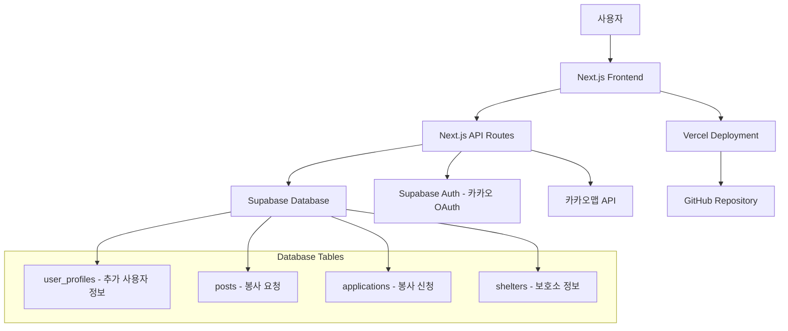
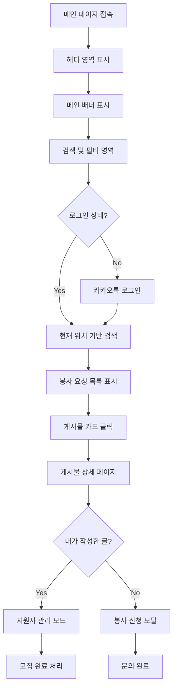
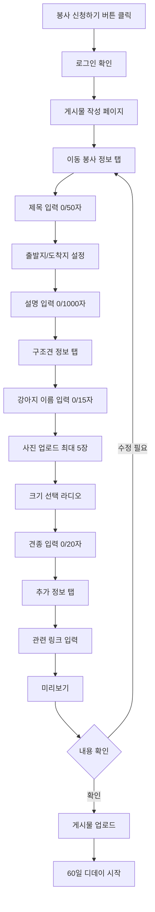
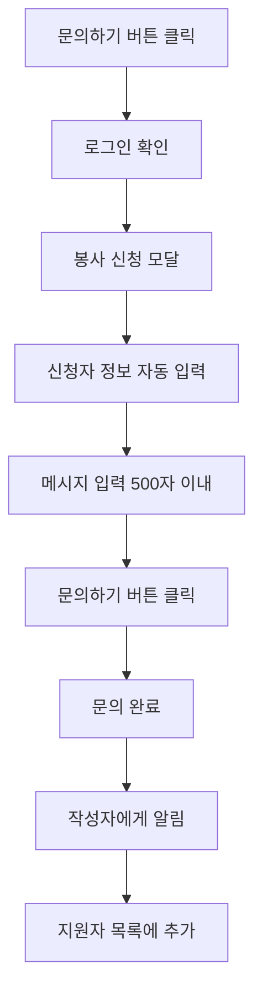
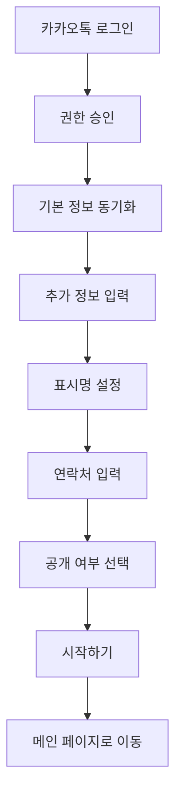
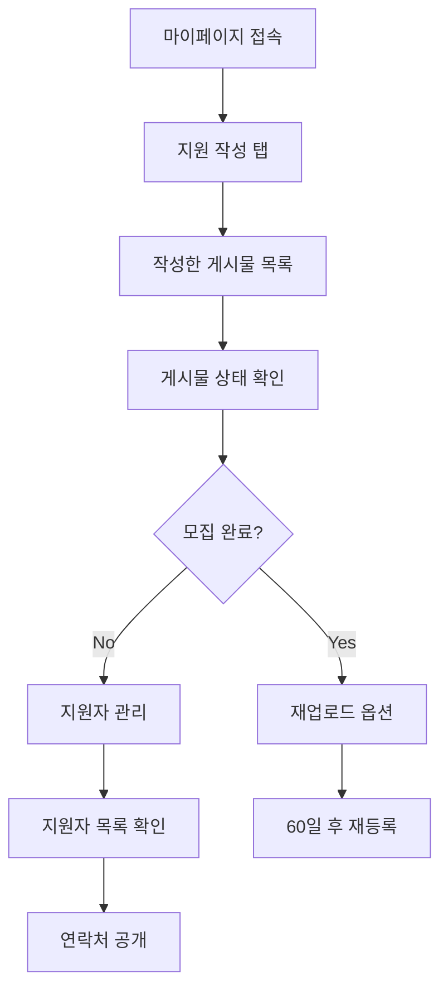
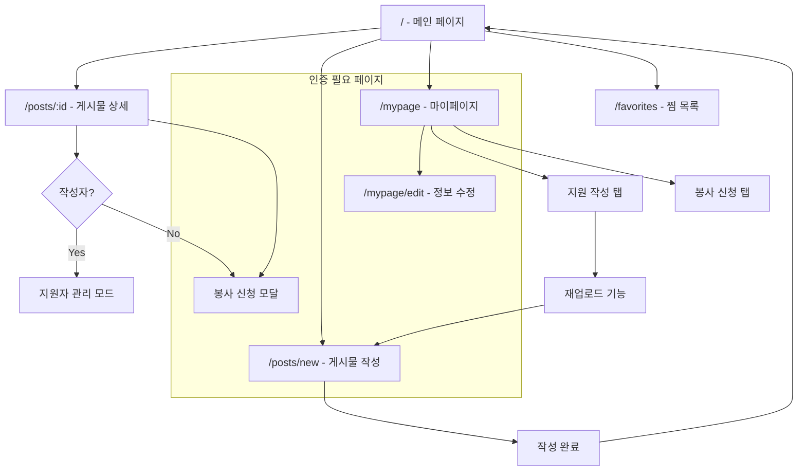

# 유기견 이동봉사 매칭 플랫폼 PRD

## 📋 프로젝트 개요

### 프로젝트명
유기견 이동봉사 매칭 플랫폼

### 목적
입양 예정인 유기견들이 새로운 가족에게 안전하게 이동할 수 있도록 봉사자와 보호소/개인 구조자를 연결하는 매칭 플랫폼

### 기술 스택
- **Frontend**: Next.js, TypeScript, Tailwind CSS, shadcn/ui
- **Backend**: Next.js API Routes
- **Database**: Supabase
- **Authentication**: Supabase Auth (카카오톡 OAuth Provider)
- **Map API**: 카카오맵 API
- **Version Control**: GitHub
- **Deployment**: Vercel (GitHub 연동)

## 🎯 핵심 기능

### 1. 메인 페이지
- 현재 위치 기반 봉사 요청 검색
- 긴급도별 표시 (D-3, D-19, D-80 등)
- 로그인/회원가입 (카카오톡 연동)

### 2. 봉사 요청 등록
- 이동 정보 (출발지/도착지)
- 구조견 정보 (이름, 크기, 견종, 사진)
- 추가 정보 (관련 게시물 링크)

### 3. 봉사 신청
- 봉사자 정보 입력
- 메시지 전달 (500자 이내)
- 연락처 공개

### 4. 마이페이지
- 내 정보 관리
- 작성한 게시물 관리
- 지원한 봉사 내역

## 🏗️ 시스템 아키텍처



## 📊 데이터베이스 스키마

> **Note**: 사용자 기본 정보 및 인증은 Supabase의 내장 `auth.users` 테이블을 사용합니다.
>
> **ID 설계 원칙**: UUID 대신 SERIAL(자동 증가 정수)을 사용하여 공간 효율성과 가독성을 높이고,
> 테이블 간 데이터 비교 시 성능을 향상시킵니다.

### User Profiles Table (추가 사용자 정보)
```sql
CREATE TABLE user_profiles (
  id SERIAL PRIMARY KEY,
  auth_user_id UUID REFERENCES auth.users(id) NOT NULL,
  display_name VARCHAR(100),
  phone VARCHAR(20),
  phone_visible BOOLEAN DEFAULT false,
  bio TEXT,
  instagram VARCHAR(100),
  naver_cafe VARCHAR(200),
  kakao_openchat VARCHAR(200),
  created_at TIMESTAMP DEFAULT NOW(),
  updated_at TIMESTAMP DEFAULT NOW(),

  UNIQUE(auth_user_id)
);

-- 테이블 주석
COMMENT ON TABLE user_profiles IS '사용자 프로필 정보 테이블 - Supabase 인증 사용자의 추가 정보를 저장';

-- 컬럼 주석
COMMENT ON COLUMN user_profiles.id IS '사용자 프로필 고유 식별자 (자동 증가)';
COMMENT ON COLUMN user_profiles.auth_user_id IS 'Supabase 인증 사용자 ID (외래키)';
COMMENT ON COLUMN user_profiles.display_name IS '사용자 표시명 (최대 100자)';
COMMENT ON COLUMN user_profiles.phone IS '전화번호 (010-0000-0000 형식)';
COMMENT ON COLUMN user_profiles.phone_visible IS '전화번호 공개 여부 (기본값: 비공개)';
COMMENT ON COLUMN user_profiles.bio IS '사용자 자기소개 (제한 없음)';
COMMENT ON COLUMN user_profiles.instagram IS '인스타그램 계정명 (최대 100자)';
COMMENT ON COLUMN user_profiles.naver_cafe IS '네이버 카페 링크 (최대 200자)';
COMMENT ON COLUMN user_profiles.kakao_openchat IS '카카오톡 오픈채팅 링크 (최대 200자)';
COMMENT ON COLUMN user_profiles.created_at IS '생성일시 (자동 설정)';
COMMENT ON COLUMN user_profiles.updated_at IS '수정일시 (자동 설정)';

-- 인덱스 생성
CREATE INDEX idx_user_profiles_auth_user_id ON user_profiles(auth_user_id);

-- RLS (Row Level Security) 정책 설정
ALTER TABLE user_profiles ENABLE ROW LEVEL SECURITY;

CREATE POLICY "사용자는 자신의 프로필만 조회 가능" ON user_profiles
  FOR SELECT USING (auth.uid() = auth_user_id);

CREATE POLICY "사용자는 자신의 프로필만 수정 가능" ON user_profiles
  FOR ALL USING (auth.uid() = auth_user_id);
```

### Posts Table (봉사 요청)
```sql
CREATE TABLE posts (
  id SERIAL PRIMARY KEY,
  user_id SERIAL REFERENCES user_profiles(id) NOT NULL,
  title VARCHAR(100) NOT NULL,
  description TEXT NOT NULL,
  departure_address VARCHAR(200) NOT NULL,
  departure_lat DECIMAL(10, 8),
  departure_lng DECIMAL(11, 8),
  arrival_address VARCHAR(200) NOT NULL,
  arrival_lat DECIMAL(10, 8),
  arrival_lng DECIMAL(11, 8),
  dog_name VARCHAR(50) NOT NULL,
  dog_size VARCHAR(20) NOT NULL,
  dog_breed VARCHAR(100) NOT NULL,
  images TEXT[],
  related_link VARCHAR(500),
  deadline DATE NOT NULL,
  status VARCHAR(20) DEFAULT 'active',
  created_at TIMESTAMP DEFAULT NOW(),
  updated_at TIMESTAMP DEFAULT NOW()
);

-- 테이블 주석
COMMENT ON TABLE posts IS '봉사 요청 게시물 테이블 - 유기견 이동 봉사 요청 정보를 저장';

-- 컬럼 주석
COMMENT ON COLUMN posts.id IS '게시물 고유 식별자 (자동 증가)';
COMMENT ON COLUMN posts.user_id IS '작성자 ID (외래키)';
COMMENT ON COLUMN posts.title IS '게시물 제목 (최대 100자, 필수)';
COMMENT ON COLUMN posts.description IS '게시물 상세 내용 (제한 없음, 필수)';
COMMENT ON COLUMN posts.departure_address IS '출발지 주소 (최대 200자, 필수)';
COMMENT ON COLUMN posts.departure_lat IS '출발지 위도 (소수점 8자리까지)';
COMMENT ON COLUMN posts.departure_lng IS '출발지 경도 (소수점 8자리까지)';
COMMENT ON COLUMN posts.arrival_address IS '도착지 주소 (최대 200자, 필수)';
COMMENT ON COLUMN posts.arrival_lat IS '도착지 위도 (소수점 8자리까지)';
COMMENT ON COLUMN posts.arrival_lng IS '도착지 경도 (소수점 8자리까지)';
COMMENT ON COLUMN posts.dog_name IS '강아지 이름 (최대 50자, 필수)';
COMMENT ON COLUMN posts.dog_size IS '강아지 크기 (소형/중소형/중형/대형, 필수)';
COMMENT ON COLUMN posts.dog_breed IS '강아지 견종 (최대 100자, 필수)';
COMMENT ON COLUMN posts.images IS '이미지 URL 배열 (Supabase Storage)';
COMMENT ON COLUMN posts.related_link IS '관련 게시물 링크 (최대 500자)';
COMMENT ON COLUMN posts.deadline IS '마감일 (필수)';
COMMENT ON COLUMN posts.status IS '게시물 상태 (active/completed/expired, 기본값: active)';
COMMENT ON COLUMN posts.created_at IS '생성일시 (자동 설정)';
COMMENT ON COLUMN posts.updated_at IS '수정일시 (자동 설정)';

-- 인덱스 생성
CREATE INDEX idx_posts_user_id ON posts(user_id);
CREATE INDEX idx_posts_status ON posts(status);
CREATE INDEX idx_posts_deadline ON posts(deadline);
CREATE INDEX idx_posts_location ON posts(departure_lat, departure_lng, arrival_lat, arrival_lng);

-- RLS 정책 설정
ALTER TABLE posts ENABLE ROW LEVEL SECURITY;

CREATE POLICY "모든 사용자가 활성 게시물 조회 가능" ON posts
  FOR SELECT USING (status = 'active');

CREATE POLICY "작성자만 자신의 게시물 수정 가능" ON posts
  FOR ALL USING (auth.uid() IN (SELECT auth_user_id FROM user_profiles WHERE id = user_id));
```

### Applications Table (봉사 신청)
```sql
CREATE TABLE applications (
  id SERIAL PRIMARY KEY,
  post_id SERIAL REFERENCES posts(id) ON DELETE CASCADE NOT NULL,
  user_id SERIAL REFERENCES user_profiles(id) NOT NULL,
  message TEXT NOT NULL,
  status VARCHAR(20) DEFAULT 'pending',
  created_at TIMESTAMP DEFAULT NOW(),

  UNIQUE(post_id, user_id)
);

-- 테이블 주석
COMMENT ON TABLE applications IS '봉사 신청 테이블 - 사용자의 봉사 신청 정보를 저장';

-- 컬럼 주석
COMMENT ON COLUMN applications.id IS '신청 고유 식별자 (자동 증가)';
COMMENT ON COLUMN applications.post_id IS '봉사 요청 게시물 ID (외래키)';
COMMENT ON COLUMN applications.user_id IS '신청자 ID (외래키)';
COMMENT ON COLUMN applications.message IS '신청 메시지 (제한 없음, 필수)';
COMMENT ON COLUMN applications.status IS '신청 상태 (pending/accepted/rejected, 기본값: pending)';
COMMENT ON COLUMN applications.created_at IS '신청일시 (자동 설정)';

-- 인덱스 생성
CREATE INDEX idx_applications_post_id ON applications(post_id);
CREATE INDEX idx_applications_user_id ON applications(user_id);
CREATE INDEX idx_applications_status ON applications(status);

-- RLS 정책 설정
ALTER TABLE applications ENABLE ROW LEVEL SECURITY;

CREATE POLICY "게시물 작성자와 신청자만 조회 가능" ON applications
  FOR SELECT USING (
    auth.uid() IN (SELECT auth_user_id FROM user_profiles WHERE id = user_id) OR
    auth.uid() IN (
      SELECT up.auth_user_id
      FROM posts p
      JOIN user_profiles up ON p.user_id = up.id
      WHERE p.id = post_id
    )
  );

CREATE POLICY "로그인한 사용자만 신청 가능" ON applications
  FOR INSERT WITH CHECK (auth.uid() IN (SELECT auth_user_id FROM user_profiles WHERE id = user_id));
```

### Shelters Table (보호소 정보)
```sql
CREATE TABLE shelters (
  id SERIAL PRIMARY KEY,
  user_id SERIAL REFERENCES user_profiles(id) NOT NULL,
  name VARCHAR(200) NOT NULL,
  description TEXT,
  phone VARCHAR(20),
  instagram VARCHAR(100),
  naver_cafe VARCHAR(200),
  kakao_openchat VARCHAR(200),
  verified BOOLEAN DEFAULT false,
  created_at TIMESTAMP DEFAULT NOW(),
  updated_at TIMESTAMP DEFAULT NOW()
);

-- 테이블 주석
COMMENT ON TABLE shelters IS '보호소 정보 테이블 - 보호소 및 관리자 정보를 저장';

-- 컬럼 주석
COMMENT ON COLUMN shelters.id IS '보호소 고유 식별자 (자동 증가)';
COMMENT ON COLUMN shelters.user_id IS '보호소 관리자 ID (외래키)';
COMMENT ON COLUMN shelters.name IS '보호소명 (최대 200자, 필수)';
COMMENT ON COLUMN shelters.description IS '보호소 소개글 (제한 없음)';
COMMENT ON COLUMN shelters.phone IS '보호소 전화번호 (010-0000-0000 형식)';
COMMENT ON COLUMN shelters.instagram IS '보호소 인스타그램 계정명 (최대 100자)';
COMMENT ON COLUMN shelters.naver_cafe IS '보호소 네이버 카페 링크 (최대 200자)';
COMMENT ON COLUMN shelters.kakao_openchat IS '보호소 카카오톡 오픈채팅 링크 (최대 200자)';
COMMENT ON COLUMN shelters.verified IS '보호소 인증 여부 (기본값: 미인증)';
COMMENT ON COLUMN shelters.created_at IS '생성일시 (자동 설정)';
COMMENT ON COLUMN shelters.updated_at IS '수정일시 (자동 설정)';

-- 인덱스 생성
CREATE INDEX idx_shelters_user_id ON shelters(user_id);
CREATE INDEX idx_shelters_verified ON shelters(verified);
CREATE INDEX idx_shelters_name ON shelters(name);

-- RLS 정책 설정
ALTER TABLE shelters ENABLE ROW LEVEL SECURITY;

CREATE POLICY "모든 사용자가 인증된 보호소 조회 가능" ON shelters
  FOR SELECT USING (verified = true);

CREATE POLICY "보호소 관리자만 수정 가능" ON shelters
  FOR ALL USING (auth.uid() IN (SELECT auth_user_id FROM user_profiles WHERE id = user_id));
```

### 추가 테이블: Favorites (찜 목록)
```sql
CREATE TABLE favorites (
  id SERIAL PRIMARY KEY,
  user_id SERIAL REFERENCES user_profiles(id) NOT NULL,
  post_id SERIAL REFERENCES posts(id) ON DELETE CASCADE NOT NULL,
  created_at TIMESTAMP DEFAULT NOW()
);

-- 테이블 주석
COMMENT ON TABLE favorites IS '찜 목록 테이블 - 사용자가 관심을 가진 게시물을 저장';

-- 컬럼 주석
COMMENT ON COLUMN favorites.id IS '찜 고유 식별자 (자동 증가)';
COMMENT ON COLUMN favorites.user_id IS '사용자 ID (외래키)';
COMMENT ON COLUMN favorites.post_id IS '게시물 ID (외래키)';
COMMENT ON COLUMN favorites.created_at IS '찜한 일시 (자동 설정)';

-- 중복 찜 방지를 위한 유니크 제약
UNIQUE(user_id, post_id);

-- 인덱스 생성
CREATE INDEX idx_favorites_user_id ON favorites(user_id);
CREATE INDEX idx_favorites_post_id ON favorites(post_id);

-- RLS 정책 설정
ALTER TABLE favorites ENABLE ROW LEVEL SECURITY;

CREATE POLICY "사용자는 자신의 찜 목록만 조회 가능" ON favorites
  FOR SELECT USING (auth.uid() IN (SELECT auth_user_id FROM user_profiles WHERE id = user_id));

CREATE POLICY "로그인한 사용자만 찜 가능" ON favorites
  FOR INSERT WITH CHECK (auth.uid() IN (SELECT auth_user_id FROM user_profiles WHERE id = user_id));

CREATE POLICY "사용자는 자신의 찜만 삭제 가능" ON favorites
  FOR DELETE USING (auth.uid() IN (SELECT auth_user_id FROM user_profiles WHERE id = user_id));
```

## 🖥️ 화면 정의서

> **참고**: 기획안 이미지는 `docs/images/` 디렉토리에 저장되어 있으며, 각 화면별로 상세한 UI/UX 가이드를 제공합니다.

### 1. 메인 페이지 (`/`)

#### 1-1. 헤더 영역
- **로고**: 좌측 상단 "Move Togaether" 브랜딩
- **네비게이션**: 메뉴 버튼 (햄버거 메뉴)
- **로그인/회원가입**: 우측 상단 카카오톡 연동 버튼
- **현재 위치**: GPS 기반 위치 표시 및 변경 기능

#### 1-2. 메인 배너 영역
- **전국 배너**: "전국에서 진행 중인 봉사" 슬로건
- **배너 이미지**: 유기견과 함께하는 따뜻한 이미지
- **페이지네이션**: 1/5 표시 (5개 배너 순환)

#### 1-3. 검색 및 필터 영역
- **위치 검색**: "현재 위치를 검색해 주세요" 플레이스홀더
- **검색 버튼**: 돋보기 아이콘과 함께 검색 실행
- **봉사 신청 버튼**: "봉사 신청하기" (로그인 후 활성화)
- **필터 옵션**: 지역별, 날짜별, 강아지 크기별 필터링

#### 1-4. 게시물 리스트 영역
- **레이아웃**: 3열 그리드 (데스크톱) / 1열 세로 (모바일)
- **게시물 카드 정보**:
  - **이미지**: 강아지 사진 (1/5 슬라이더, 하단 점 표시)
  - **제목**: "서울→대구 호치 이동봉사" (말줄임 처리)
  - **강아지 정보**: "호치 • 소형견 • 믹스" 형식
  - **디데이**: "D-60" (빨간색 강조)
  - **위치**: "서울 → 대구" (화살표로 방향 표시)
  - **문의하기 버튼**: 파란색 CTA 버튼

#### 1-5. 하단 정보 영역
- **서비스 소개**: "Move Togaether는..." 간단한 설명
- **연락처**: 고객센터 정보
- **저작권**: © 2024 Move Togaether

### 2. 게시물 상세 페이지 (`/posts/[id]`)

#### 2-1. 상단 네비게이션
- **뒤로가기**: 좌측 상단 화살표 버튼
- **공유하기**: 우측 상단 공유 아이콘
- **찜하기**: 하트 아이콘 (빈 하트/채워진 하트)

#### 2-2. 게시물 헤더 정보
- **제목**: "서울에서 대구까지 입양 예정인 강아지 호치의 이동 봉사자를 구합니다!"
- **디데이**: "60일 남았습니다" (빨간색 강조)
- **상태**: "모집중" 또는 "모집완료" 배지

#### 2-3. 이동 경로 정보
- **출발지**:
  - 주소: "서울특별시 중구 을지로 281"
  - 상세: "서울역 1번 출구"
  - 지도: 카카오맵 미니맵 표시
- **도착지**:
  - 주소: "대구광역시 남구 대명9동"
  - 상세: "대구역 2번 출구"
  - 지도: 카카오맵 미니맵 표시
- **길찾기 버튼**: "네이버 길찾기", "카카오 길찾기" 연동

#### 2-4. 강아지 정보 섹션
- **프로필 이미지**: 원형 이미지 (좌측)
- **기본 정보**:
  - 이름: "호치"
  - 크기: "소형견" (배지 형태)
  - 견종: "믹스"
  - 나이: "2살"
- **특징**: "친근하고 활발한 성격" 등 상세 설명

#### 2-5. 이미지 갤러리
- **메인 이미지**: 큰 이미지로 표시
- **썸네일**: 하단 5개 썸네일 (현재 선택된 이미지 강조)
- **이미지 네비게이션**: 좌우 화살표로 이미지 전환

#### 2-6. 상세 설명
- **본문**: 강아지 특성, 준비물, 주의사항 등 상세 정보
- **작성일**: "25.01.01 작성" 형식
- **태그**: "친근함", "활발함" 등 키워드 태그

#### 2-7. 보호소/작성자 정보
- **보호소명**: "부천 OOOOO 보호소" (인증 배지 표시)
- **소개글**: "부천에 있는 OOOOO 보호소입니다. 아이들이 행복을 찾을 수 있도록 도와주세요."
- **연락처**: "010-0000-0000" (전화/문자 버튼)
- **SNS 링크**: 인스타그램, 네이버 카페, 카카오톡 오픈채팅
- **문의하기 버튼**: "문의하기" (파란색 CTA)

### 3. 봉사 신청 모달

#### 3-1. 모달 헤더
- **제목**: "봉사 신청하기"
- **닫기 버튼**: 우측 상단 X 버튼

#### 3-2. 신청자 정보 (자동 입력)
- **이름**: "김떙땡" (프로필에서 자동 가져오기)
- **연락처**: "010-0000-0000" (프로필에서 자동 가져오기)
- **연락처 공개 안내**: "빠른 컨택을 위해 지원자의 연락처가 공개되며, 구인 완료 시 지원자의 정보를 확인할 수 없습니다."

#### 3-3. 메시지 입력
- **입력창**: 500자 이내 제한 (현재 글자 수 표시)
- **안내문**: "봉사 가능 일정, 이동 수단(자차/대중교통 등), 추가로 전달할 사항을 적어주세요. 개인 SNS로 미리 연락을 취하셨을 경우 연락한 채널과 아이디를 적어주시면 소통에 도움이 됩니다."
- **문의하기 버튼**: "문의하기" (파란색 CTA)

#### 3-4. 완료 상태
- **완료 메시지**: "문의를 남겼습니다"
- **수정하기 버튼**: "수정하기" (회색 버튼)

### 4. 작성자용 게시물 관리 페이지

#### 4-1. 게시물 상태 관리
- **상태 표시**: "모집중" 또는 "모집완료" 배지
- **모집 완료 버튼**: 모집 종료 시 사용 (회색 버튼)
- **지원자 수 표시**: "게시물 지원자 2" (파란색 강조)

#### 4-2. 지원자 목록
- **지원자 정보 카드**:
  - **프로필**: 원형 이미지 (기본 아바타)
  - **이름**: "김떙땡"
  - **연락처**: "010-0000-0000"
  - **신청일시**: "25.01.01 18:25" (회색 텍스트)
  - **메시지 내용**: 전체 표시 (말줄임 없음)
  - **액션 버튼**: "전화하기" (파란색), "문자하기" (회색)

#### 4-3. 모집 완료 후
- **안내 메시지**: "모집이 종료되어 신청자 정보를 확인하실 수 없습니다."
- **재업로드 버튼**: "재업로드" (파란색 CTA)

### 5. 게시물 작성 페이지 (`/posts/new`)

#### 5-1. 상단 네비게이션
- **뒤로가기**: 좌측 상단 화살표 버튼
- **제목**: "봉사 신청하기" (중앙)

#### 5-2. 탭 구조
- **이동 봉사 정보**: 기본 정보 입력 (활성 탭)
- **구조견 정보**: 강아지 상세 정보
- **추가 정보**: 관련 링크 등

#### 5-3. 이동 봉사 정보 탭
- **제목**: 필수 입력 (0/50자, 현재 글자 수 표시)
- **이동 경로**:
  - 출발지 검색: "출발지를 검색해 주세요" (카카오 주소 API)
  - 도착지 검색: "도착지를 검색해 주세요" (카카오 주소 API)
- **설명**: 필수 입력 (0/1000자, 현재 글자 수 표시)
  - 플레이스홀더: "희망 일정, 켄넬 지원 여부, 구조견에 대한 설명, 봉사자님께 전하는 말 등"

#### 5-4. 구조견 정보 탭
- **이름**: 필수 입력 (0/15자, 현재 글자 수 표시)
- **사진**: 최대 5장 업로드 (드래그 앤 드롭 지원)
- **크기**: 라디오 버튼 선택
  - 소형 (~5kg)
  - 중소형 (5.1kg~8kg)
  - 중형 (8.1kg~20kg)
  - 대형 (20.1kg~)
- **견종**: 필수 입력 (0/20자, 현재 글자 수 표시)

#### 5-5. 추가 정보 탭
- **관련 게시물 링크**: 선택 입력 (URL 입력 필드)
- **미리보기 기능**: 실제 게시물과 동일한 형태로 표시

#### 5-6. 미리보기 및 업로드
- **게시물 미리보기**: 실제 게시물과 동일한 형태로 표시
- **안내사항**: "더 많은 구조견들에게 기회를 주기 위해 60일의 디데이가 지나면 게시물은 숨겨집니다. 디데이 종료 시 재업로드 할 수 있습니다."
- **확인하고 업로드하기** 버튼: "확인하고 업로드하기" (파란색 CTA)

### 6. 마이페이지 (`/mypage`)

#### 6-1. 사용자 정보 영역
- **프로필 이미지**: 원형 이미지 (기본 아바타)
- **프로필 정보**: 이름, 연락처, 소개글
- **내 정보 수정 버튼**: "내 정보 수정" (파란색 CTA)

#### 6-2. 탭 구조
- **지원 작성**: 내가 작성한 봉사 요청 (활성 탭)
- **봉사 신청**: 내가 신청한 봉사 목록

#### 6-3. 지원 작성 탭
- **게시물 리스트**: 작성한 모든 게시물
- **상태 표시**:
  - 진행중: "D-40" (빨간색), 지원자 수 표시
  - 완료: "아직 못 갔어요" 또는 "입양 완료"
- **재업로드 버튼**: 만료된 게시물 재등록 (파란색 CTA)

#### 6-4. 봉사 신청 탭
- **신청 내역**: 신청한 봉사 목록
- **신청일 표시**: "24.10.01 지원", "25.01.01 지원" (회색 텍스트)

### 7. 내 정보 수정 페이지 (`/mypage/edit`)

#### 7-1. 상단 네비게이션
- **뒤로가기**: 좌측 상단 화살표 버튼
- **제목**: "내 정보 수정" (중앙)

#### 7-2. 기본 정보
- **이름**: 필수 입력 (텍스트 필드)
- **연락처**:
  - 전화번호 입력: "010-0000-0000" 형식
  - **공개/비공개** 토글 버튼: "공개" (파란색) / "비공개" (회색)
- **소개글**: 선택 입력 (텍스트 영역)

#### 7-3. 연락 채널
- **인스타그램**: ID 입력 (텍스트 필드)
- **네이버 카페**: 링크 입력 (URL 입력 필드)
- **카카오톡 오픈채팅**: 링크 입력 (URL 입력 필드)
  - 안내: "채팅방 우상단 세줄 버튼 ⋮ 오른쪽 세개 버튼 중 가운데 공유 버튼 ⋮ 링크 복사"

#### 7-4. 액션 버튼
- **수정하기**: "수정하기" (파란색 CTA)
- **취소**: "취소" (회색 버튼)

### 8. 찜 목록 페이지 (`/favorites`)

#### 8-1. 상단 네비게이션
- **뒤로가기**: 좌측 상단 화살표 버튼
- **제목**: "찜 목록" (중앙)

#### 8-2. 찜한 게시물 목록
- **관심 게시물**: 하트 표시된 게시물들
- **상태별 표시**:
  - 진행중: "D-30", "D-40", "D-45" (빨간색)
  - 완료: "아직 못 갔어요", "입양 완료" (회색)

### 9. 로그인/회원가입 페이지

#### 9-1. 카카오톡 연동
- **카카오톡 로그인**: "카카오톡으로 시작하기" (노란색 CTA)
- **권한 안내**: "이름, 이메일, 프로필 사진" 접근 권한
- **개인정보 처리**: "개인정보 처리방침" 및 "이용약관" 링크

#### 9-2. 추가 정보 입력
- **표시명**: 사용자 표시명 입력
- **연락처**: 전화번호 입력 (010-0000-0000 형식)
- **공개 여부**: 연락처 공개/비공개 선택
- **시작하기 버튼**: "시작하기" (파란색 CTA)
- **본문**: 강아지 특성, 준비물 등 상세 정보
- **작성일**: "25.01.01 작성"

#### 2-3. 보호소/작성자 정보
- **보호소명**: "부천 OOOOO 보호소"
- **소개글**: "부천에 있는 OOOOO 보호소입니다. 아이들이 행복을 찾을 수 있도록 도와주세요."
- **연락처**: "010-0000-0000"
- **SNS 링크**: 인스타그램, 네이버 카페
- **문의하기 버튼**

### 3. 봉사 신청 모달

#### 3-1. 신청자 정보 (자동 입력)
- **이름**: "김떙땡"
- **연락처**: "010-0000-0000"
- **연락처 공개 안내**: "빠른 컨택을 위해 지원자의 연락처가 공개되며, 구인 완료 시 지원자의 정보를 확인할 수 없습니다."

#### 3-2. 메시지 입력
- **입력창**: 500자 이내 제한
- **안내문**: "봉사 가능 일정, 이동 수단(자차/대중교통 등), 추가로 전달할 사항을 적어주세요. 개인 SNS로 미리 연락을 취하셨을 경우 연락한 채널과 아이디를 적어주시면 소통에 도움이 됩니다."
- **문의하기 버튼**

#### 3-3. 완료 상태
- **완료 메시지**: "문의를 남겼습니다"
- **수정하기 버튼**

### 4. 작성자용 게시물 관리 페이지

#### 4-1. 게시물 상태 관리
- **모집 완료 버튼**: 모집 종료 시 사용
- **지원자 수 표시**: "게시물 지원자 2"

#### 4-2. 지원자 목록
- **지원자 정보 카드**:
  - 이름, 연락처
  - 신청일시: "25.01.01 18㈬25"
  - 메시지 내용 (전체 표시)
  - **전화하기/문자하기** 버튼

#### 4-3. 모집 완료 후
- **안내 메시지**: "모집이 종료되어 신청자 정보를 확인하실 수 없습니다."

### 5. 게시물 작성 페이지 (`/posts/new`)

#### 5-1. 탭 구조
- **이동 봉사 정보**: 기본 정보 입력
- **구조견 정보**: 강아지 상세 정보
- **추가 정보**: 관련 링크 등

#### 5-2. 이동 봉사 정보 탭
- **제목**: 필수 입력 (0/50자)
- **이동 경로**:
  - 출발지 검색 (카카오 주소 API)
  - 도착지 검색 (카카오 주소 API)
- **설명**: 필수 입력 (0/1000자)
  - 플레이스홀더: "희망 일정, 켄넬 지원 여부, 구조견에 대한 설명, 봉사자님께 전하는 말 등"

#### 5-3. 구조견 정보 탭
- **이름**: 필수 입력 (0/15자)
- **사진**: 최대 5장 업로드
- **크기**: 라디오 버튼 선택
  - 소형 (~5kg)
  - 중소형 (5.1kg~8kg)
  - 중형 (8.1kg~20kg)
  - 대형 (20.1kg~㎍~)
- **견종**: 필수 입력 (0/20자)

#### 5-4. 추가 정보 탭
- **관련 게시물 링크**: 선택 입력
- **미리보기 기능**

#### 5-5. 미리보기 및 업로드
- **게시물 미리보기**: 실제 게시물과 동일한 형태로 표시
- **안내사항**: "더 많은 구조견들에게 기회를 주기 위해 60일의 디데이가 지나면 게시물은 숨겨집니다. 디데이 종료 시 재업로드 할 수 있습니다."
- **확인하고 업로드하기** 버튼

### 6. 마이페이지 (`/mypage`)

#### 6-1. 사용자 정보 영역
- **프로필 정보**: 이름, 연락처, 소개글
- **내 정보 수정 버튼**

#### 6-2. 탭 구조
- **지원 작성**: 내가 작성한 봉사 요청
- **봉사 신청**: 내가 신청한 봉사 목록

#### 6-3. 지원 작성 탭
- **게시물 리스트**: 작성한 모든 게시물
- **상태 표시**:
  - 진행중: D-40, 지원자 수 표시
  - 완료: "아직 못 갔어요" 또는 "입양 완료"
- **재업로드 버튼**: 만료된 게시물 재등록

#### 6-4. 봉사 신청 탭
- **신청 내역**: 신청한 봉사 목록
- **신청일 표시**: "24.10.01 지원", "25.01.01 지원"

### 7. 내 정보 수정 페이지 (`/mypage/edit`)

#### 7-1. 기본 정보
- **이름**: 필수 입력
- **연락처**:
  - 전화번호 입력
  - **공개/비공개** 토글 버튼
- **소개글**: 선택 입력

#### 7-2. 연락 채널
- **인스타그램**: ID 입력
- **네이버 카페**: 링크 입력
- **카카오톡 오픈채팅**: 링크 입력
  - 안내: "채팅방 우상단 세줄 버튼 ㏖ 오른쪽 세개 버튼 중 가운데 공유 버튼 ㏖ 링크 복사"

#### 7-3. 액션 버튼
- **수정하기 / 취소** 버튼

### 8. 찜 목록 페이지 (`/favorites`)

#### 8-1. 찜한 게시물 목록
- **관심 게시물**: 하트 표시된 게시물들
- **상태별 표시**:
  - 진행중: D-30, D-40, D-45
  - 완료: "아직 못 갔어요", "입양 완료"

## 🎨 UI/UX 플로우

> **참고**: 기획안 이미지 기반으로 상세한 사용자 플로우를 정의합니다.

### 메인 페이지 플로우


### 봉사 요청 등록 플로우


### 봉사 신청 플로우


### 사용자 인증 플로우


### 게시물 관리 플로우


## 📱 페이지별 라우팅 구조



## 🔧 기능 상세 명세

### 1. 인증 시스템
- **로그인 방식**: Supabase Auth + 카카오 OAuth Provider
- **사용자 관리**: Supabase의 내장 `auth.users` 테이블 활용
- **세션 관리**: Supabase Auth의 JWT 토큰 기반 세션
- **추가 프로필 정보**: `user_profiles` 테이블로 확장 정보 관리
- **권한 관리**: Row Level Security (RLS) 정책 적용

### 2. 위치 기반 서비스
- **지도 API**: 카카오맵 JavaScript API
- **주소 검색**: 카카오 우편번호 서비스
- **길찾기**: 카카오맵 길찾기 연동
- **좌표 저장**: 위도/경도 정보 DB 저장으로 거리 계산 최적화

### 3. 이미지 관리
- **업로드**: Supabase Storage
- **최적화**: Next.js Image 컴포넌트 활용
- **제한**: 최대 5장, 파일 크기 제한

### 4. 알림 시스템
- **D-7, D-14 알림**: 마감일 임박 시 이메일 알림
- **신청 알림**: 새로운 봉사 신청 시 작성자에게 알림
- **상태 변경 알림**: 모집 완료, 재업로드 알림
- **구현 방안**: Supabase Edge Functions + 이메일 서비스

## 📱 반응형 디자인 가이드

> **참고**: 기획안 이미지 기반으로 모바일 우선 반응형 디자인을 정의합니다.

### 브레이크포인트
- **Mobile**: < 768px (기본 디자인)
- **Tablet**: 768px - 1024px
- **Desktop**: > 1024px

### 모바일 우선 디자인 원칙

#### **1. 터치 친화적 인터페이스**
- **버튼 크기**: 최소 44px × 44px (iOS/Android 가이드라인)
- **터치 영역**: 충분한 간격으로 오타 방지
- **스와이프 제스처**: 이미지 갤러리, 배너 슬라이더

#### **2. 모바일 최적화 레이아웃**
- **세로 스크롤**: 자연스러운 스크롤 경험
- **카드 레이아웃**: 1열 배치로 가독성 향상
- **햄버거 메뉴**: 좌측 상단에 메뉴 버튼 배치

### 주요 컴포넌트별 반응형 가이드

#### **1. PostCard 컴포넌트**
- **모바일**: 1열 세로 배치, 전체 너비 활용
- **태블릿**: 2열 그리드, 적당한 여백
- **데스크톱**: 3열 그리드, 최적화된 카드 크기

#### **2. LocationSearch 컴포넌트**
- **모바일**: 전체 너비 검색창, 돋보기 아이콘 우측 배치
- **태블릿/데스크톱**: 적당한 너비, 좌측 정렬

#### **3. ImageUpload 컴포넌트**
- **모바일**: 드래그 앤 드롭 + 터치 업로드
- **태블릿/데스크톱**: 드래그 앤 드롭 + 클릭 업로드

#### **4. ContactModal 컴포넌트**
- **모바일**: 전체 화면 모달, 하단에서 슬라이드 업
- **태블릿/데스크톱**: 중앙 정렬 모달, 배경 블러

#### **5. UserProfile 컴포넌트**
- **모바일**: 세로 배치, 프로필 이미지 상단
- **태블릿/데스크톱**: 가로 배치, 프로필 이미지 좌측

#### **6. TabNavigation 컴포넌트**
- **모바일**: 하단 탭 바 (iOS 스타일)
- **태블릿/데스크톱**: 상단 탭 (웹 스타일)

#### **7. StatusBadge 컴포넌트**
- **모바일**: 작은 크기, 색상으로 상태 구분
- **태블릿/데스크톱**: 적당한 크기, 텍스트 + 색상

#### **8. Navigation 컴포넌트**
- **모바일**: 햄버거 메뉴 + 드로어
- **태블릿**: 햄버거 메뉴 + 드롭다운
- **데스크톱**: 가로 메뉴바

### 화면별 반응형 최적화

#### **1. 메인 페이지**
- **모바일**: 세로 스크롤, 카드 1열, 배너 전체 너비
- **태블릿**: 카드 2열, 배너 중앙 정렬
- **데스크톱**: 카드 3열, 배너 최적화된 크기

#### **2. 게시물 상세**
- **모바일**: 세로 레이아웃, 이미지 전체 너비
- **태블릿**: 이미지 좌측, 정보 우측
- **데스크톱**: 최적화된 레이아웃, 여백 활용

#### **3. 게시물 작성**
- **모바일**: 탭을 세로로 배치, 폼 전체 너비
- **태블릿**: 탭을 가로로 배치, 폼 적당한 너비
- **데스크톱**: 탭 가로 배치, 폼 최적화된 너비

### 터치 인터페이스 최적화

#### **1. 제스처 지원**
- **스와이프**: 이미지 갤러리, 배너 슬라이더
- **핀치 줌**: 이미지 상세 보기
- **롱 프레스**: 컨텍스트 메뉴

#### **2. 피드백 제공**
- **터치 리플**: 버튼 클릭 시 시각적 피드백
- **하단 시트**: 모달 대신 하단에서 슬라이드 업
- **로딩 상태**: 스켈레톤 UI, 스피너 표시

### 성능 최적화

#### **1. 이미지 최적화**
- **모바일**: 적절한 해상도, WebP 포맷 지원
- **태블릿/데스크톱**: 고해상도, 다양한 포맷 지원

#### **2. 로딩 전략**
- **모바일**: 지연 로딩, 우선순위 기반 로딩
- **태블릿/데스크톱**: 즉시 로딩, 백그라운드 프리로딩

## 🚀 개발 우선순위

> **참고**: 기획안 이미지 기반으로 실제 구현 우선순위를 정의합니다.

### Phase 1: MVP (Minimum Viable Product)
**목표**: 기본적인 봉사 요청 조회 및 신청 기능

#### **1-1. 기본 페이지 구조 및 라우팅**
- [ ] 메인 페이지 (`/`) - 게시물 리스트 표시
- [ ] 게시물 상세 페이지 (`/posts/[id]`) - 상세 정보 및 신청
- [ ] 기본 레이아웃 (헤더, 푸터, 네비게이션)

#### **1-2. 핵심 UI 컴포넌트**
- [ ] PostCard 컴포넌트 - 게시물 카드 표시
- [ ] ImageGallery 컴포넌트 - 이미지 슬라이더 (1/5)
- [ ] StatusBadge 컴포넌트 - D-day, 상태 표시
- [ ] Button 컴포넌트 - CTA 버튼 (문의하기, 시작하기)

#### **1-3. 기본 데이터 구조**
- [ ] 게시물 목록 API (목업 데이터)
- [ ] 게시물 상세 API (목업 데이터)
- [ ] 기본 이미지 처리

### Phase 2: Core Features
**목표**: 사용자 인증 및 게시물 작성 기능

#### **2-1. 사용자 인증 시스템**
- [ ] 카카오톡 로그인 연동
- [ ] 사용자 프로필 관리 (이름, 연락처, 소개글)
- [ ] 연락처 공개/비공개 설정
- [ ] SNS 링크 관리 (인스타그램, 네이버 카페, 카카오톡)

#### **2-2. 게시물 작성 시스템**
- [ ] 게시물 작성 페이지 (`/posts/new`)
- [ ] 탭 구조 (이동 봉사 정보, 구조견 정보, 추가 정보)
- [ ] 폼 검증 (글자 수 제한, 필수 입력)
- [ ] 이미지 업로드 (최대 5장, 드래그 앤 드롭)

#### **2-3. 위치 기반 기능**
- [ ] 카카오 주소 검색 API 연동
- [ ] 출발지/도착지 설정
- [ ] 지도 미니맵 표시
- [ ] 길찾기 연동 (네이버, 카카오)

### Phase 3: Enhanced Features
**목표**: 봉사 신청 및 관리 기능

#### **3-1. 봉사 신청 시스템**
- [ ] 봉사 신청 모달
- [ ] 신청자 정보 자동 입력
- [ ] 메시지 입력 (500자 제한)
- [ ] 신청 완료 처리

#### **3-2. 게시물 관리**
- [ ] 마이페이지 (`/mypage`)
- [ ] 지원 작성 탭 (내가 작성한 게시물)
- [ ] 봉사 신청 탭 (내가 신청한 봉사)
- [ ] 지원자 목록 관리

#### **3-3. 상태 관리**
- [ ] 게시물 상태 (모집중, 모집완료)
- [ ] D-day 카운트다운 (60일)
- [ ] 모집 완료 처리
- [ ] 재업로드 기능

### Phase 4: Advanced Features
**목표**: 사용자 경험 향상 및 추가 기능

#### **4-1. 찜 기능**
- [ ] 찜 목록 페이지 (`/favorites`)
- [ ] 하트 아이콘 토글
- [ ] 찜한 게시물 관리

#### **4-2. 검색 및 필터링**
- [ ] 위치 기반 검색
- [ ] 강아지 크기별 필터
- [ ] 날짜별 정렬
- [ ] 검색 결과 최적화

#### **4-3. 모바일 최적화**
- [ ] 터치 인터페이스 최적화
- [ ] 반응형 디자인 완성
- [ ] PWA 기능 (오프라인 지원)
- [ ] 성능 최적화

### Phase 5: Polish & Launch
**목표**: 최종 테스트 및 출시 준비

#### **5-1. 품질 관리**
- [ ] Playwright 테스트 완성
- [ ] 크로스 브라우저 테스트
- [ ] 모바일 디바이스 테스트
- [ ] 성능 최적화

#### **5-2. 출시 준비**
- [ ] 에러 모니터링 설정
- [ ] 분석 도구 연동
- [ ] 사용자 피드백 수집 시스템
- [ ] 문서화 완성

## 🔒 보안 및 개인정보

### 데이터 보호
- **개인정보**: 전화번호 공개/비공개 선택 가능
- **데이터 암호화**: Supabase의 기본 보안 정책 활용
- **인증**: Supabase Auth의 JWT 토큰 기반 보안 인증
- **데이터 접근 제어**: Row Level Security (RLS)로 데이터 접근 권한 관리

### API 보안
- **Rate Limiting**: API 호출 제한
- **CORS 설정**: 허용된 도메인만 접근 가능
- **입력 검증**: XSS, SQL Injection 방지

## 📈 성능 최적화

### Next.js 최적화
- **SSR/SSG**: 적절한 렌더링 전략 선택
- **이미지 최적화**: Next.js Image 컴포넌트
- **코드 스플리팅**: 동적 import 활용

### 데이터베이스 최적화
- **인덱싱**: 검색 성능 향상을 위한 적절한 인덱스 설정
- **쿼리 최적화**: Supabase의 PostgREST를 활용한 효율적 쿼리
- **RLS 최적화**: 적절한 정책 설정으로 보안과 성능 균형
- **실시간 기능**: Supabase Realtime으로 신청 상태 실시간 업데이트

## 🧪 테스트 전략

### 테스트 종류
- **Unit Test**: Jest + React Testing Library
- **Integration Test**: API 엔드포인트 테스트
- **E2E Test**: Playwright 또는 Cypress

### 테스트 커버리지
- **핵심 기능**: Supabase Auth 연동, 게시물 CRUD, 권한 관리
- **폼 검증**: 입력값 유효성 검사
- **API 테스트**: Supabase 함수 및 RLS 정책 테스트
- **인증 테스트**: 카카오 OAuth 플로우 테스트

## 📋 배포 및 운영

### GitHub 연동 배포
- **Repository**: GitHub에 코드 저장 및 버전 관리
- **CI/CD**: GitHub Actions를 통한 자동 배포
- **Branch Strategy**: main 브랜치에 push 시 자동 Vercel 배포

### Vercel 배포 설정
- **GitHub 연동**: Repository 연결 시 자동 배포 설정
- **환경 변수**:
  - `NEXT_PUBLIC_SUPABASE_URL`: Supabase 프로젝트 URL
  - `NEXT_PUBLIC_SUPABASE_ANON_KEY`: Supabase 익명 키
  - `NEXT_PUBLIC_KAKAO_MAP_API_KEY`: 카카오맵 API 키
- **도메인 연결**: 커스텀 도메인 설정
- **SSL 인증서**: 자동 갱신

### 모니터링
- **에러 추적**: Vercel Analytics
- **성능 모니터링**: Web Vitals 추적

---

*이 문서는 개발 진행에 따라 지속적으로 업데이트됩니다.*