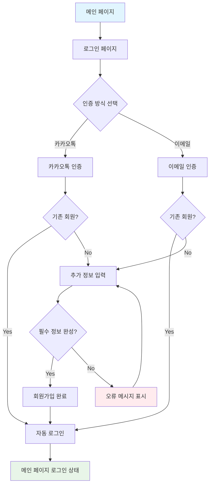

# 회원가입 및 로그인 시나리오

## 📋 개요

이 문서는 Move Togaether 플랫폼의 사용자 인증 플로우를 정의합니다. 카카오톡과 이메일 두 가지 인증 방식을 지원하며, 각각의 전체적인 흐름과 예외 상황을 상세히 설명합니다.

## 🎯 핵심 원칙

- **사용자 경험 중심**: 복잡하지 않은 단계로 회원가입 완료
- **명확한 피드백**: 각 단계에서 발생할 수 있는 상황을 명확하게 안내
- **안전한 처리**: 예외 상황에서도 사용자 데이터 보호
- **일관된 플로우**: 카카오톡과 이메일 인증에서 동일한 사용자 경험 제공

## 📱 전체 플로우 개요

## 🔄 카카오톡 인증 플로우

### 1단계: 메인 페이지 → 로그인 페이지

#### **사용자 동작**
- 메인 페이지에서 "로그인" 버튼 클릭
- 로그인 페이지로 이동

#### **로그인 페이지 구성**
- **제목**: "로그인 / 회원가입"
- **카카오톡 버튼**: "카카오톡으로 시작하기"
- **이메일 버튼**: "이메일로 시작하기"
- **회원가입 링크**: "계정이 없으신가요? 회원가입"

### 2단계: 카카오톡 인증 시도

#### **사용자 동작**
- "카카오톡으로 시작하기" 버튼 클릭
- 카카오톡 앱 또는 웹 인증 페이지로 이동

#### **카카오톡 인증 과정**
1. **권한 승인**: 이름, 이메일, 프로필 사진 접근 권한 요청
2. **사용자 승인**: "동의하고 시작하기" 버튼 클릭
3. **인증 완료**: Supabase에서 자동으로 사용자 정보 처리

### 3단계: 기존 회원 여부 확인

#### **자동 처리 과정**
- Supabase가 카카오톡에서 받은 이메일로 기존 계정 검색
- **기존 회원 발견**: 자동 로그인 처리
- **신규 사용자**: 추가 정보 입력 페이지로 이동

#### **예외 상황**
- **네트워크 오류**: "연결에 실패했습니다. 다시 시도해주세요"
- **권한 거부**: "카카오톡 로그인이 필요합니다"
- **사용자 취소**: 메인 페이지로 복귀

### 4단계: 추가 정보 입력 (신규 사용자)

#### **입력 필드**
- **닉네임** (필수): 2-20자, 특수문자 제외
- **연락처** (필수): 전화번호 형식
- **소개글** (선택): 90자 이내
- **연락 채널** (선택): 인스타그램, 네이버 카페, 카카오톡 오픈채팅

#### **실시간 검증**
- **닉네임 중복**: 입력 시 자동으로 중복 확인
- **형식 검증**: 전화번호, 링크 형식 실시간 확인
- **필수 항목**: 닉네임과 연락처 입력 완료 시 가입하기 버튼 활성화

### 5단계: 회원가입 완료

#### **성공 시나리오**
- "회원가입이 완료되었습니다" 메시지
- 자동 로그인 처리
- 메인 페이지로 이동

#### **실패 시나리오**
- **닉네임 중복**: "이미 사용 중인 닉네임입니다"
- **형식 오류**: "올바른 형식으로 입력해주세요"
- **필수 정보 누락**: "필수 정보를 모두 입력해주세요"

## 📧 이메일 인증 플로우

### 1단계: 메인 페이지 → 로그인 페이지

- 카카오톡 인증과 동일

### 2단계: 이메일 인증 시도

#### **사용자 동작**
- "이메일로 시작하기" 버튼 클릭
- 이메일 주소 입력 페이지로 이동

#### **이메일 입력 과정**
1. **이메일 주소 입력**: 사용자가 이메일 주소 입력
2. **인증 메일 발송**: "인증 메일 보내기" 버튼 클릭
3. **메일 확인**: 입력한 이메일로 인증 링크 발송
4. **링크 클릭**: 사용자가 메일의 인증 링크 클릭

### 3단계: 기존 회원 여부 확인

#### **자동 처리 과정**
- Supabase가 입력된 이메일로 기존 계정 검색
- **기존 회원 발견**: 자동 로그인 처리
- **신규 사용자**: 추가 정보 입력 페이지로 이동

#### **예외 상황**
- **잘못된 이메일**: "올바른 이메일 주소를 입력해주세요"
- **인증 메일 미도착**: "인증 메일을 다시 보내기" 버튼 제공
- **인증 링크 만료**: "인증 링크가 만료되었습니다. 다시 시도해주세요"

### 4단계: 추가 정보 입력 (신규 사용자)

- 카카오톡 인증과 동일한 과정

### 5단계: 회원가입 완료

- 카카오톡 인증과 동일한 과정

## ⚠️ 예외 처리 시나리오

### 카카오톡 인증 예외

#### **1. 네트워크 오류**
- **상황**: 카카오톡 인증 중 네트워크 연결 실패
- **처리**: "연결에 실패했습니다. 다시 시도해주세요" 메시지
- **해결**: 재시도 버튼 제공

#### **2. 권한 거부**
- **상황**: 사용자가 카카오톡 권한 승인 거부
- **처리**: "카카오톡 로그인이 필요합니다" 안내
- **해결**: 다른 인증 방식(이메일) 안내

#### **3. 사용자 취소**
- **상황**: 사용자가 인증 과정 중 취소
- **처리**: 메인 페이지로 자동 복귀
- **해결**: 별도 메시지 없이 자연스럽게 복귀

### 이메일 인증 예외

#### **1. 잘못된 이메일 형식**
- **상황**: 이메일 주소 형식이 올바르지 않음
- **처리**: "올바른 이메일 주소를 입력해주세요" 메시지
- **해결**: 올바른 형식으로 재입력 안내

#### **2. 인증 메일 미도착**
- **상황**: 인증 메일이 수신되지 않음
- **처리**: "인증 메일을 다시 보내기" 버튼 제공
- **해결**: 스팸함 확인 안내 및 재발송 기능

#### **3. 인증 링크 만료**
- **상황**: 인증 링크 클릭 시 만료됨
- **처리**: "인증 링크가 만료되었습니다" 메시지
- **해결**: 새로운 인증 메일 발송

### 회원가입 과정 예외

#### **1. 닉네임 중복**
- **상황**: 이미 사용 중인 닉네임 입력
- **처리**: "이미 사용 중인 닉네임입니다" 메시지
- **해결**: 다른 닉네임 입력 안내

#### **2. 필수 정보 누락**
- **상황**: 닉네임 또는 연락처 미입력
- **처리**: "필수 정보를 모두 입력해주세요" 메시지
- **해결**: 누락된 필드에 빨간색 테두리 표시

#### **3. 형식 오류**
- **상황**: 전화번호나 링크 형식이 올바르지 않음
- **처리**: "올바른 형식으로 입력해주세요" 메시지
- **해결**: 올바른 형식 예시 제공

#### **4. 회원가입 취소**
- **상황**: 사용자가 회원가입 과정 중 취소
- **처리**: "입력한 정보가 모두 사라집니다" 확인 모달
- **해결**: 취소/확인 선택 후 처리

## 🔄 사용자 상태별 화면 변화

### 비로그인 상태 (메인 페이지)

#### **표시 요소**
- 헤더 우측: "로그인" 버튼
- 봉사 신청 버튼: 클릭 시 "로그인이 필요합니다" 모달
- 게시물 조회: 가능하지만 상호작용 제한
- 찜하기: 비활성화 (회색 하트)

#### **제한 기능**
- 봉사 신청 불가
- 문의하기 불가
- 마이페이지 접근 불가

### 로그인 상태 (메인 페이지)

#### **표시 요소**
- 헤더: 사용자 프로필 이미지와 닉네임
- 봉사 신청 버튼: 활성화
- 모든 상호작용 기능: 활성화

#### **활성화 기능**
- 봉사 신청
- 게시물 찜하기
- 문의하기
- 마이페이지 접근

## 📱 페이지별 구성

### 로그인 페이지 (`/auth`)

#### **주요 구성 요소**
- **제목**: "로그인 / 회원가입"
- **카카오톡 버튼**: "카카오톡으로 시작하기"
- **이메일 버튼**: "이메일로 시작하기"
- **구분선**: "또는"
- **회원가입 링크**: "계정이 없으신가요? 회원가입"

#### **사용자 플로우**
1. 카카오톡 버튼 클릭 → 카카오톡 인증 플로우
2. 이메일 버튼 클릭 → 이메일 인증 플로우
3. 회원가입 링크 클릭 → 회원가입 페이지

### 회원가입 페이지 (`/auth/signup`)

#### **주요 구성 요소**
- **헤더**: "회원가입" 제목 + X 버튼
- **프로필 영역**: 프로필 이미지 (수정 가능)
- **입력 폼**: 닉네임, 소개글, 연락처, 연락 채널
- **가입하기 버튼**: 하단 고정

#### **입력 필드 상세**
- **닉네임**: 2-20자, 특수문자 제외, 중복 확인
- **소개글**: 90자 이내, 줄바꿈 불가
- **연락처**: 전화번호 형식, 자동 하이픈
- **연락 채널**: 체크박스 선택 시 링크 입력 필드 활성화

## 🔒 보안 및 개인정보

### 데이터 보호

#### **수집 정보**
- **카카오톡**: 이름, 이메일, 프로필 사진
- **사용자 입력**: 닉네임, 연락처, 소개글, 연락 채널
- **자동 생성**: 가입일시, 마지막 로그인

#### **보안 처리**
- **Supabase 인증**: 안전한 인증 시스템 활용
- **데이터 암호화**: 민감한 정보 암호화 저장
- **접근 제어**: 사용자 본인만 정보 수정 가능

### 개인정보 처리

#### **공개 정보**
- **닉네임**: 다른 사용자에게 공개
- **연락처**: 봉사 신청 시에만 공개
- **소개글**: 프로필에서 공개

#### **비공개 정보**
- **이메일**: 시스템 내부에서만 사용
- **카카오톡 ID**: 인증 목적으로만 사용

---

*이 문서는 개발 진행에 따라 지속적으로 업데이트됩니다.*
