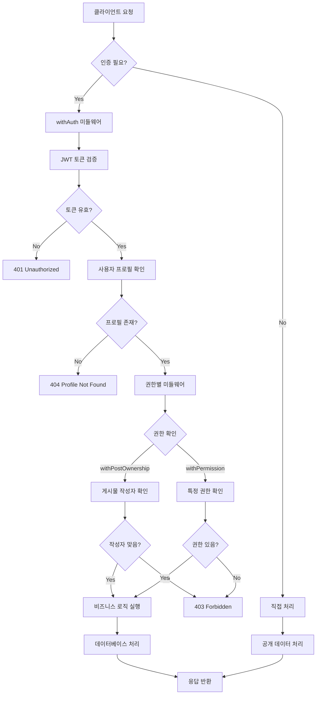
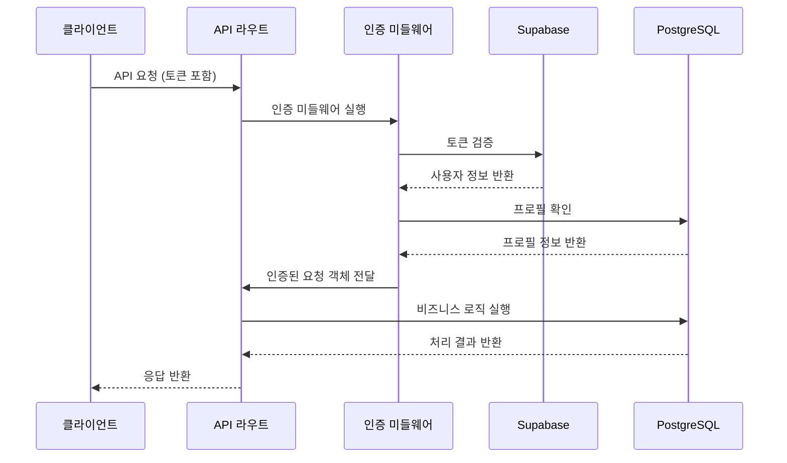
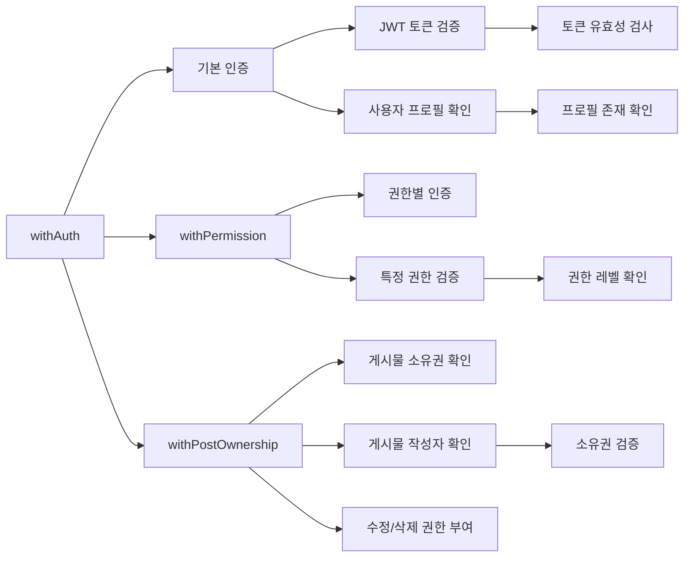
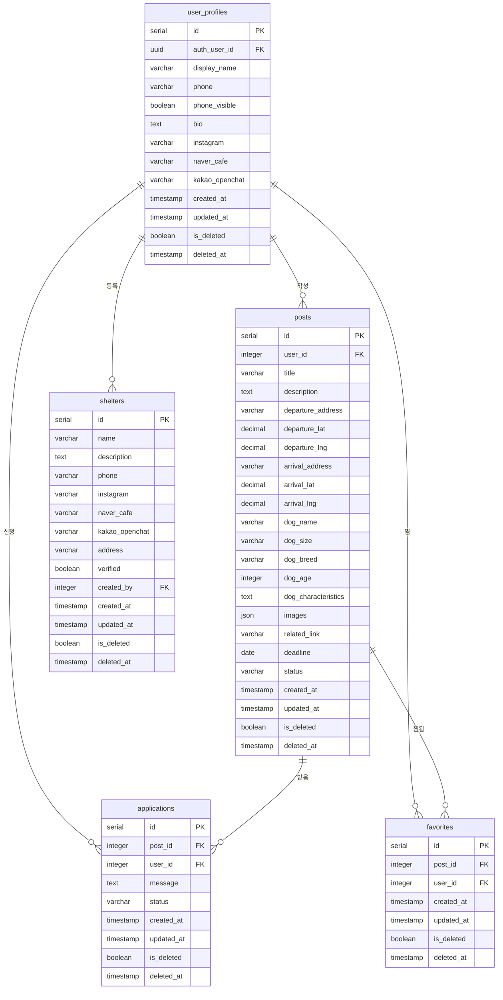
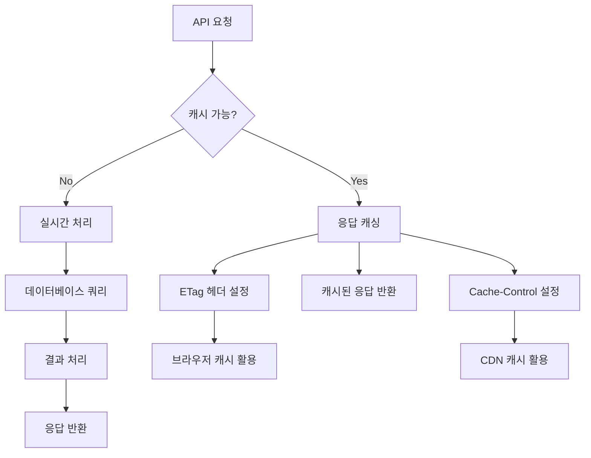
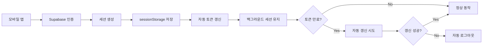
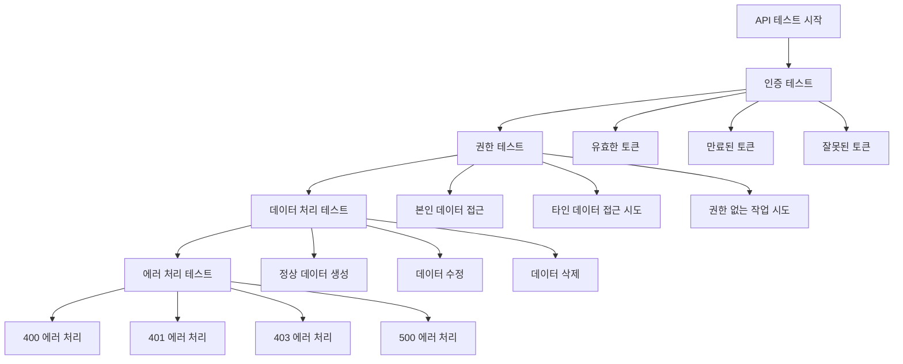

# 2025년 8월 31일 작업 로그: API 구조 설계 및 백엔드 중심 인증 구현

## 📅 작업 일시
**2025년 8월 31일**

## 🎯 작업 목표
- Supabase 기반 백엔드 API 구조 설계 및 구현
- 클라이언트에서 직접 데이터베이스 접근 제한
- 백엔드 중심의 안전한 인증 시스템 구축
- API 미들웨어를 통한 권한 제어 시스템 구현

## 🔄 Git 변경사항 요약

### **마지막 커밋 이후 변경된 파일들**
```
📁 새로 생성된 디렉토리
├── src/app/api/           # API 라우트 구조
├── src/lib/               # 유틸리티 라이브러리
├── sql/                   # 데이터베이스 스키마
└── docs/                  # 문서화

📄 새로 생성된 파일들
├── src/lib/supabase.js           # Supabase 클라이언트 설정
├── src/lib/auth-middleware.js    # 인증 미들웨어
├── src/lib/api.js               # API 유틸리티 함수
├── docs/api_structure.md        # API 구조 문서
├── docs/auth_setup_guide.md     # 인증 설정 가이드
└── sql/20250831-01_initialize.sql # 데이터베이스 초기화 스크립트
```

## 🏗️ 구현된 API 구조

### **1. 핵심 API 엔드포인트**

```mermaid
graph TB
    A[API Base: /api] --> B[인증 및 프로필]
    A --> C[게시물 관리]
    A --> D[봉사 신청]
    A --> E[찜 목록]
    A --> F[보호소 관리]

    B --> B1[GET /auth/profile]
    B --> B2[PUT /auth/profile]

    C --> C1[GET /posts - 목록 조회]
    C --> C2[GET /posts/my - 내 게시물]
    C --> C3[POST /posts - 생성]
        C --> C4["GET /posts/[id] - 상세"]
    C --> C5["PUT /posts/[id] - 수정"]
    C --> C6["DELETE /posts/[id] - 삭제"]

    D --> D1[GET /applications - 신청 목록]
    D --> D2[POST /applications - 신청 생성]
    D --> D3["PUT /applications/[id]/status - 상태 변경"]

    E --> E1[GET /favorites - 찜 목록]
    E --> E2[GET /favorites/check - 찜 여부 확인]
    E --> E3[POST /favorites - 찜 추가]
    E --> E4[DELETE /favorites - 찜 제거]

    F --> F1[GET /shelters - 보호소 목록]
    F --> F2["GET /shelters/[id] - 보호소 상세"]
    F --> F3[POST /shelters - 보호소 등록]
    F --> F4["PUT /shelters/[id] - 보호소 수정"]
```



### **2. 인증 및 권한 제어 구조**



### **3. 데이터 흐름 구조**



## 🔐 보안 및 인증 시스템

### **1. 인증 미들웨어 구조**



### **2. 권한 제어 매트릭스**

| 리소스 | 조회 | 생성 | 수정 | 삭제 | 비고 |
|--------|------|------|------|------|------|
| **게시물** | 모든 사용자 | 로그인 사용자 | 작성자만 | 작성자만 | 소프트 삭제 |
| **봉사 신청** | 본인 신청/받은 신청 | 로그인 사용자 | 게시물 작성자만 | - | 상태 변경만 |
| **찜 목록** | 본인만 | 로그인 사용자 | - | 본인만 | 토글 방식 |
| **보호소** | 모든 사용자 | 로그인 사용자 | 등록자만 | - | 인증 보호소 구분 |
| **프로필** | 본인만 | 자동 생성 | 본인만 | - | Supabase 연동 |

## 🛠️ 기술적 구현 세부사항

### **1. Supabase 클라이언트 설정**

```javascript
// 클라이언트 사이드 (인증 전용)
export const supabase = createClient(supabaseUrl, supabaseAnonKey, {
  auth: {
    autoRefreshToken: true,        // 자동 토큰 갱신
    persistSession: true,          // 세션 지속성
    storage: window.sessionStorage // 보안 강화
  }
})

// 서버 사이드 (데이터 처리)
export const createServerSupabaseClient = (accessToken) => {
  if (accessToken) {
    return createClient(supabaseUrl, process.env.SUPABASE_SERVICE_ROLE_KEY, {
      global: { headers: { Authorization: `Bearer ${accessToken}` } }
    })
  } else {
    return createClient(supabaseUrl, supabaseAnonKey)
  }
}
```

### **2. API 미들웨어 패턴**

```javascript
// 기본 인증
export const GET = withAuth(async (request) => {
  const { profile } = request  // 이미 인증 완료
  return NextResponse.json({ profile })
})

// 권한별 인증
export const PUT = withPostOwnership(async (request) => {
  // 게시물 작성자 권한 확인 완료
  return NextResponse.json({ message: 'Updated' })
})
```

### **3. 에러 처리 시스템**

```javascript
// 자동 인증 오류 처리
if (response.status === 401) {
  await supabase.auth.signOut()
  throw new Error('Authentication failed - please login again')
}

// 에러 타입별 분류
export const handleAPIError = (error) => {
  if (error.message.includes('Authentication failed')) {
    return { type: 'auth', message: '로그인이 필요합니다.' }
  } else if (error.message.includes('Not authorized')) {
    return { type: 'permission', message: '권한이 없습니다.' }
  }
  // ... 기타 에러 처리
}
```

## 📊 데이터베이스 스키마

### **1. 테이블 구조**



### **2. RLS 정책 및 인덱스**

```sql
-- 핵심 인덱스만 생성 (성능 최적화)
CREATE INDEX idx_user_profiles_auth_user_id ON user_profiles(auth_user_id);
CREATE INDEX idx_posts_status_deadline ON posts(status, deadline);
CREATE INDEX idx_applications_post_user ON applications(post_id, user_id);
CREATE INDEX idx_favorites_user_post ON favorites(user_id, post_id);
CREATE INDEX idx_shelters_verified ON shelters(verified);

-- RLS 정책 (보안 강화)
CREATE POLICY "사용자 프로필 접근 정책" ON user_profiles
  FOR ALL USING (auth.uid() = auth_user_id);

CREATE POLICY "게시물 조회 정책" ON posts
  FOR SELECT USING (status = 'active' AND is_deleted = false);
```

## 🚀 성능 최적화

### **1. API 응답 최적화**



### **2. 데이터베이스 쿼리 최적화**

```javascript
// 효율적인 조인 쿼리
const { data: posts, error } = await supabase
  .from('posts')
  .select(`
    *,
    user_profiles!inner(display_name, phone_visible),
    shelters!inner(name, verified)
  `)
  .eq('is_deleted', false)
  .eq('status', 'active')
  .order('created_at', { ascending: false })
  .range(from, to)
```

## 📱 모바일 최적화

### **1. 세션 관리**



### **2. 오프라인 지원 준비**

```javascript
// 오프라인 상태 감지
const handleOffline = () => {
  // 로컬 캐시에서 기본 데이터 제공
  // 온라인 복구 시 자동 동기화
}

// 네트워크 상태 모니터링
window.addEventListener('online', handleOnline)
window.addEventListener('offline', handleOffline)
```

## 🧪 테스트 및 검증

### **1. API 테스트 시나리오**



### **2. 보안 테스트 체크리스트**

- [ ] JWT 토큰 유효성 검증
- [ ] 권한 기반 접근 제어
- [ ] SQL 인젝션 방지
- [ ] XSS 공격 방지
- [ ] CSRF 토큰 검증
- [ ] Rate limiting 적용
- [ ] 로그 보안 강화

## 📝 다음 단계 계획

### **1. 프론트엔드 구현**
- [ ] React 컴포넌트에서 API 연동
- [ ] 인증 상태 관리 (Context/Redux)
- [ ] 보호된 라우트 구현
- [ ] 에러 처리 및 사용자 피드백

### **2. 추가 기능 개발**
- [ ] 이미지 업로드 API
- [ ] 실시간 알림 (Supabase Realtime)
- [ ] 검색 및 필터링 최적화
- [ ] 페이지네이션 개선

### **3. 성능 및 보안 강화**
- [ ] API 응답 캐싱
- [ ] Rate limiting 구현
- [ ] 로깅 및 모니터링
- [ ] 보안 헤더 설정

## 🎯 작업 완료 요약

### **✅ 완료된 작업**
1. **API 구조 설계**: RESTful API 엔드포인트 설계 및 구현
2. **인증 시스템**: JWT 기반 인증 및 권한 제어
3. **미들웨어 구현**: `withAuth`, `withPostOwnership` 등 권한별 미들웨어
4. **데이터베이스 스키마**: 테이블 구조, RLS 정책, 인덱스 최적화
5. **보안 강화**: 클라이언트 직접 DB 접근 제한, 백엔드 중심 구조
6. **문서화**: API 구조 문서, 인증 설정 가이드 작성

### **🔄 진행 중인 작업**
- 프론트엔드 컴포넌트 구현 준비
- API 테스트 및 검증

### **📋 남은 작업**
- 프론트엔드 React 컴포넌트 구현
- 인증 상태 관리 시스템 구축
- UI/UX 컴포넌트 개발
- 통합 테스트 및 배포

## 💡 주요 학습 및 개선사항

### **1. 보안 아키텍처**
- 백엔드 중심 구조로 클라이언트 보안 위험 최소화
- 미들웨어 패턴을 통한 일관된 권한 제어
- RLS와 API 레벨 이중 보안 구현

### **2. 성능 최적화**
- 필요한 인덱스만 생성하여 쿼리 성능 향상
- 효율적인 조인 쿼리로 데이터베이스 부하 감소
- API 응답 캐싱 전략 수립

### **3. 개발자 경험**
- 명확한 API 문서화로 개발 효율성 향상
- 재사용 가능한 미들웨어 패턴으로 코드 중복 제거
- 일관된 에러 처리로 디버깅 용이성 증대
