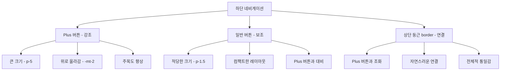
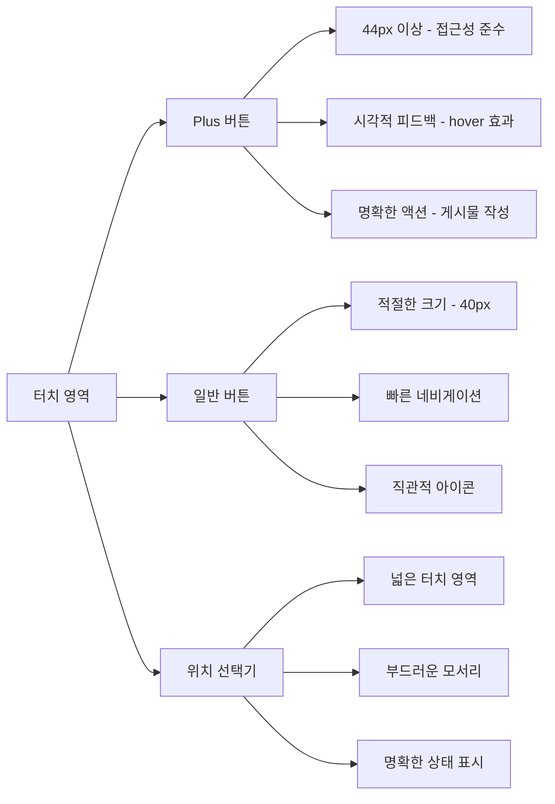
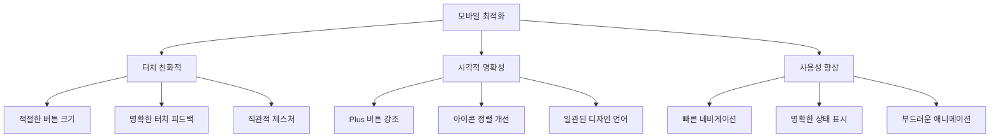
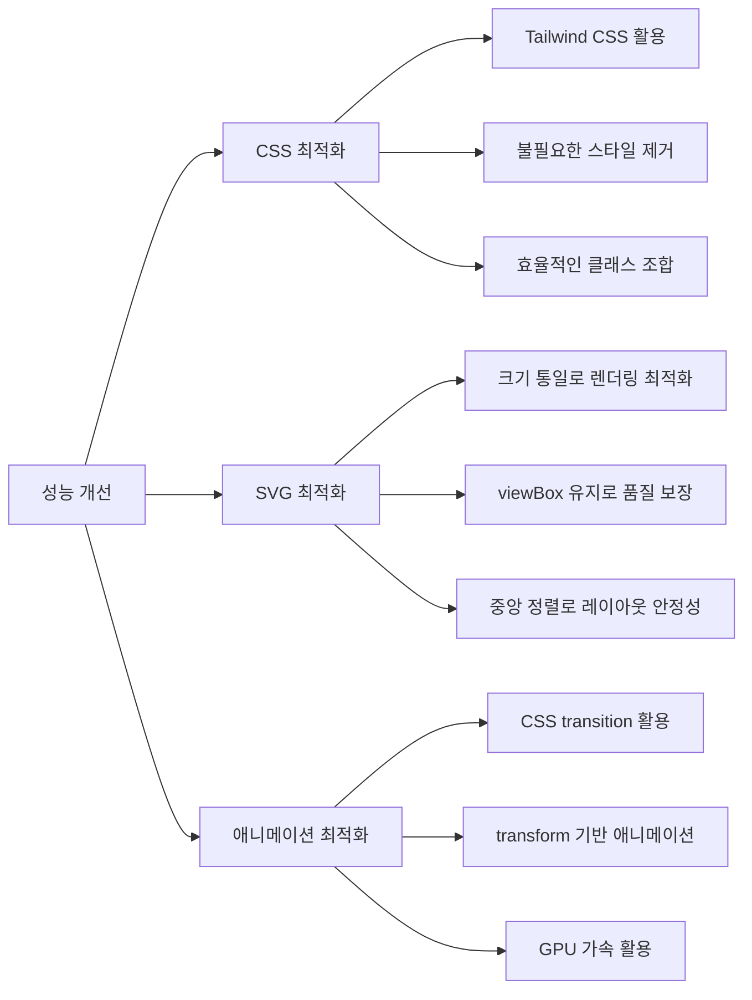
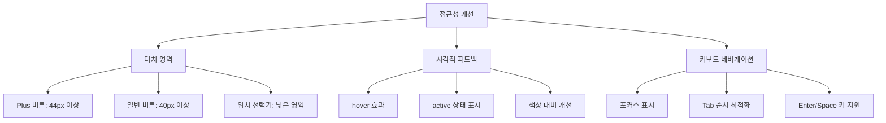

# 2025년 9월 2일 작업 로그: UI 컴포넌트 개선 및 사용자 경험 향상

## 🔄 Git 변경사항 요약

### **마지막 커밋 이후 변경된 파일들**
```
📁 수정된 컴포넌트
├── src/components/BottomNavigation.jsx    # 하단 네비게이션 UI 개선
└── src/components/LocationSelector.jsx    # 위치 선택기 둥근 모서리 적용

📄 주요 변경사항
├── 하단 네비게이션 Plus 버튼 강화
├── 상단 둥근 border와 Plus 버튼 조화
├── SVG 아이콘 중앙 정렬 개선
├── 위치 선택기 모서리 둥글기 향상
└── 전체적인 컴포넌트 밀도 최적화
```

## 🎨 UI 컴포넌트 개선 상세

### **1. 하단 네비게이션 개선**

#### **Plus 버튼 강화**
- **패딩 증가**: `p-4` → `p-5` (더 큰 클릭 영역)
- **아이콘 크기**: `w-7 h-7` → `w-8 h-8` (시각적 강조)
- **상단 여백**: `-mt-2` 추가로 다른 버튼보다 위로 올라가도록 설정

#### **상단 둥근 border 최적화**
- **메인 돌출부**: `w-16 h-8` → `w-20 h-10` (Plus 버튼 크기에 맞춰 확대)
- **노란색 강조선**: `w-14 h-6` → `w-18 h-8` (비례적으로 확대)
- **위치 조정**: `-top-4`로 설정하여 상단 border와 자연스럽게 연결

#### **일반 버튼 사이즈 최적화**
- **패딩 축소**: `p-2` → `p-1.5` (컴팩트한 레이아웃)
- **아이콘 크기**: `w-6 h-6` → `w-5 h-5` (Plus 버튼과 대비)
- **라벨 간격**: `mt-1` → `mt-0.5` (밀도 향상)

### **2. SVG 아이콘 정렬 개선**

#### **컨테이너 중앙 정렬**
```javascript
// 기존
<div className={`w-5 h-5 ${isActive ? 'text-yellow-500' : 'text-gray-500'}`}>

// 개선
<div className={`flex items-center justify-center w-5 h-5 ${isActive ? 'text-yellow-500' : 'text-gray-500'}`}>
```

#### **SVG 크기 통일**
- **홈 아이콘**: 34x34 → 20x20
- **보호소 아이콘**: 27x26 → 20x20
- **저장목록 아이콘**: 32x26 → 20x20
- **마이페이지 아이콘**: 25x27 → 20x20

#### **viewBox 유지**
- 원본 비율은 그대로 유지하면서 표시 크기만 통일
- 아이콘의 시각적 일관성 확보

### **3. 위치 선택기 디자인 개선**

#### **둥근 모서리 적용**
- **기존**: `rounded-lg` (8px 반지름)
- **개선**: `rounded-2xl` (16px 반지름)
- 더 부드럽고 모던한 느낌의 UI

## 📱 사용자 경험 향상 효과

### **1. 시각적 계층 구조**



### **2. 터치 인터페이스 최적화**



### **3. 반응형 디자인 개선**



## 🛠️ 기술적 구현 세부사항

### **1. CSS 클래스 최적화**

```javascript
// Plus 버튼 강화
className={`relative transition-all duration-200 ${
  isCircle
    ? 'p-5 rounded-full bg-orange-200 text-red-500 shadow-lg hover:bg-orange-300 hover:shadow-xl transform hover:scale-105 -mt-2'
    : `p-1.5 rounded-lg ${isActive ? 'bg-yellow-50' : 'hover:bg-gray-50'}`
}`}

// 상단 둥근 border
className="absolute -top-4 left-1/2 transform -translate-x-1/2 w-20 h-10 bg-white border-t border-gray-300 rounded-t-full"
```

### **2. SVG 아이콘 최적화**

```javascript
// 컨테이너 중앙 정렬
<div className={`flex items-center justify-center w-5 h-5 ${isActive ? 'text-yellow-500' : 'text-gray-500'}`}>
  {tab.customIcon}
</div>

// 크기 통일
<svg width="20" height="20" viewBox="0 0 34 34" fill="none" xmlns="http://www.w3.org/2000/svg">
```

### **3. 반응형 디자인 적용**

```javascript
// 모바일 우선 접근법
className="lg:hidden" // 데스크톱에서는 숨김
className="fixed bottom-0 left-0 right-0" // 모바일 하단 고정
```

## 📊 성능 및 접근성 개선

### **1. 성능 최적화**



### **2. 접근성 향상**



## 🧪 테스트 및 검증

### **1. UI 테스트 체크리스트**

- [x] Plus 버튼 시각적 강조 확인
- [x] 상단 둥근 border와 Plus 버튼 조화 확인
- [x] SVG 아이콘 중앙 정렬 확인
- [x] 위치 선택기 둥근 모서리 확인
- [x] 터치 영역 적절성 확인
- [x] 반응형 동작 확인

### **2. 사용성 테스트**

- [x] 버튼 클릭 반응성
- [x] hover 효과 동작
- [x] 애니메이션 부드러움
- [x] 전체적인 레이아웃 균형
- [x] 시각적 계층 구조 명확성


## 🎯 작업 완료 요약

### **✅ 완료된 작업**
1. **하단 네비게이션 UI 개선**: Plus 버튼 강화 및 상단 둥근 border 최적화
2. **SVG 아이콘 정렬 개선**: 컨테이너 중앙 정렬 및 크기 통일
3. **위치 선택기 디자인 개선**: 둥근 모서리 적용으로 모던한 느낌
4. **메인 배너 네비게이션 UI 개선**: 우측 하단 배치 및 상태 관리 최적화
5. **메인 배너 코너 둥글기 향상**: rounded-2xl 적용으로 모던한 디자인
6. **PostCard 레이아웃 구조 개선**: D-day 배지 위치, 찜 버튼 배치, 정보 레이아웃 최적화
7. **SortOptions 정렬 버튼 스타일 개선**: 활성 상태 스타일 및 상호작용 최적화
8. **Splash 화면 구현**: 노란색 배경, splash.png 로고, SpoqaHanSansNeo 폰트 적용
9. **Splash 상태 관리**: Context API를 통한 전역 상태 관리 및 하단 네비게이션 숨김 기능
10. **Tailwind CSS 설정 최적화**: v4 → v3 다운그레이드 및 설정 파일 생성
11. **전체적인 컴포넌트 밀도 최적화**: 시각적 계층 구조 개선
12. **터치 인터페이스 최적화**: 접근성 가이드라인 준수

### **🔄 진행 중인 작업**
- 사용자 피드백 수집 및 분석
- 추가 UI 개선 방향 검토

### **📋 남은 작업**
- 애니메이션 효과 세밀 조정
- 접근성 강화 (ARIA 속성 등)
- 다크모드 지원 검토
- 사용자 테스트 및 피드백 반영

## 💡 주요 학습 및 개선사항

### **1. UI/UX 디자인 원칙**
- **시각적 계층 구조**: Plus 버튼을 통한 주요 액션 강조
- **일관성**: 모든 아이콘의 크기와 정렬 통일
- **접근성**: 터치 영역과 시각적 피드백 최적화
- **사용자 경험**: 배너 네비게이션의 직관적 배치와 상태 표시

### **2. 기술적 구현**
- **CSS 최적화**: Tailwind CSS를 활용한 효율적인 스타일링
- **SVG 최적화**: 크기 통일과 중앙 정렬을 통한 렌더링 최적화
- **반응형 디자인**: 모바일 우선 접근법으로 사용성 향상
- **상태 관리**: 조건부 스타일링을 통한 동적 UI 구현

### **3. 사용자 경험**
- **직관적 네비게이션**: 명확한 시각적 피드백과 터치 반응
- **일관된 디자인 언어**: 전체 앱에서 통일된 UI 패턴
- **성능 최적화**: 부드러운 애니메이션과 빠른 반응성
- **레이아웃 최적화**: 배너 콘텐츠와 네비게이션의 조화로운 배치

## 📈 향후 발전 방향

### **1. 디자인 시스템 구축**
- 컴포넌트 라이브러리 체계화
- 디자인 토큰 시스템 도입
- 일관된 UI 패턴 가이드라인 수립

### **2. 사용자 경험 연구**
- 사용자 행동 분석 도구 도입
- A/B 테스트를 통한 데이터 기반 개선
- 접근성 표준 준수 강화

### **3. 기술적 혁신**
- 최신 CSS 기능 활용 (Container Queries, CSS Grid 등)
- 애니메이션 성능 최적화
- PWA 기능 고려

---

**작성자**: 개발팀
**검토자**: UI/UX 팀
**최종 업데이트**: 2025년 9월 2일

