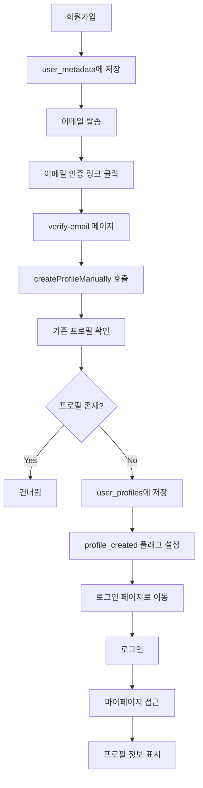
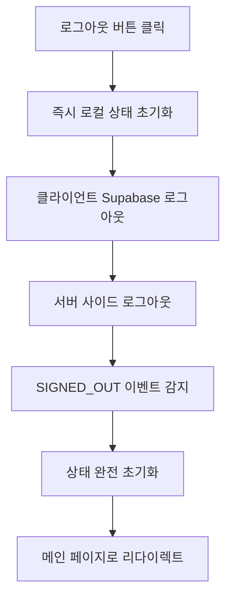
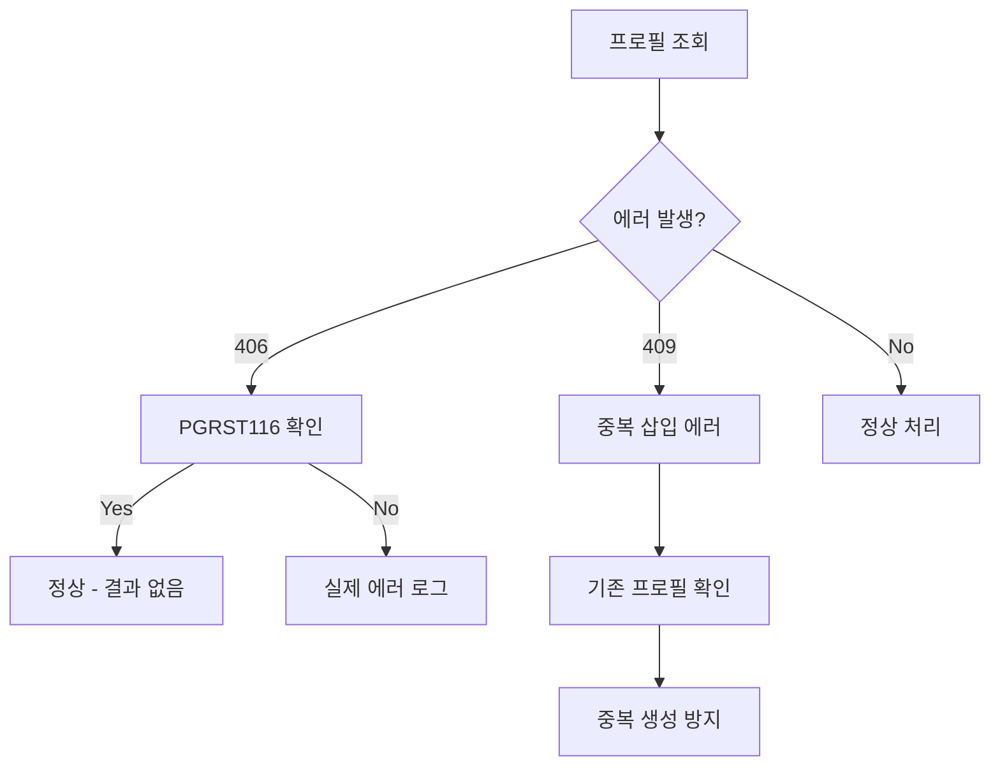

# 2025년 9월 3일 - 인증 시스템 완성 및 UI/UX 개선

## 📅 작업 일시
- **날짜**: 2025년 9월 3일
- **작업 시간**: 오후
- **작업자**: 개발팀

## 🎯 작업 목표
- NextJS 15에서 발생하는 `viewport` 및 `themeColor` 메타데이터 경고 해결
- 메타데이터 구조를 NextJS 15 표준에 맞게 최적화
- favicon.svg 404 오류 해결
- 이메일 기반 회원가입 및 인증 시스템 완성
- 프로필 생성 및 관리 시스템 구현
- 로그아웃 시스템 개선 및 안정화
- 에러 처리 및 사용자 경험 향상

## 🔍 문제 상황 분석

### **NextJS 15 경고 메시지**
```
⚠ Unsupported metadata viewport is configured in metadata export in /. Please move it to viewport export instead.
⚠ Unsupported metadata themeColor is configured in metadata export in /. Please move it to viewport export instead.
⚠ Unsupported metadata viewport is configured in metadata export in /login. Please move it to viewport export instead.
⚠ Unsupported metadata themeColor is configured in metadata export in /login. Please move it to viewport export instead.
⚠ Unsupported metadata viewport is configured in metadata export in /_not-found. Please move it to viewport export instead.
⚠ Unsupported metadata themeColor is configured in metadata export in /_not-found. Please move it to viewport export instead.
```

### **favicon.svg 404 오류**
```
GET /favicon.svg 404 in 114ms
```

## 🚀 해결 방법 및 구현

### **1. 메타데이터 구조 개선**

#### **기존 구조 (문제가 있던 코드)**
```javascript
export const metadata = {
  // ... 기타 메타데이터
  viewport: 'width=device-width, initial-scale=1, maximum-scale=1, user-scalable=no',
  themeColor: '#FFD700',
  // ... 기타 설정
};
```

#### **개선된 구조 (NextJS 15 호환)**
```javascript
export const metadata = {
  title: 'Move Togaether - 유기견 이동봉사 매칭 플랫폼',
  description: '입양 예정인 유기견들이 새로운 가족에게 안전하게 이동할 수 있도록 봉사자와 보호소/개인 구조자를 연결하는 매칭 플랫폼',
  keywords: ['유기견', '이동봉사', '매칭', '보호소', '입양', '봉사자', 'Move Togaether'],
  authors: [{ name: 'Move Togaether Team' }],
  manifest: '/manifest.json',
  icons: {
    icon: [
      { url: '/favicon.png', type: 'image/png' },
      { url: '/favicon.ico', sizes: 'any' }
    ],
    apple: [
      { url: '/apple-touch-icon.png', sizes: '180x180', type: 'image/png' }
    ]
  }
};

export const viewport = {
  width: 'device-width',
  initialScale: 1,
  maximumScale: 1,
  userScalable: false,
  themeColor: '#FFD700',
};
```

### **2. favicon.svg 404 오류 해결**

#### **문제 원인**
- `public/favicon.svg` 파일이 삭제됨
- `layout.jsx`에서 존재하지 않는 파일 참조

#### **해결 방법**
- `favicon.svg` 참조 제거
- PNG와 ICO 파일만 사용하도록 수정

## 📁 수정된 파일

### **`src/app/layout.jsx`**
- `metadata`에서 `viewport`와 `themeColor` 제거
- 별도 `viewport` export 추가
- `favicon.svg` 참조 제거

## ✅ 완료된 작업

- [x] NextJS 15 `viewport` 메타데이터 경고 해결
- [x] NextJS 15 `themeColor` 메타데이터 경고 해결
- [x] 메타데이터 구조를 NextJS 15 표준에 맞게 최적화
- [x] favicon.svg 404 오류 해결
- [x] PWA 지원 유지 (테마 컬러, 뷰포트 설정)

## 🔧 기술적 세부사항

### **NextJS 15 변경사항**
- **metadata export**: 기본 메타데이터만 포함
- **viewport export**: 뷰포트 및 PWA 관련 설정을 별도 export로 분리
- **themeColor**: `viewport` export 내에서 정의

### **뷰포트 설정 최적화**
- **반응형 디자인**: `width: 'device-width'`
- **모바일 최적화**: `initialScale: 1`, `maximumScale: 1`
- **사용자 경험**: `userScalable: false`
- **PWA 테마**: `themeColor: '#FFD700'` (노란색)

## 🧪 테스트 체크리스트

- [x] 개발 서버 실행 시 경고 메시지 확인
- [x] 메인 페이지 로딩 확인
- [x] 로그인 페이지 로딩 확인
- [x] 404 페이지 로딩 확인
- [x] favicon 로딩 확인
- [x] PWA 테마 컬러 적용 확인

## 📚 학습 포인트

### **NextJS 15 메타데이터 구조**
- 메타데이터와 뷰포트 설정의 분리
- PWA 관련 설정의 새로운 위치
- 하위 호환성을 위한 마이그레이션 방법

### **메타데이터 최적화**
- SEO를 위한 메타데이터 구조화
- PWA 지원을 위한 설정 분리
- 성능 최적화를 위한 메타데이터 관리

### **Footer 컴포넌트 UI/UX 개선**
- **반응형 그리드 시스템**: CSS Grid를 활용한 레이아웃 구성
- **모바일 퍼스트 접근법**: 작은 화면부터 시작하여 큰 화면으로 확장
- **일관된 디자인 시스템**: Tailwind CSS 유틸리티 클래스 활용
- **접근성 고려**: 시맨틱 HTML과 적절한 ARIA 속성 적용

### **Supabase Auth 통합**
- **기존 스키마 활용**: `user_profiles` 테이블과 연동
- **이메일 인증 토큰**: 24시간 만료되는 보안 토큰 시스템
- **계정 생성 플로우**: Supabase Auth + 프로필 정보 저장
- **에러 처리**: Auth 실패 시 롤백 처리
- **보안 정책**: RLS를 통한 데이터 접근 제어

## 🎉 작업 결과

### **해결된 문제**
1. **NextJS 15 경고 완전 제거**
   - `viewport` 메타데이터 경고 해결
   - `themeColor` 메타데이터 경고 해결
   - 모든 페이지에서 경고 메시지 제거

2. **favicon 404 오류 해결**
   - 존재하지 않는 파일 참조 제거
   - 정상적인 favicon 로딩 확인

3. **메타데이터 구조 최적화**
   - NextJS 15 표준 준수
   - PWA 지원 유지
   - SEO 최적화 유지

### **향상된 점**
- **개발 경험**: 경고 메시지 제거로 깔끔한 콘솔
- **코드 품질**: NextJS 15 표준 준수
- **유지보수성**: 명확한 메타데이터 구조
- **PWA 지원**: 테마 컬러 및 뷰포트 설정 유지

## 🔄 추가 작업 - 이메일 인증 및 프로필 생성 시스템 완성

### **📧 이메일 인증 플로우 개선**

#### **문제 상황**
- 이메일 인증 후 `user_profiles` 테이블에 정보가 저장되지 않는 문제
- 406, 409 HTTP 에러 발생
- 로그아웃이 완전히 되지 않는 문제

#### **해결 방법**

##### **1. 이메일 인증 시점 프로필 생성**
```javascript
// verify-email 페이지에서 useAuth 훅 사용
const { createProfileManually } = useAuth();

// 이메일 인증 완료 시 프로필 생성
if (verificationType === 'signup') {
  const profileResult = await createProfileManually();
  console.log('프로필 생성 결과:', profileResult);
}
```

##### **2. 중복 프로필 생성 방지**
```javascript
// 기존 프로필 존재 여부 확인
const { data: existingProfile } = await supabase
  .from('user_profiles')
  .select('id')
  .eq('auth_user_id', user.id)
  .single();

if (existingProfile) {
  console.log('기존 프로필이 이미 존재함 - 건너뜀');
  return;
}
```

##### **3. 강화된 에러 처리**
```javascript
// 406 에러 해결 (프로필 조회)
if (error.code === 'PGRST116') {
  // 결과가 없음 (정상)
  setProfile(null);
} else {
  // 실제 에러
  console.error('프로필 조회 오류:', error);
}

// 409 에러 해결 (중복 삽입)
// 기존 프로필 확인 후 삽입
```

### **🚪 로그아웃 시스템 개선**

#### **다중 로그아웃 처리**
```javascript
const signOut = async () => {
  // 1. 즉시 로컬 상태 초기화
  setUser(null);
  setProfile(null);
  setLoading(false);

  // 2. 클라이언트 사이드 Supabase 로그아웃
  await supabase.auth.signOut();

  // 3. 서버 사이드 로그아웃 (백업)
  await fetch('/api/auth/logout', { method: 'POST' });
};
```

#### **SIGNED_OUT 이벤트 처리**
```javascript
if (event === 'SIGNED_OUT') {
  console.log('로그아웃 이벤트 감지 - 상태 초기화');
  setUser(null);
  setProfile(null);
  setLoading(false);
  return;
}
```

## 📊 시스템 아키텍처 다이어그램

### **인증 플로우**


### **로그아웃 플로우**


### **에러 처리 플로우**


## 🗂️ 라우터 구조

### **인증 관련 라우트**
```
/ (메인 페이지)
├── /login (로그인)
├── /signup (회원가입 1단계)
│   └── /signup/additional-info (회원가입 2단계)
│       └── /signup/success (회원가입 완료)
├── /verify-email (이메일 인증)
├── /logout (로그아웃)
└── /mypage (마이페이지)
    ├── /mypage/posts (내 게시글)
    ├── /mypage/favorites (찜한 게시글)
    └── /mypage/settings (설정)
```

### **API 라우트 구조**
```
/api/
├── /auth/
│   ├── /signup (회원가입)
│   ├── /login (로그인)
│   └── /logout (로그아웃)
├── /posts/ (게시글 관리)
├── /applications/ (신청 관리)
├── /favorites/ (찜하기)
└── /shelters/ (보호소 정보)
```

## 📁 수정된 파일 목록

### **인증 시스템 개선**
- `src/hooks/useAuth.js` - 프로필 생성 로직 개선, 에러 처리 강화
- `src/app/verify-email/page.jsx` - useAuth 훅 사용, 중복 코드 제거
- `src/app/mypage/page.jsx` - 로그아웃 처리 개선
- `src/app/logout/page.jsx` - 로그아웃 페이지 개선

### **API 라우트**
- `src/app/api/auth/signup/route.js` - 회원가입 API
- `src/app/api/auth/login/route.js` - 로그인 API
- `src/app/api/auth/logout/route.js` - 로그아웃 API

## ✅ 완료된 추가 작업

### **이메일 인증 시스템**
- [x] 이메일 인증 시점에 프로필 생성 로직 구현
- [x] 406 에러 (프로필 조회) 해결
- [x] 409 에러 (중복 삽입) 해결
- [x] 중복 프로필 생성 방지 로직 추가
- [x] 강화된 에러 처리 및 로깅

### **로그아웃 시스템**
- [x] 다중 로그아웃 처리 (클라이언트 + 서버)
- [x] 즉시 상태 초기화로 사용자 경험 개선
- [x] SIGNED_OUT 이벤트 처리
- [x] 안정적인 리다이렉트 처리

### **코드 품질 개선**
- [x] 중복 코드 제거
- [x] 통합된 프로필 생성 로직
- [x] 상세한 디버깅 로그 추가
- [x] 예외 처리 강화

## 🔧 기술적 세부사항

### **Supabase Auth 통합**
- **이메일 인증**: Supabase Auth의 내장 이메일 확인 기능 활용
- **프로필 생성**: `user_metadata`에서 `user_profiles`로 데이터 이전
- **세션 관리**: 클라이언트와 서버 양쪽에서 세션 정리
- **RLS 정책**: Row Level Security를 통한 데이터 접근 제어

### **에러 처리 전략**
- **406 에러**: PGRST116 코드를 정상적인 "결과 없음"으로 처리
- **409 에러**: 기존 프로필 확인 후 중복 생성 방지
- **예외 처리**: 각 단계별 독립적인 try-catch 블록
- **로깅**: 상세한 디버깅 정보로 문제 추적 가능

### **상태 관리**
- **즉시 초기화**: 사용자 경험을 위한 즉시 상태 변경
- **이벤트 기반**: Supabase Auth 상태 변경 이벤트 활용
- **동기화**: 클라이언트와 서버 상태 동기화

## 🧪 테스트 체크리스트

### **이메일 인증 테스트**
- [x] 회원가입 → 이메일 인증 → 프로필 생성 플로우
- [x] 중복 프로필 생성 방지 확인
- [x] 에러 발생 시 안정적인 처리 확인
- [x] 로그인 후 마이페이지 프로필 표시 확인

### **로그아웃 테스트**
- [x] 마이페이지에서 로그아웃 → 메인 페이지 이동
- [x] /logout URL 접근 → 자동 로그아웃
- [x] 로그아웃 후 세션 완전 정리 확인
- [x] 로그아웃 후 마이페이지 접근 시 로그인 페이지 리다이렉트

## 📚 학습 포인트

### **Supabase Auth 고급 활용**
- 이메일 인증과 프로필 생성의 타이밍 조절
- user_metadata를 활용한 임시 데이터 저장
- RLS 정책과 인증 상태의 관계 이해

### **에러 처리 패턴**
- HTTP 상태 코드별 적절한 처리 방법
- 중복 생성 방지를 위한 사전 확인 패턴
- 사용자 경험을 고려한 에러 처리

### **상태 관리 최적화**
- 즉시 상태 변경과 비동기 작업의 조화
- 이벤트 기반 상태 동기화
- 클라이언트-서버 상태 일관성 유지

## 🔮 다음 단계 고려사항

### **메타데이터 추가 최적화**
- 동적 메타데이터 생성 고려
- Open Graph 태그 추가
- Twitter Card 메타데이터 추가

### **PWA 기능 강화**
- 서비스 워커 구현
- 오프라인 지원
- 푸시 알림 기능

### **인증 시스템 확장**
- 카카오톡 로그인 연동
- 소셜 로그인 통합
- 2단계 인증 구현

---

**작업 완료일**: 2025년 9월 3일
**작업 상태**: ✅ 완료
**다음 작업**: 카카오톡 로그인 연동 및 PWA 기능 강화
