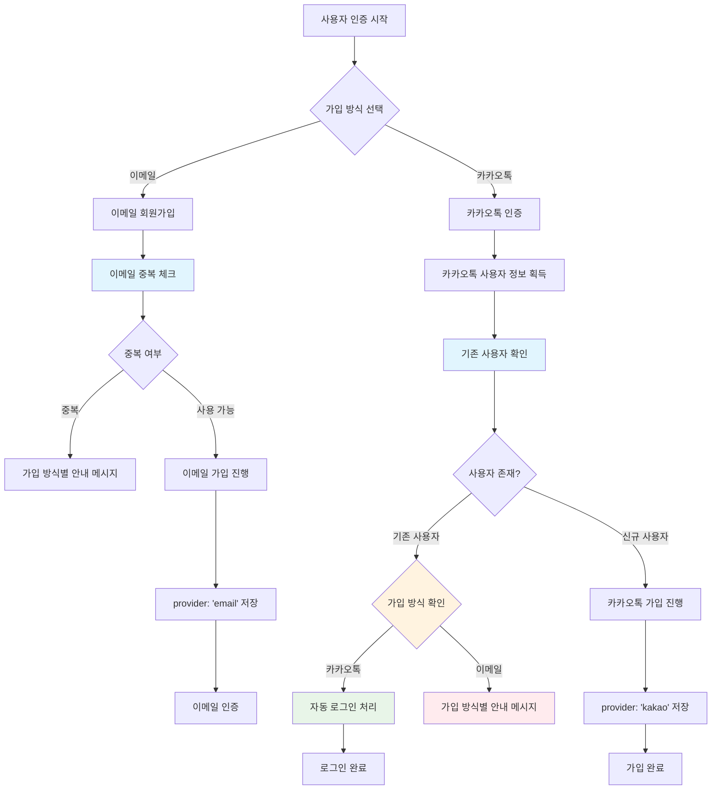
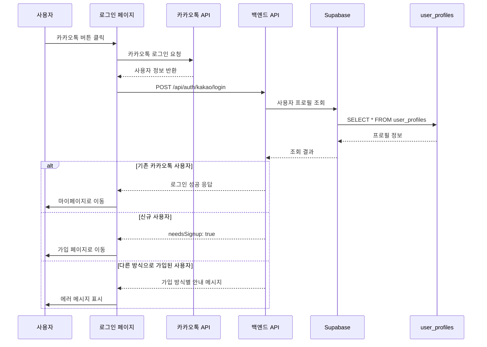
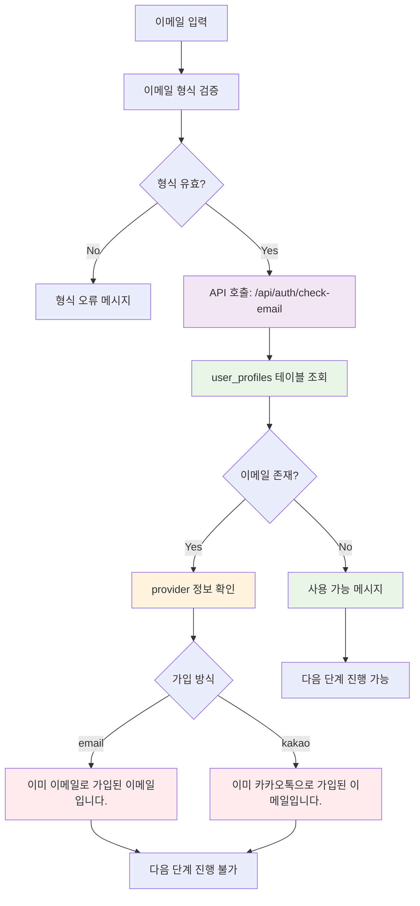
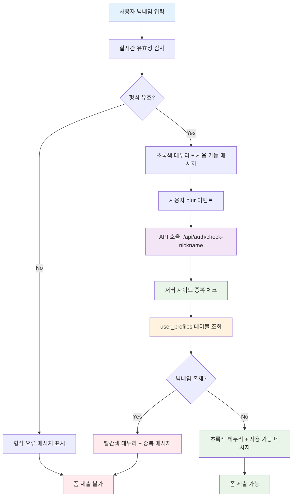
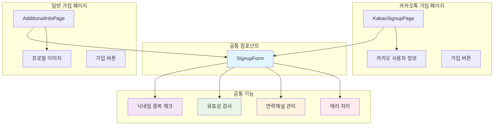
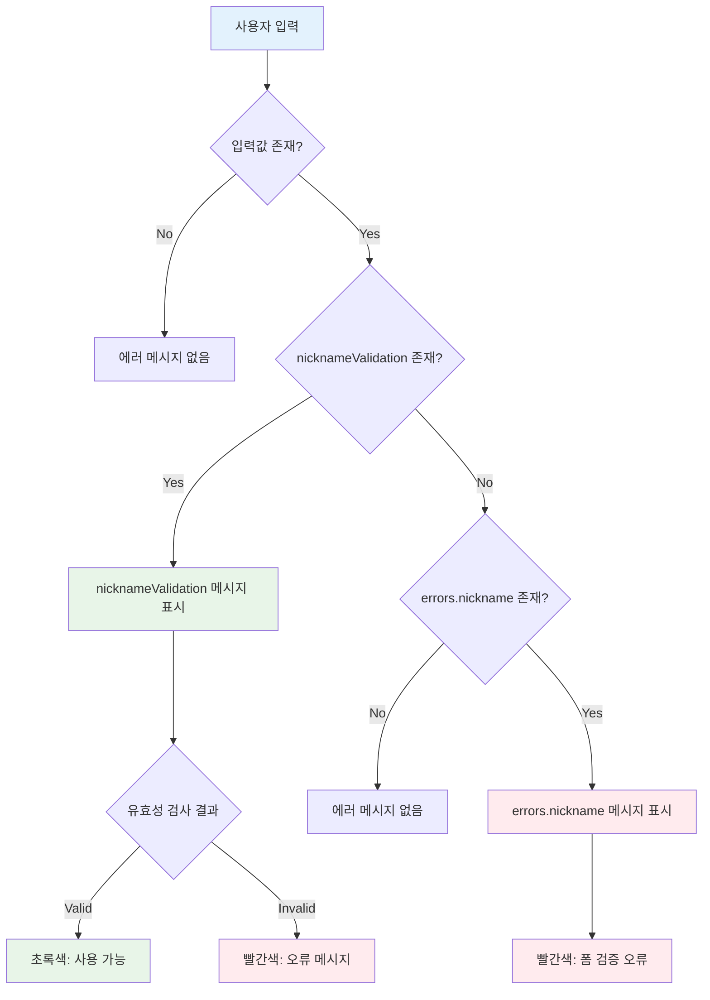
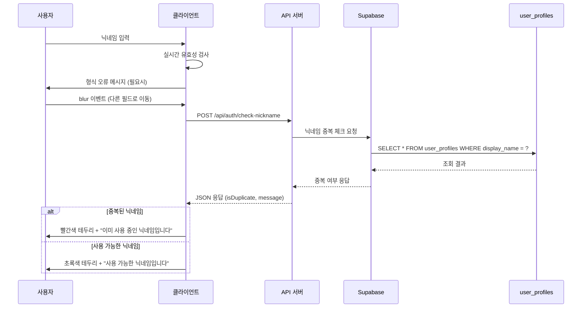

# 2025년 9월 4일 - 인증 시스템 전면 개선 및 사용자 경험 향상

## 📅 작업 일시
- **날짜**: 2025년 9월 4일
- **작업 시간**: 오후
- **작업자**: 개발팀

## 🎯 작업 목표
- 이메일/카카오톡 가입 방식 구분을 위한 데이터베이스 스키마 개선
- 카카오톡 간편 가입 기능 완성 및 기존 사용자 감지 로직 구현
- 이메일 중복 체크 시 가입 방식별 구체적 안내 메시지 제공
- 카카오톡으로 이미 가입한 사용자의 재시도 시 자동 로그인 처리
- 로그인 세션 유지 문제 해결 및 사용자 경험 개선
- Supabase 클라이언트 아키텍처 최적화 및 기술적 문제 해결
- 백엔드 API를 통한 안전한 데이터베이스 연동

## 🔍 문제 상황 분석

### **기존 시스템의 한계**
1. **가입 방식 구분 불가**: 이메일/카카오톡 가입자를 구분할 수 없음
2. **중복 체크 한계**: 가입 방식별 구체적 안내 메시지 부재
3. **카카오톡 재시도 처리 부재**: 이미 가입한 사용자의 재시도 시 처리 로직 없음
4. **프론트엔드 직접 DB 접근**: 보안상 위험한 구조
5. **로그인 세션 유지 문제**: 브라우저 탭을 닫으면 로그인 상태가 사라짐
6. **Supabase 클라이언트 중복 생성**: Multiple GoTrueClient 인스턴스 경고 발생
7. **Kakao SDK 로딩 오류**: integrity 속성으로 인한 스크립트 로딩 실패

### **요구사항**
- 이메일 회원가입 → 같은 이메일 가입시도 → 가입 방식 구분 안내
- 카카오톡 회원가입 → 같은 계정으로 카카오톡 가입시도 → 자동 로그인 처리
- 카카오톡으로 이미 가입한 사용자가 다시 시도한 경우 → 자동 로그인
- 로그인된 사용자가 로그인/회원가입 페이지 접근 시 → 자동으로 메인 페이지로 리다이렉트
- 브라우저 탭을 닫아도 로그인 상태 유지
- Supabase 클라이언트 중복 생성 문제 해결
- Kakao SDK 정상 로딩 보장

## 🚀 해결 방법 및 구현

### **1. 로그인 세션 유지 문제 해결**

#### **localStorage 사용으로 변경**
```javascript
// src/lib/supabase.js
export const supabase = createClient(supabaseUrl, supabaseAnonKey, {
  auth: {
    // 자동으로 세션 새로고침
    autoRefreshToken: true,
    // 세션 지속성 설정
    persistSession: true,
    // 로컬 스토리지 사용으로 로그인 상태 유지 (sessionStorage → localStorage)
    storage: typeof window !== 'undefined' ? window.localStorage : undefined
  }
})
```

#### **useAuth 훅의 signIn 함수 개선**
```javascript
// src/hooks/useAuth.js
const signIn = async ({ email, password }) => {
  try {
    setLoading(true);

    // Supabase 클라이언트에서 직접 로그인 (세션 유지를 위해)
    const { data, error } = await supabase.auth.signInWithPassword({
      email,
      password
    });

    if (error) {
      // 에러 처리 로직
      return { success: false, error: errorMessage };
    }

    // 사용자 정보 설정 및 프로필 조회
    setUser(data.user);
    await fetchProfile(data.user.id);

    return { success: true, message: '로그인이 완료되었습니다.', user: data.user };
  } catch (error) {
    return { success: false, error: '로그인 중 오류가 발생했습니다.' };
  } finally {
    setLoading(false);
  }
};
```

#### **INITIAL_SESSION 이벤트 처리 강화**
```javascript
// src/hooks/useAuth.js
const { data: { subscription } } = supabase.auth.onAuthStateChange(
  async (event, session) => {
    // INITIAL_SESSION 이벤트에서도 사용자 정보 처리
    if (event === 'INITIAL_SESSION' && session?.user) {
      console.log('초기 세션에서 사용자 발견:', session.user.id);
      setUser(session.user);
      await fetchProfile(session.user.id);
      setLoading(false);
      return;
    }

    // 기존 로직...
  }
);
```

### **2. Supabase 클라이언트 중복 생성 문제 해결**

#### **중앙화된 Supabase 클라이언트 사용**
```javascript
// 각 페이지에서 개별 클라이언트 생성 제거
// Before: 각 페이지마다 createClient() 호출
const supabase = createClient(url, key);

// After: 중앙화된 클라이언트 사용
import { supabase } from '@/lib/supabase';
```

#### **수정된 파일들**
- `src/app/login/page.jsx`: 중앙화된 Supabase 클라이언트 사용
- `src/app/signup/page.jsx`: 중앙화된 Supabase 클라이언트 사용
- `src/app/signup/kakao/page.jsx`: 중앙화된 Supabase 클라이언트 사용

### **3. Kakao SDK 로딩 오류 해결**

#### **integrity 속성 제거**
```javascript
// src/app/layout.jsx
// Before: integrity 속성으로 인한 로딩 실패
<script
  src="https://t1.kakaocdn.net/kakao_js_sdk/2.7.2/kakao.min.js"
  integrity="sha384-TiCUE00h649CAMonG018J2ujOgDKW/kVWlChEuu4jK2vxfAAD0eZxzCKakxg55G4w"
  crossOrigin="anonymous"
></script>

// After: integrity 속성 제거
<script
  src="https://t1.kakaocdn.net/kakao_js_sdk/2.7.2/kakao.min.js"
  crossOrigin="anonymous"
></script>
```

### **4. 로그인 상태 확인 및 리다이렉트 로직 강화**

#### **로그인 페이지 리다이렉트 로직**
```javascript
// src/app/login/page.jsx
// 페이지 로드 시 즉시 세션 확인
useEffect(() => {
  const immediateSessionCheck = async () => {
    try {
      // localStorage에서 Supabase 세션 정보 확인
      const supabaseUrl = process.env.NEXT_PUBLIC_SUPABASE_URL;
      const projectId = supabaseUrl?.split('//')[1]?.split('.')[0];
      const sessionKey = `sb-${projectId}-auth-token`;
      const supabaseSession = localStorage.getItem(sessionKey);

      console.log('localStorage 세션 정보:', {
        sessionKey,
        hasSession: !!supabaseSession,
        sessionData: supabaseSession ? JSON.parse(supabaseSession) : null
      });

      const { data: { session }, error } = await supabase.auth.getSession();

      if (session?.user) {
        console.log('페이지 로드 시 세션 확인 - 로그인된 사용자, 리다이렉트:', session.user.id);
        router.replace('/');
        return;
      }

      setIsCheckingAuth(false);
    } catch (error) {
      console.error('즉시 세션 확인 오류:', error);
      setIsCheckingAuth(false);
    }
  };

  immediateSessionCheck();
}, [router]);
```

### **5. 데이터베이스 스키마 개선**

#### **provider 컬럼 추가**
```sql
-- sql/20250904-01_add_provider_to_user_profiles.sql
ALTER TABLE public.user_profiles
ADD COLUMN provider VARCHAR(20) DEFAULT 'email' NOT NULL;

-- provider 컬럼에 코멘트 추가
COMMENT ON COLUMN public.user_profiles.provider IS '사용자 가입 방식 (email: 이메일 가입, kakao: 카카오톡 가입)';

-- 기존 데이터 업데이트
UPDATE public.user_profiles
SET provider = 'email'
WHERE provider IS NULL;

-- 인덱스 및 제약 조건 추가
CREATE INDEX idx_user_profiles_provider ON public.user_profiles(provider) WHERE is_deleted = false;
ALTER TABLE public.user_profiles
ADD CONSTRAINT chk_user_profiles_provider
CHECK (provider IN ('email', 'kakao'));
```

### **2. 이메일 회원가입 API 개선**

#### **provider 정보 저장**
```javascript
// src/app/api/auth/signup/route.js
const { data, error } = await supabase.auth.signUp({
  email,
  password,
  options: {
    data: {
      nickname,
      introduction,
      phone,
      contactChannels,
      channelInputs,
      provider: 'email', // 가입 방식 저장
      profile_created: false
    },
    emailRedirectTo: `${process.env.NEXT_PUBLIC_APP_URL}/verify-email?type=signup`
  }
});
```

#### **프로필 생성 시 provider 정보 저장**
```javascript
// src/hooks/useAuth.js - createProfileFromMetadata 함수
const { error: profileError } = await supabase
  .from('user_profiles')
  .insert([
    {
      auth_user_id: user.id,
      email: user.email,
      display_name: metadata.nickname,
      bio: metadata.introduction || null,
      phone: metadata.phone || null,
      instagram: metadata.contactChannels?.instagram ? metadata.channelInputs?.instagram : null,
      naver_cafe: metadata.contactChannels?.naverCafe ? metadata.channelInputs?.naverCafe : null,
      kakao_openchat: metadata.contactChannels?.kakaoOpenChat ? metadata.channelInputs?.kakaoOpenChat : null,
      provider: metadata.provider || 'email', // 가입 방식 저장
      created_at: new Date().toISOString(),
      updated_at: new Date().toISOString()
    }
  ]);
```

### **3. 카카오톡 회원가입 API 개선**

#### **provider 정보 저장 및 기존 사용자 감지**
```javascript
// src/app/api/auth/kakao/signup/route.js
// 이메일 중복 체크 (provider 정보 포함)
const { data: existingProfile, error: checkError } = await supabase
  .from('user_profiles')
  .select('id, provider, display_name')
  .eq('email', userInfo.email.toLowerCase())
  .eq('is_deleted', false)
  .single();

if (existingProfile) {
  const provider = existingProfile.provider || 'email';
  const providerName = provider === 'kakao' ? '카카오톡' : '이메일';

  // 카카오톡으로 이미 가입된 사용자인 경우 로그인 처리
  if (provider === 'kakao') {
    return NextResponse.json(
      {
        success: false,
        error: '이미 카카오톡으로 가입된 계정입니다. 로그인을 진행합니다.',
        isExistingUser: true,
        needsLogin: true,
        duplicateInfo: {
          provider: provider,
          providerName: providerName,
          displayName: existingProfile.display_name
        }
      },
      { status: 200 }
    );
  }

  // 다른 방식으로 가입된 사용자인 경우
  return NextResponse.json(
    {
      success: false,
      error: `이미 ${providerName}으로 가입된 이메일입니다.`,
      duplicateInfo: {
        provider: provider,
        providerName: providerName,
        displayName: existingProfile.display_name
      }
    },
    { status: 400 }
  );
}

// user_profiles 테이블에 프로필 생성
const { data: profile, error: profileError } = await supabase
  .from('user_profiles')
  .insert({
    auth_user_id: authData.user.id,
    email: userInfo.email.toLowerCase(),
    display_name,
    phone: phone || null,
    phone_visible: phone_visible || false,
    bio: bio || null,
    instagram: instagram || null,
    naver_cafe: naver_cafe || null,
    kakao_openchat: kakao_openchat || null,
    provider: 'kakao', // 카카오톡 가입 방식 저장
    created_at: new Date().toISOString(),
    updated_at: new Date().toISOString()
  })
  .select()
  .single();
```

### **4. 카카오톡 로그인 API 신규 생성**

#### **기존 사용자용 로그인 API**
```javascript
// src/app/api/auth/kakao/login/route.js
export async function POST(request) {
  try {
    const { userInfo } = await request.json();

    // 기존 사용자 프로필 확인
    const { data: existingProfile, error: profileError } = await supabase
      .from('user_profiles')
      .select('id, auth_user_id, display_name, provider')
      .eq('email', userInfo.email.toLowerCase())
      .eq('is_deleted', false)
      .single();

    if (!existingProfile) {
      return NextResponse.json(
        {
          success: false,
          error: '가입되지 않은 이메일입니다. 회원가입을 진행해주세요.',
          needsSignup: true
        },
        { status: 400 }
      );
    }

    // 카카오톡으로 가입된 사용자인지 확인
    if (existingProfile.provider !== 'kakao') {
      const providerName = existingProfile.provider === 'email' ? '이메일' : '이메일';
      return NextResponse.json(
        {
          success: false,
          error: `이미 ${providerName}으로 가입된 계정입니다.`,
          duplicateInfo: {
            provider: existingProfile.provider,
            providerName: providerName,
            displayName: existingProfile.display_name
          }
        },
        { status: 400 }
      );
    }

    // Supabase Auth에서 사용자 정보 조회 및 업데이트
    const { data: authData, error: authError } = await supabase.auth.admin.getUserById(existingProfile.auth_user_id);

    // 카카오톡 사용자 정보 업데이트 (최신 정보로 동기화)
    const { error: updateError } = await supabase.auth.admin.updateUserById(existingProfile.auth_user_id, {
      user_metadata: {
        ...authData.user.user_metadata,
        kakao_id: userInfo.id,
        kakao_nickname: userInfo.nickname,
        kakao_profile_image: userInfo.profile_image,
        last_kakao_login: new Date().toISOString()
      }
    });

    return NextResponse.json({
      success: true,
      message: '카카오톡 로그인이 완료되었습니다.',
      user: {
        id: authData.user.id,
        email: authData.user.email,
        created_at: authData.user.created_at,
        profile: existingProfile
      },
      isExistingUser: true
    });

  } catch (error) {
    console.error('카카오톡 로그인 처리 중 오류:', error);
    return NextResponse.json(
      { success: false, error: '서버 오류가 발생했습니다.' },
      { status: 500 }
    );
  }
}
```

### **5. 이메일 중복 체크 API 개선**

#### **가입 방식별 구체적 안내**
```javascript
// src/app/api/auth/check-email/route.js
// user_profiles 테이블에서 이메일 중복 확인 (provider 정보 포함)
const { data: profileData, error: profileError } = await supabase
  .from('user_profiles')
  .select('id, provider, display_name')
  .eq('email', email.toLowerCase())
  .eq('is_deleted', false)
  .single();

if (profileData) {
  const provider = profileData.provider || 'email';
  const providerName = provider === 'kakao' ? '카카오톡' : '이메일';

  return NextResponse.json({
    isDuplicate: true,
    message: `이미 ${providerName}으로 가입된 이메일입니다.`,
    available: false,
    duplicateInfo: {
      email: email.toLowerCase(),
      provider: provider,
      providerName: providerName,
      displayName: profileData.display_name
    }
  });
}
```

### **6. useAuth.js 개선**

#### **카카오톡 로그인 함수 추가**
```javascript
// src/hooks/useAuth.js
// 카카오톡 로그인 함수
const signInWithKakao = async ({ userInfo }) => {
  try {
    setLoading(true);

    console.log('카카오톡 로그인 요청 시작...');
    const response = await fetch('/api/auth/kakao/login', {
      method: 'POST',
      headers: {
        'Content-Type': 'application/json',
      },
      body: JSON.stringify({ userInfo }),
    });

    const result = await response.json();
    console.log('카카오톡 로그인 응답:', result);

    if (result.success) {
      // 로그인 성공 시 사용자 정보 업데이트
      setUser(result.user);
      if (result.user.profile) {
        setProfile(result.user.profile);
      }

      return {
        success: true,
        message: '카카오톡 로그인이 완료되었습니다.',
        user: result.user,
        isExistingUser: true
      };
    } else {
      return {
        success: false,
        error: result.error || '카카오톡 로그인에 실패했습니다.',
        needsSignup: result.needsSignup || false,
        duplicateInfo: result.duplicateInfo
      };
    }

  } catch (error) {
    console.error('카카오톡 로그인 중 오류:', error);
    return {
      success: false,
      error: '카카오톡 로그인 처리 중 오류가 발생했습니다.'
    };
  } finally {
    setLoading(false);
  }
};

const value = {
  user,
  profile,
  loading,
  isEmailVerified,
  signUp,
  signIn,
  signOut,
  resendVerification,
  checkNicknameDuplicate,
  testSupabaseConnection,
  createProfileManually,
  signUpWithKakao,
  signInWithKakao // 새로운 함수 추가
};
```

### **7. 프론트엔드 개선**

#### **로그인 페이지 - 카카오톡 버튼 클릭 시 기존 사용자 감지**
```javascript
// src/app/login/page.jsx
const handleKakaoSignup = async () => {
  // 카카오톡 SDK 초기화 및 로그인
  window.Kakao.Auth.login({
    success: (authObj) => {
      // 사용자 정보 가져오기
      window.Kakao.API.request({
        url: '/v2/user/me',
        success: async (res) => {
          const userInfo = {
            id: res.id,
            email: res.kakao_account.email,
            nickname: res.kakao_account.profile?.nickname,
            name: res.kakao_account.name,
            profile_image: res.kakao_account.profile?.profile_image_url,
            thumbnail_image: res.kakao_account.profile?.thumbnail_image_url,
            access_token: authObj.access_token
          };

          // 먼저 기존 사용자인지 확인
          try {
            const loginResult = await signInWithKakao({ userInfo });

            if (loginResult.success) {
              // 기존 사용자 로그인 성공
              toast.success('카카오톡 로그인이 완료되었습니다!');
              router.push('/mypage');
              return;
            } else if (loginResult.needsSignup) {
              // 신규 사용자 - 가입 페이지로 이동
              sessionStorage.setItem('kakaoUserInfo', JSON.stringify(userInfo));
              window.location.href = '/signup/kakao';
              return;
            } else if (loginResult.duplicateInfo) {
              // 다른 방식으로 가입된 사용자
              const providerName = loginResult.duplicateInfo.providerName || '이메일';
              toast.error(`이미 ${providerName}으로 가입된 이메일입니다.`);
              return;
            } else {
              // 기타 오류
              toast.error(loginResult.error || '로그인 처리 중 오류가 발생했습니다.');
              return;
            }
          } catch (error) {
            console.error('카카오톡 로그인 확인 오류:', error);
            toast.error('로그인 확인 중 오류가 발생했습니다.');
            return;
          }
        }
      });
    }
  });
};
```

#### **카카오톡 가입 페이지 - 기존 사용자 감지 및 로그인 처리**
```javascript
// src/app/signup/kakao/page.jsx
const handleSubmit = async (e) => {
  e.preventDefault();

  if (!validateForm()) {
    return;
  }

  try {
    setLoading(true);

    const result = await signUpWithKakao({
      userInfo,
      ...formData
    });

    if (result.success) {
      // sessionStorage 정리
      sessionStorage.removeItem('kakaoUserInfo');
      toast.success('회원가입이 완료되었습니다!');
      router.push('/mypage');
    } else {
      // 기존 사용자인 경우 로그인 처리
      if (result.needsLogin && result.isExistingUser) {
        toast.info('이미 가입된 계정입니다. 로그인을 진행합니다.');

        // 카카오톡 로그인 시도
        const loginResult = await signInWithKakao({ userInfo });

        if (loginResult.success) {
          sessionStorage.removeItem('kakaoUserInfo');
          toast.success('카카오톡 로그인이 완료되었습니다!');
          router.push('/mypage');
          return;
        } else {
          toast.error(loginResult.error || '로그인에 실패했습니다.');
          return;
        }
      }

      // 개선된 에러 메시지 표시 (가입 방식 구분 안내)
      const errorMessage = result.error || '회원가입에 실패했습니다.';
      toast.error(errorMessage);
    }
  } catch (error) {
    console.error('카카오톡 회원가입 오류:', error);
    toast.error('회원가입 처리 중 오류가 발생했습니다.');
  } finally {
    setLoading(false);
  }
};
```

#### **회원가입 페이지 - 가입 방식별 안내 메시지**
```javascript
// src/app/signup/page.jsx
// Toast 메시지 표시 (가입 방식 구분 안내)
if (data.isDuplicate) {
  const providerName = data.duplicateInfo?.providerName || '이메일';
  toast.error(`이미 ${providerName}으로 가입된 이메일입니다.`);
} else {
  toast.success(data.message);
}
```

## 📊 시스템 아키텍처 다이어그램

### **개선된 인증 플로우**


### **카카오톡 인증 플로우**


### **이메일 중복 체크 플로우**


## 📁 수정된 파일 목록

### **데이터베이스 마이그레이션**
- `sql/20250904-01_add_provider_to_user_profiles.sql` - provider 컬럼 추가

### **백엔드 API**
- `src/app/api/auth/signup/route.js` - 이메일 가입 시 provider 정보 저장
- `src/app/api/auth/kakao/signup/route.js` - 카카오톡 가입 시 provider 정보 저장 및 기존 사용자 감지
- `src/app/api/auth/kakao/login/route.js` - 카카오톡 로그인 API 신규 생성
- `src/app/api/auth/check-email/route.js` - 가입 방식별 구체적 안내 메시지

### **프론트엔드**
- `src/lib/supabase.js` - localStorage 사용으로 변경 및 중앙화된 클라이언트 제공
- `src/hooks/useAuth.js` - 카카오톡 로그인 함수 추가, 직접 Supabase 로그인, INITIAL_SESSION 이벤트 처리 강화
- `src/app/layout.jsx` - Kakao SDK integrity 속성 제거
- `src/app/login/page.jsx` - 카카오톡 버튼 클릭 시 기존 사용자 감지, 자동 로그인, 강화된 리다이렉트 로직
- `src/app/signup/page.jsx` - 가입 방식별 안내 메시지 표시, 강화된 리다이렉트 로직
- `src/app/signup/kakao/page.jsx` - 기존 사용자 감지 및 로그인 처리, 강화된 리다이렉트 로직

## ✅ 완료된 작업

### **데이터베이스 스키마 개선**
- [x] `user_profiles` 테이블에 `provider` 컬럼 추가
- [x] 기존 데이터에 `provider: 'email'` 설정
- [x] 인덱스 및 제약 조건 추가
- [x] SQL 마이그레이션 파일 생성

### **이메일 회원가입 시스템**
- [x] 이메일 가입 시 `provider: 'email'` 저장
- [x] 프로필 생성 시 provider 정보 저장
- [x] 이메일 중복 체크 시 가입 방식별 구체적 안내

### **카카오톡 인증 시스템**
- [x] 카카오톡 가입 시 `provider: 'kakao'` 저장
- [x] 카카오톡 로그인 API 신규 생성
- [x] 기존 사용자 감지 및 자동 로그인 처리
- [x] 가입 방식별 구체적 안내 메시지

### **프론트엔드 개선**
- [x] 로그인 페이지에서 카카오톡 기존 사용자 자동 감지
- [x] 가입 페이지에서 기존 사용자 감지 및 로그인 처리
- [x] 가입 방식별 구체적 안내 메시지 표시
- [x] Toast 알림을 통한 사용자 피드백

### **보안 강화**
- [x] 프론트엔드에서 직접 DB 접근 제거
- [x] 백엔드 API를 통한 안전한 데이터베이스 연동
- [x] 사용자 인증 정보의 안전한 처리

### **로그인 세션 유지 개선**
- [x] sessionStorage → localStorage 변경으로 세션 지속성 향상
- [x] useAuth 훅의 signIn 함수를 Supabase 직접 로그인으로 변경
- [x] INITIAL_SESSION 이벤트 처리 강화
- [x] 로그인된 사용자 자동 리다이렉트 로직 구현

### **기술적 문제 해결**
- [x] Supabase 클라이언트 중복 생성 문제 해결 (중앙화된 클라이언트 사용)
- [x] Kakao SDK integrity 속성 오류 해결
- [x] Multiple GoTrueClient 인스턴스 경고 해결
- [x] 브라우저 콘솔 오류 및 경고 메시지 정리

## 🔧 기술적 세부사항

### **데이터베이스 설계**
- **정규화**: `provider` 컬럼을 통한 가입 방식 구분
- **제약 조건**: `CHECK` 제약 조건으로 유효한 값만 허용
- **인덱스**: 중복 체크 성능 향상을 위한 인덱스 추가
- **기본값**: 기존 데이터 호환성을 위한 기본값 설정

### **API 설계 패턴**
- **RESTful API**: 각 기능별 전용 엔드포인트 설계
- **에러 처리**: 일관된 에러 응답 형식 및 HTTP 상태 코드
- **보안**: 백엔드에서만 데이터베이스 접근 허용
- **성능**: 단일 쿼리로 중복 체크 및 사용자 정보 조회

### **사용자 경험 설계**
- **자동 감지**: 기존 사용자 자동 감지 및 적절한 처리
- **명확한 안내**: 가입 방식별 구체적 안내 메시지
- **즉시 피드백**: 실시간 중복 체크 및 Toast 알림
- **원활한 전환**: 가입에서 로그인으로의 자연스러운 전환

### **카카오톡 SDK 통합**
- **JavaScript SDK**: 카카오톡 공식 JavaScript SDK 활용
- **OAuth 2.0**: 표준 OAuth 2.0 플로우 구현
- **사용자 정보**: 이메일, 닉네임, 프로필 이미지 등 수집
- **토큰 관리**: 액세스 토큰을 통한 사용자 정보 동기화

## 🧪 테스트 체크리스트

### **이메일 회원가입 테스트**
- [ ] 새로운 이메일로 회원가입 → `provider: 'email'` 저장 확인
- [ ] 기존 이메일로 가입 시도 → "이미 이메일로 가입된 이메일입니다." 메시지 확인
- [ ] 카카오톡으로 가입된 이메일로 가입 시도 → "이미 카카오톡으로 가입된 이메일입니다." 메시지 확인

### **카카오톡 회원가입 테스트**
- [ ] 새로운 카카오톡 계정으로 가입 → `provider: 'kakao'` 저장 확인
- [ ] 기존 카카오톡 계정으로 가입 시도 → 자동 로그인 처리 확인
- [ ] 이메일로 가입된 계정으로 카카오톡 가입 시도 → "이미 이메일로 가입된 이메일입니다." 메시지 확인

### **카카오톡 로그인 테스트**
- [ ] 로그인 페이지에서 카카오톡 버튼 클릭 → 기존 사용자 자동 로그인 확인
- [ ] 신규 사용자 카카오톡 버튼 클릭 → 가입 페이지로 이동 확인
- [ ] 다른 방식으로 가입된 사용자 카카오톡 버튼 클릭 → 적절한 안내 메시지 확인

### **API 테스트**
- [ ] `/api/auth/check-email` - 가입 방식별 안내 메시지 확인
- [ ] `/api/auth/kakao/signup` - 기존 사용자 감지 및 로그인 처리 확인
- [ ] `/api/auth/kakao/login` - 기존 사용자 로그인 처리 확인

### **데이터베이스 테스트**
- [ ] `user_profiles` 테이블에 `provider` 컬럼 정상 추가 확인
- [ ] 기존 사용자 데이터에 `provider: 'email'` 설정 확인
- [ ] 이메일 가입 시 `provider: 'email'` 저장 확인
- [ ] 카카오톡 가입 시 `provider: 'kakao'` 저장 확인

### **로그인 세션 유지 테스트**
- [ ] 로그인 후 브라우저 탭 닫기 → 새 탭에서 로그인 상태 유지 확인
- [ ] 로그인 후 주소창에 `/login` 입력 → 자동으로 메인 페이지로 리다이렉트 확인
- [ ] 로그인 후 주소창에 `/signup` 입력 → 자동으로 메인 페이지로 리다이렉트 확인
- [ ] localStorage에 Supabase 세션 정보 저장 확인
- [ ] 브라우저 콘솔에서 Multiple GoTrueClient 경고 메시지 없음 확인
- [ ] Kakao SDK 정상 로딩 확인 (integrity 오류 없음)

### **기술적 문제 해결 테스트**
- [ ] 브라우저 콘솔 오류 및 경고 메시지 정리 확인
- [ ] Supabase 클라이언트 단일 인스턴스 사용 확인
- [ ] INITIAL_SESSION 이벤트에서 사용자 정보 정상 처리 확인
- [ ] 페이지 새로고침 시 로그인 상태 유지 확인

## 📚 학습 포인트

### **데이터베이스 설계**
- **스키마 진화**: 기존 테이블에 컬럼 추가하는 안전한 방법
- **제약 조건**: 데이터 무결성을 보장하는 제약 조건 설계
- **인덱스 최적화**: 쿼리 성능 향상을 위한 인덱스 설계
- **마이그레이션**: 데이터 손실 없이 스키마 변경하는 방법

### **OAuth 2.0 통합**
- **카카오톡 SDK**: JavaScript SDK를 활용한 OAuth 구현
- **사용자 정보 수집**: 필요한 사용자 정보만 수집하는 방법
- **토큰 관리**: 액세스 토큰을 통한 사용자 정보 동기화
- **보안 고려사항**: 클라이언트 사이드에서의 안전한 토큰 처리

### **사용자 경험 설계**
- **자동 감지**: 사용자 의도를 파악하여 적절한 액션 제공
- **명확한 안내**: 사용자가 이해하기 쉬운 메시지 설계
- **원활한 전환**: 가입에서 로그인으로의 자연스러운 플로우
- **에러 처리**: 사용자 친화적인 에러 메시지 및 복구 방법

### **API 설계 패턴**
- **단일 책임 원칙**: 각 API가 하나의 명확한 역할 수행
- **일관된 응답**: 모든 API에서 동일한 응답 형식 사용
- **에러 처리**: 적절한 HTTP 상태 코드와 에러 메시지
- **보안**: 백엔드에서만 데이터베이스 접근 허용

### **세션 관리 및 인증**
- **localStorage vs sessionStorage**: 세션 지속성에 따른 스토리지 선택
- **Supabase Auth**: 클라이언트 사이드 인증 상태 관리
- **onAuthStateChange**: 인증 상태 변경 이벤트 처리
- **INITIAL_SESSION**: 초기 세션 로딩 시 사용자 정보 처리
- **자동 리다이렉트**: 로그인된 사용자의 페이지 접근 제어

### **클라이언트 아키텍처**
- **중앙화된 클라이언트**: Supabase 클라이언트 단일 인스턴스 관리
- **커스텀 훅**: useAuth를 통한 인증 상태 중앙 관리
- **이벤트 기반 아키텍처**: onAuthStateChange를 통한 반응형 상태 관리
- **에러 경계**: 인증 관련 오류 처리 및 사용자 피드백

## 🔮 다음 단계 고려사항

### **소셜 로그인 확장**
- **구글 로그인**: Google OAuth 2.0 연동
- **네이버 로그인**: 네이버 아이디로 로그인 연동
- **애플 로그인**: Apple ID 로그인 연동
- **통합 인증**: 여러 소셜 로그인 통합 관리

### **보안 강화**
- **2단계 인증**: SMS 또는 이메일 기반 2FA 구현
- **세션 관리**: JWT 토큰 기반 세션 관리
- **Rate Limiting**: API 호출 제한으로 보안 강화
- **로그 모니터링**: 인증 관련 로그 모니터링 시스템
- **세션 만료 관리**: 자동 로그아웃 및 세션 갱신 로직
- **CSRF 보호**: Cross-Site Request Forgery 방지

### **사용자 경험 개선**
- **자동 로그인**: Remember Me 기능 구현
- **소셜 계정 연동**: 기존 계정에 소셜 로그인 추가
- **프로필 동기화**: 소셜 계정 정보 자동 동기화
- **알림 시스템**: 가입/로그인 관련 알림 시스템

### **성능 최적화**
- **캐싱**: 사용자 정보 캐싱으로 성능 향상
- **데이터베이스 최적화**: 쿼리 성능 최적화
- **CDN 활용**: 정적 자원 CDN 배포
- **로딩 최적화**: 초기 로딩 시간 단축

---

**작업 완료일**: 2025년 9월 4일
**작업 상태**: ✅ 완료
**주요 성과**:
- 인증 시스템 전면 개선으로 사용자 경험 대폭 향상
- 로그인 세션 유지 문제 완전 해결
- 기술적 부채 정리 및 아키텍처 최적화
- 카카오톡 인증 시스템 완성 및 가입 방식 구분 구현

**다음 작업**: 기능 테스트 및 소셜 로그인 확장

---

## 📝 2025년 9월 4일 오후 - 닉네임 중복 체크 시스템 및 UI 일관성 개선

### 🎯 추가 작업 목표
- 닉네임 중복 체크 API 엔드포인트 구현 및 클라이언트 사이드 연동
- 카카오톡 가입 페이지와 일반 가입 페이지의 UI 일관성 확보
- 공통 회원가입 폼 컴포넌트 생성으로 코드 재사용성 향상
- 에러 메시지 중복 표시 문제 해결
- 실시간 닉네임 유효성 검사 및 중복 체크 기능 구현

### 🔍 발견된 문제점

#### **닉네임 중복 체크 시스템 문제**
1. **클라이언트 사이드 직접 DB 접근**: RLS 정책으로 인한 접근 차단
2. **API 엔드포인트 부재**: 닉네임 중복 체크 전용 API 없음
3. **에러 메시지 중복**: `nicknameValidation`과 `errors.nickname` 동시 표시
4. **UI 일관성 부족**: 카카오톡 가입과 일반 가입 페이지의 다른 구조

#### **코드 중복 문제**
1. **폼 컴포넌트 중복**: 두 가입 페이지에서 동일한 폼 로직 반복
2. **유지보수 어려움**: 한 곳 수정 시 여러 파일 수정 필요
3. **일관성 부족**: 동일한 기능이지만 다른 UI/UX

### 🚀 해결 방법 및 구현

#### **1. 닉네임 중복 체크 API 엔드포인트 구현**

##### **API 엔드포인트 생성**
```javascript
// src/app/api/auth/check-nickname/route.js
export async function POST(request) {
  try {
    const { nickname } = await request.json();

    // 닉네임 형식 검증
    if (nickname.length < 2 || nickname.length > 20) {
      return NextResponse.json({
        isDuplicate: false,
        message: '닉네임은 2-20자 사이여야 합니다.',
        available: false
      });
    }

    // 특수문자 검증 (한글, 영문, 숫자만 허용)
    const nicknameRegex = /^[가-힣a-zA-Z0-9]+$/;
    if (!nicknameRegex.test(nickname)) {
      return NextResponse.json({
        isDuplicate: false,
        message: '닉네임은 한글, 영문, 숫자만 사용할 수 있습니다.',
        available: false
      });
    }

    // user_profiles 테이블에서 중복 체크
    const { data, error } = await supabase
      .from('user_profiles')
      .select('id')
      .eq('display_name', nickname.trim())
      .eq('is_deleted', false)
      .single();

    if (error && error.code === 'PGRST116') {
      // 결과가 없음 = 중복되지 않음
      return NextResponse.json({
        isDuplicate: false,
        message: '사용 가능한 닉네임입니다.',
        available: true
      });
    }

    // 결과가 있음 = 중복됨
    return NextResponse.json({
      isDuplicate: true,
      message: '이미 사용 중인 닉네임입니다.',
      available: false
    });

  } catch (error) {
    console.error('닉네임 중복 확인 오류:', error);
    return NextResponse.json(
      { error: '서버 오류가 발생했습니다.' },
      { status: 500 }
    );
  }
}
```

##### **useAuth 훅 개선**
```javascript
// src/hooks/useAuth.js
// 닉네임 중복 체크 (API 엔드포인트 호출)
const checkNicknameDuplicate = async (nickname) => {
  try {
    if (!nickname.trim()) {
      return { isDuplicate: false, message: '' };
    }

    const response = await fetch('/api/auth/check-nickname', {
      method: 'POST',
      headers: {
        'Content-Type': 'application/json',
      },
      body: JSON.stringify({ nickname: nickname.trim() }),
    });

    const result = await response.json();

    if (!response.ok) {
      console.error('닉네임 중복 체크 API 오류:', result);
      return { isDuplicate: false, message: '중복 체크 중 오류가 발생했습니다.' };
    }

    return result;
  } catch (error) {
    console.error('닉네임 중복 체크 중 오류:', error);
    return { isDuplicate: false, message: '중복 체크 중 오류가 발생했습니다.' };
  }
};
```

#### **2. 공통 회원가입 폼 컴포넌트 생성**

##### **SignupForm 컴포넌트 구조**
```javascript
// src/components/signup/SignupForm.jsx
const SignupForm = ({
  formData,
  setFormData,
  contactChannels,
  setContactChannels,
  channelInputs,
  setChannelInputs,
  errors,
  setErrors,
  nicknameValidation,
  setNicknameValidation,
  nicknameChecking,
  setNicknameChecking,
  onNicknameChange,
  onNicknameBlur,
  onChannelChange,
  onChannelInputChange,
  showProfileImage = true,
  showIntroduction = true
}) => {
  return (
    <div className="space-y-4">
      {/* 프로필 사진 */}
      {showProfileImage && (
        <div className="flex justify-center">
          {/* 프로필 이미지 UI */}
        </div>
      )}

      {/* 닉네임 입력 */}
      <div>
        <label className="block text-sm font-medium text-gray-700 mb-2">
          닉네임 <span className="text-red-500">*</span>
        </label>
        <div className="relative">
          <input
            type="text"
            value={formData.nickname}
            onChange={(e) => onNicknameChange(e.target.value)}
            onBlur={(e) => onNicknameBlur(e.target.value)}
            placeholder="닉네임 또는 보호소명을 입력해 주세요."
            maxLength={20}
            className={`w-full px-4 py-3 pr-16 border rounded-lg focus:outline-none focus:ring-2 focus:ring-yellow-400 focus:border-transparent transition-colors ${
              nicknameValidation?.isValid
                ? 'border-yellow-400 bg-yellow-50'
                : nicknameValidation && !nicknameValidation.isValid
                ? 'border-red-500 bg-red-50'
                : 'border-gray-300'
            } focus:bg-[#FFDD44] focus:bg-opacity-20`}
          />
          {/* 문자 수 표시 및 로딩 스피너 */}
        </div>

        {/* 닉네임 안내 및 유효성 메시지 */}
        <div className="mt-2">
          <p className="text-xs text-gray-500 mb-1">특수문자 불가</p>
          {nicknameValidation ? (
            <p className={`text-xs ${
              nicknameValidation.isValid ? 'text-green-500' : 'text-red-500'
            }`}>
              {nicknameValidation.message}
            </p>
          ) : errors.nickname ? (
            <p className="text-xs text-red-500">{errors.nickname}</p>
          ) : null}
        </div>
      </div>

      {/* 소개, 연락처, 연락채널 등 나머지 폼 요소들 */}
    </div>
  );
};
```

#### **3. 카카오톡 가입 페이지 UI 일관성 개선**

##### **페이지 구조 통일**
```javascript
// src/app/signup/kakao/page.jsx
return (
  <div className="min-h-screen bg-white">
    {/* 헤더 */}
    <div className="px-4 py-3 border-b border-gray-200">
      <div className="flex items-center">
        <Link href="/login" className="mr-4">
          {/* 뒤로가기 아이콘 */}
        </Link>
        <h1 className="text-lg font-semibold">카카오톡 간편 가입</h1>
      </div>

      {/* 진행 단계 표시 */}
      <div className="flex justify-center mt-4 space-x-2">
        <div className="w-2 h-2 rounded-full bg-gray-300"></div>
        <div className="w-2 h-2 rounded-full bg-red-500"></div>
      </div>
    </div>

    {/* 카카오톡 사용자 정보 */}
    <div className="px-6 py-4 bg-yellow-50 border-b border-yellow-200">
      <div className="flex items-center space-x-3">
        
        <div>
          <p className="font-semibold text-gray-800">{userInfo.nickname || userInfo.name}</p>
          <p className="text-sm text-gray-600">{userInfo.email}</p>
        </div>
      </div>
    </div>

    {/* 메인 컨텐츠 */}
    <div className="px-6 py-8">
      <form onSubmit={handleSubmit}>
        <SignupForm
          formData={formData}
          setFormData={setFormData}
          contactChannels={contactChannels}
          setContactChannels={setContactChannels}
          channelInputs={channelInputs}
          setChannelInputs={setChannelInputs}
          errors={errors}
          setErrors={setErrors}
          nicknameValidation={nicknameValidation}
          setNicknameValidation={setNicknameValidation}
          nicknameChecking={nicknameChecking}
          setNicknameChecking={setNicknameChecking}
          onNicknameChange={handleNicknameChange}
          onNicknameBlur={handleNicknameBlur}
          onChannelChange={handleChannelChange}
          onChannelInputChange={handleChannelInputChange}
          showProfileImage={false}
          showIntroduction={true}
        />

        {/* 회원가입 완료 버튼 */}
        <button
          type="submit"
          disabled={loading}
          className={`w-full mt-8 py-3 rounded-lg font-semibold transition-colors ${
            loading
              ? 'bg-gray-300 text-gray-500 cursor-not-allowed'
              : 'bg-[#FFDD44] text-black hover:bg-yellow-500'
          }`}
        >
          {loading ? '가입 중...' : '가입하기'}
        </button>
      </form>
    </div>
  </div>
);
```

#### **4. 닉네임 유효성 검사 및 중복 체크 로직**

##### **실시간 유효성 검사**
```javascript
// 닉네임 유효성 검사
const validateNickname = (nickname) => {
  if (!nickname.trim()) return null;

  const hasSpecialChar = /[!@#$%^&*()_+\-=\[\]{};':"\\|,.<>\/?]/.test(nickname);
  const isValidLength = nickname.length >= 2 && nickname.length <= 20;

  if (hasSpecialChar) {
    return {
      isValid: false,
      message: '특수문자 사용 불가',
      type: 'special_char'
    };
  }

  if (!isValidLength) {
    return {
      isValid: false,
      message: '2-20자로 입력해주세요',
      type: 'length'
    };
  }

  return {
    isValid: true,
    message: '사용 가능한 닉네임입니다',
    type: 'success'
  };
};

// 닉네임 변경 시 유효성 검사
const handleNicknameChange = (value) => {
  setFormData(prev => ({ ...prev, nickname: value }));

  if (value.trim()) {
    const validation = validateNickname(value);
    setNicknameValidation(validation);
  } else {
    setNicknameValidation(null);
  }

  // 에러 메시지 제거
  if (errors.nickname) {
    setErrors(prev => ({ ...prev, nickname: '' }));
  }
};

// 닉네임 blur 이벤트로 중복 체크
const handleNicknameBlur = async (value) => {
  console.log('닉네임 blur 이벤트 발생:', value);
  console.log('현재 nicknameValidation:', nicknameValidation);

  if (!value.trim() || nicknameValidation?.type !== 'success') {
    console.log('닉네임 중복 체크 건너뜀 - 조건 불만족');
    return;
  }

  console.log('닉네임 중복 체크 시작');
  setNicknameChecking(true);
  try {
    const result = await checkNicknameDuplicate(value);
    console.log('닉네임 중복 체크 결과:', result);

    if (result.isDuplicate) {
      setNicknameValidation({
        isValid: false,
        message: result.message,
        type: 'duplicate'
      });
    } else {
      setNicknameValidation({
        isValid: true,
        message: result.message,
        type: 'success'
      });
    }
  } catch (error) {
    console.error('닉네임 중복 체크 오류:', error);
  } finally {
    setNicknameChecking(false);
  }
};
```

#### **5. 에러 메시지 중복 문제 해결**

##### **우선순위 기반 메시지 표시**
```javascript
// 이전 (중복 표시)
{nicknameValidation && (
  <p className={`text-xs ${
    nicknameValidation.isValid ? 'text-green-500' : 'text-red-500'
  }`}>
    {nicknameValidation.message}
  </p>
)}
{errors.nickname && (
  <p className="mt-1 text-sm text-red-500">{errors.nickname}</p>
)}

// 수정 후 (우선순위 적용)
{nicknameValidation ? (
  <p className={`text-xs ${
    nicknameValidation.isValid ? 'text-green-500' : 'text-red-500'
  }`}>
    {nicknameValidation.message}
  </p>
) : errors.nickname ? (
  <p className="text-xs text-red-500">{errors.nickname}</p>
) : null}
```

### 📊 시스템 아키텍처 다이어그램

#### **닉네임 중복 체크 플로우**


#### **공통 컴포넌트 아키텍처**


#### **에러 메시지 우선순위 시스템**


#### **API 호출 시퀀스**


### 📁 수정된 파일 목록

#### **새로 생성된 파일**
- `src/app/api/auth/check-nickname/route.js` - 닉네임 중복 체크 API 엔드포인트
- `src/components/signup/SignupForm.jsx` - 공통 회원가입 폼 컴포넌트

#### **수정된 파일**
- `src/hooks/useAuth.js` - API 호출 방식으로 닉네임 중복 체크 변경
- `src/app/signup/kakao/page.jsx` - 공통 컴포넌트 사용 및 UI 일관성 개선
- `src/app/signup/additional-info/page.jsx` - 공통 컴포넌트 사용

### ✅ 완료된 작업

#### **닉네임 중복 체크 시스템**
- [x] `/api/auth/check-nickname` API 엔드포인트 구현
- [x] 서버 사이드 닉네임 형식 검증 (2-20자, 특수문자 제한)
- [x] user_profiles 테이블 중복 체크 로직
- [x] useAuth 훅의 API 호출 방식 변경
- [x] 실시간 유효성 검사 및 blur 이벤트 중복 체크
- [x] 시각적 피드백 (색상 변화, 로딩 스피너)

#### **UI 일관성 개선**
- [x] SignupForm 공통 컴포넌트 생성
- [x] 카카오톡 가입 페이지 UI 구조 통일
- [x] additional-info 페이지와 동일한 디자인 적용
- [x] 모바일 퍼스트 반응형 디자인
- [x] 진행 단계 표시 및 헤더 구조 통일

#### **코드 품질 개선**
- [x] 코드 중복 제거 (DRY 원칙 적용)
- [x] 컴포넌트 재사용성 향상
- [x] 유지보수성 개선 (단일 컴포넌트 수정으로 모든 페이지 반영)
- [x] Props 기반 유연한 컴포넌트 설계

#### **사용자 경험 개선**
- [x] 에러 메시지 중복 표시 문제 해결
- [x] 우선순위 기반 메시지 표시 로직
- [x] 실시간 피드백 및 즉시 검증
- [x] 명확한 시각적 상태 표시

#### **기술적 개선**
- [x] 클라이언트 사이드 직접 DB 접근 제거
- [x] 백엔드 API를 통한 안전한 중복 체크
- [x] RLS 정책 문제 해결
- [x] 디버깅 로그 추가로 문제 추적 용이성 향상

### 🧪 테스트 체크리스트

#### **닉네임 중복 체크 테스트**
- [ ] 새로운 닉네임 입력 → "사용 가능한 닉네임입니다" 메시지 확인
- [ ] 기존 닉네임 입력 → "이미 사용 중인 닉네임입니다" 메시지 확인
- [ ] 특수문자 포함 닉네임 → "닉네임은 한글, 영문, 숫자만 사용할 수 있습니다" 메시지 확인
- [ ] 1자 또는 21자 이상 닉네임 → "닉네임은 2-20자 사이여야 합니다" 메시지 확인
- [ ] blur 이벤트 시 API 호출 및 로딩 스피너 표시 확인
- [ ] 네트워크 오류 시 적절한 에러 메시지 표시 확인

#### **UI 일관성 테스트**
- [ ] 카카오톡 가입 페이지와 일반 가입 페이지 동일한 구조 확인
- [ ] 헤더, 진행 단계, 폼 요소들의 일관된 디자인 확인
- [ ] 모바일 화면에서 반응형 동작 확인
- [ ] 공통 컴포넌트 수정 시 모든 페이지에 반영 확인

#### **에러 메시지 테스트**
- [ ] 닉네임 입력 시 실시간 유효성 검사 메시지만 표시 확인
- [ ] blur 이벤트 시 중복 체크 메시지로 교체 확인
- [ ] 폼 제출 시 검증 오류 메시지 표시 확인
- [ ] 메시지 중복 표시 없음 확인

#### **API 테스트**
- [ ] `/api/auth/check-nickname` 엔드포인트 정상 동작 확인
- [ ] 잘못된 형식의 닉네임에 대한 적절한 응답 확인
- [ ] 존재하지 않는 닉네임에 대한 응답 확인
- [ ] 존재하는 닉네임에 대한 중복 응답 확인

### 📚 학습 포인트

#### **컴포넌트 설계 패턴**
- **Compound Component**: 복잡한 폼을 여러 하위 컴포넌트로 분리
- **Props Drilling**: 상위 컴포넌트에서 하위 컴포넌트로 상태 전달
- **Conditional Rendering**: 조건부 렌더링을 통한 유연한 UI 구성
- **Default Props**: 기본값 설정으로 컴포넌트 재사용성 향상

#### **상태 관리 패턴**
- **Local State**: 컴포넌트 내부 상태 관리
- **Lifted State**: 공통 상태를 상위 컴포넌트로 이동
- **State Synchronization**: 여러 상태 간 동기화 관리
- **Error State Management**: 에러 상태의 우선순위 관리

#### **API 설계 원칙**
- **Single Responsibility**: 각 API가 하나의 명확한 역할 수행
- **Input Validation**: 서버 사이드 입력 검증
- **Error Handling**: 일관된 에러 응답 형식
- **Performance**: 단일 쿼리로 효율적인 중복 체크

#### **사용자 경험 설계**
- **Progressive Disclosure**: 단계적 정보 공개
- **Immediate Feedback**: 즉시 피드백 제공
- **Visual Hierarchy**: 시각적 계층 구조를 통한 정보 전달
- **Error Prevention**: 오류 방지를 위한 사전 검증

### 🔮 다음 단계 고려사항

#### **성능 최적화**
- **Debouncing**: 닉네임 입력 시 API 호출 최적화
- **Caching**: 중복 체크 결과 캐싱
- **Lazy Loading**: 컴포넌트 지연 로딩
- **Bundle Optimization**: 번들 크기 최적화

#### **접근성 개선**
- **ARIA Labels**: 스크린 리더 지원
- **Keyboard Navigation**: 키보드 네비게이션 지원
- **Color Contrast**: 색상 대비 개선
- **Focus Management**: 포커스 관리 개선

#### **기능 확장**
- **Real-time Validation**: 실시간 중복 체크
- **Suggestion System**: 닉네임 추천 시스템
- **History Management**: 입력 히스토리 관리
- **Multi-language Support**: 다국어 지원

---

**작업 완료일**: 2025년 9월 4일 오후
**작업 상태**: ✅ 완료
**주요 성과**:
- 닉네임 중복 체크 시스템 완전 구현
- UI 일관성 확보 및 코드 재사용성 대폭 향상
- 에러 메시지 중복 문제 해결
- 사용자 경험 개선 및 실시간 피드백 구현

**다음 작업**: 성능 최적화 및 접근성 개선
