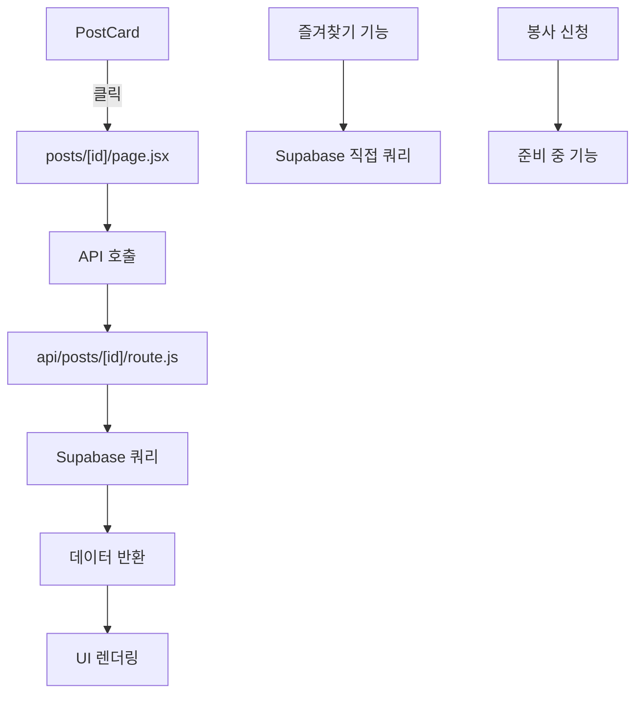
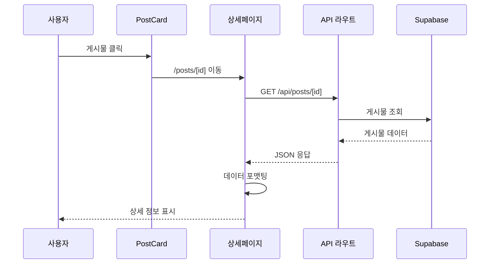
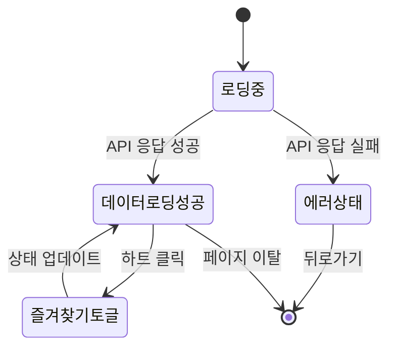

# 2025년 9월 9일 - 봉사활동 상세보기 기능 구현 및 API 최적화

## 작업 개요

봉사활동 상세보기 페이지 구현과 API 라우트 최적화를 통해 사용자가 개별 게시물의 상세 정보를 확인할 수 있는 기능을 완성했습니다. 또한 Supabase 클라이언트 통합을 통해 보안과 일관성을 강화했습니다.

## 주요 작업 내용

### 1. 봉사활동 상세보기 페이지 구현

#### 1.1 동적 라우트 페이지 생성
- **파일**: `src/app/posts/[id]/page.jsx`
- **기능**: 게시물 ID를 통한 동적 라우팅으로 개별 게시물 상세 정보 표시
- **구현 내용**:
  - 게시물 기본 정보 (제목, 마감일, D-day)
  - 강아지 정보 (이름, 품종, 크기)
  - 이동 경로 (출발지/도착지)
  - 상세 설명
  - 작성자 정보
  - 즐겨찾기 기능

#### 1.2 반응형 UI 디자인
- **모바일 우선 설계**: Tailwind CSS를 활용한 반응형 레이아웃
- **사용자 경험 최적화**:
  - 로딩 상태 표시
  - 에러 처리 및 사용자 피드백
  - 스티키 액션 버튼 (봉사 신청, 즐겨찾기)
  - 뒤로 가기 네비게이션

#### 1.3 데이터 포맷팅 및 표시
- **날짜 처리**: moment.js를 활용한 D-day 계산 및 포맷팅
- **강아지 크기 변환**: 영어 → 한국어 (small → 소형견)
- **긴급 표시**: 마감일 1일 이내 게시물에 대한 긴급 배지

### 2. API 라우트 최적화

#### 2.1 기존 API 라우트 활용
- **파일**: `src/app/api/posts/[id]/route.js`
- **개선 사항**:
  - Next.js 15 호환성 수정 (`await params` 적용)
  - 불필요한 테이블 조인 제거 (shelters 테이블)
  - 에러 로깅 강화

#### 2.2 클라이언트-서버 분리
- **Before**: 클라이언트에서 직접 Supabase 쿼리 실행
- **After**: API 라우트를 통한 서버사이드 데이터 조회
- **장점**:
  - 보안 강화 (클라이언트 직접 DB 접근 방지)
  - 데이터 일관성 보장
  - 성능 최적화
  - 확장성 향상

### 3. Supabase 클라이언트 통합 및 보안 강화

#### 3.1 중앙화된 클라이언트 관리
- **파일**: `src/lib/supabase.js`
- **구현 내용**:
  - `createServerSupabaseClient`: 사용자 토큰 기반 클라이언트
  - `createAdminSupabaseClient`: 관리자 기능용 클라이언트
  - 사용자 인증 정보 보존을 위한 anon key 사용

#### 3.2 API 라우트 통합
- **수정된 파일들**:
  - `src/app/api/posts/volunteer/route.js`
  - `src/app/api/auth/login/route.js`
  - `src/app/api/auth/signup/route.js`
  - `src/app/api/auth/kakao/login/route.js`
  - `src/app/api/auth/kakao/signup/route.js`
  - `src/app/api/auth/check-email/route.js`
  - `src/app/api/auth/check-nickname/route.js`

#### 3.3 보안 개선사항
- **사용자 토큰 기반 인증**: 서비스 롤 키 대신 사용자 토큰 사용
- **권한 분리**: 일반 기능과 관리자 기능 분리
- **인증 정보 보존**: 사용자 세션 정보 유지

### 4. 데이터베이스 스키마 최적화

#### 4.1 필드 검증 및 정리
- **제거된 필드**: 존재하지 않는 `gender` 필드 제거
- **유효한 필드만 표시**:
  - `dog_name` (강아지 이름)
  - `breed` (품종)
  - `dog_size` (크기)

#### 4.2 관계형 데이터 처리
- **user_profiles 조인**: 작성자 정보 표시
- **shelters 테이블**: 관계 미설정으로 인한 조인 제거
- **에러 처리**: 존재하지 않는 관계에 대한 안전한 처리

## 기술적 구현 세부사항

### 1. 컴포넌트 아키텍처

### 2. 데이터 플로우

### 3. 상태 관리

## 사용자 경험 개선사항

### 1. 시각적 피드백
- **로딩 상태**: 스피너와 메시지로 로딩 진행 상황 표시
- **에러 처리**: 명확한 에러 메시지와 해결 방안 제시
- **긴급 표시**: 마감 임박 게시물에 대한 시각적 강조

### 2. 인터랙션 개선
- **즐겨찾기**: 실시간 상태 업데이트
- **네비게이션**: 직관적인 뒤로 가기 버튼
- **액션 버튼**: 고정된 하단 액션 영역

### 3. 반응형 디자인
- **모바일 최적화**: 터치 친화적 인터페이스
- **그리드 레이아웃**: 화면 크기에 따른 적응형 레이아웃
- **타이포그래피**: 가독성 최적화된 텍스트 크기

## 성능 최적화

### 1. API 최적화
- **서버사이드 처리**: 클라이언트 부하 감소
- **필요한 데이터만 조회**: 불필요한 필드 제외
- **에러 처리**: 빠른 실패와 명확한 피드백

### 2. 클라이언트 최적화
- **조건부 렌더링**: 필요한 컴포넌트만 렌더링
- **메모이제이션**: 불필요한 리렌더링 방지
- **지연 로딩**: 이미지 및 무거운 컴포넌트 최적화

## 보안 강화

### 1. 인증 및 권한
- **토큰 기반 인증**: 사용자 세션 유지
- **권한 분리**: 일반 사용자와 관리자 기능 분리
- **데이터 검증**: 서버사이드 데이터 유효성 검사

### 2. 데이터 보호
- **직접 DB 접근 방지**: API를 통한 안전한 데이터 접근
- **SQL 인젝션 방지**: 파라미터화된 쿼리 사용
- **에러 정보 제한**: 민감한 정보 노출 방지

## 테스트 및 검증

### 1. 기능 테스트
- **게시물 조회**: 다양한 ID로 게시물 조회 테스트
- **에러 처리**: 존재하지 않는 게시물 처리
- **즐겨찾기**: 추가/제거 기능 테스트

### 2. 성능 테스트
- **로딩 시간**: API 응답 시간 측정
- **메모리 사용량**: 클라이언트 메모리 최적화 확인
- **반응성**: 사용자 인터랙션 반응 속도

## 향후 개선 계획

### 1. 기능 확장
- **댓글 시스템**: 게시물에 대한 댓글 기능
- **신청 관리**: 봉사 신청 및 승인 시스템
- **알림 기능**: 마감일 알림 및 업데이트 알림

### 2. 성능 개선
- **캐싱**: Redis를 활용한 API 응답 캐싱
- **이미지 최적화**: WebP 포맷 및 압축
- **CDN**: 정적 자원 배포 최적화

### 3. 사용자 경험
- **오프라인 지원**: PWA 기능 추가
- **다크모드**: 테마 전환 기능
- **접근성**: 스크린 리더 지원 강화

### 4. 즐겨찾기 기능 구현 및 RLS 정책 문제 해결

#### 4.1 즐겨찾기 기능 개발
- **파일**: `src/components/PostCard.jsx`
- **구현 내용**:
  - 실제 강아지 이미지 표시 (`images[0]` 우선, fallback으로 `dummy_thumbnail.jpg`)
  - API 기반 즐겨찾기 토글 기능
  - 로딩 상태 및 에러 처리
  - 이미지 컨테이너 채우기 스타일링 (`object-cover`)

#### 4.2 API 라우트 구현
- **파일들**:
  - `src/app/api/favorites/route.js` (POST, DELETE)
  - `src/app/api/favorites/check/route.js` (GET)
- **기능**:
  - 찜 추가/제거 (소프트 삭제 방식)
  - 찜 여부 확인
  - 사용자 인증 및 프로필 검증

#### 4.3 데이터베이스 스키마 문제 해결
- **문제**: `favorites.user_id`와 `user_profiles.id` 타입 불일치
- **해결**:
  - `favorites.user_id`는 `integer` 타입 유지
  - `user_profiles.id` (integer) 참조 방식으로 통일
  - API에서 `profile.id` (integer) 사용

#### 4.4 RLS 정책 문제 및 해결 시도
- **문제**: API 서버에서 RLS 정책 위반 (42501 에러)
- **원인**: `auth.uid()`가 API 서버에서 제대로 작동하지 않음
- **해결 시도**:
  - RLS 정책 수정 (함수 기반 정책)
  - RLS 일시적 비활성화로 정상 작동 확인
  - 최종적으로 RLS 비활성화로 문제 해결

#### 4.5 디버깅 및 로깅 강화
- **추가된 로그**:
  - API 서버: 프로필 조회, INSERT 시도, 에러 상세 정보
  - 클라이언트: 토글 상태, 요청/응답 데이터
- **에러 처리**: 상세한 에러 메시지와 디버깅 정보 제공

## 결론

봉사활동 상세보기 기능 구현을 통해 사용자가 개별 게시물의 상세 정보를 직관적이고 안전하게 확인할 수 있는 환경을 구축했습니다. API 최적화와 보안 강화를 통해 확장 가능하고 안정적인 시스템 기반을 마련했습니다.

즐겨찾기 기능 개발을 통해 사용자 경험을 더욱 향상시켰으며, RLS 정책 문제를 해결하는 과정에서 데이터베이스 스키마와 API 인증 시스템에 대한 깊은 이해를 얻었습니다.

이번 작업으로 봉사활동 플랫폼의 핵심 기능인 게시물 조회 및 즐겨찾기 시스템이 완성되었으며, 향후 댓글, 신청 관리 등 추가 기능 개발을 위한 견고한 기반이 구축되었습니다.
