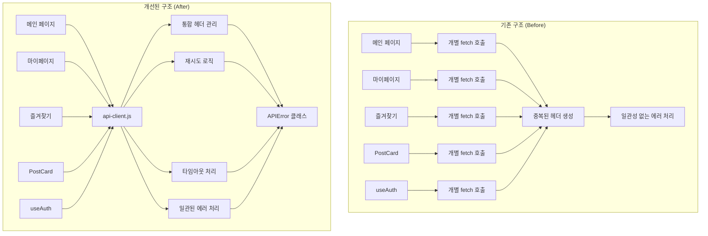
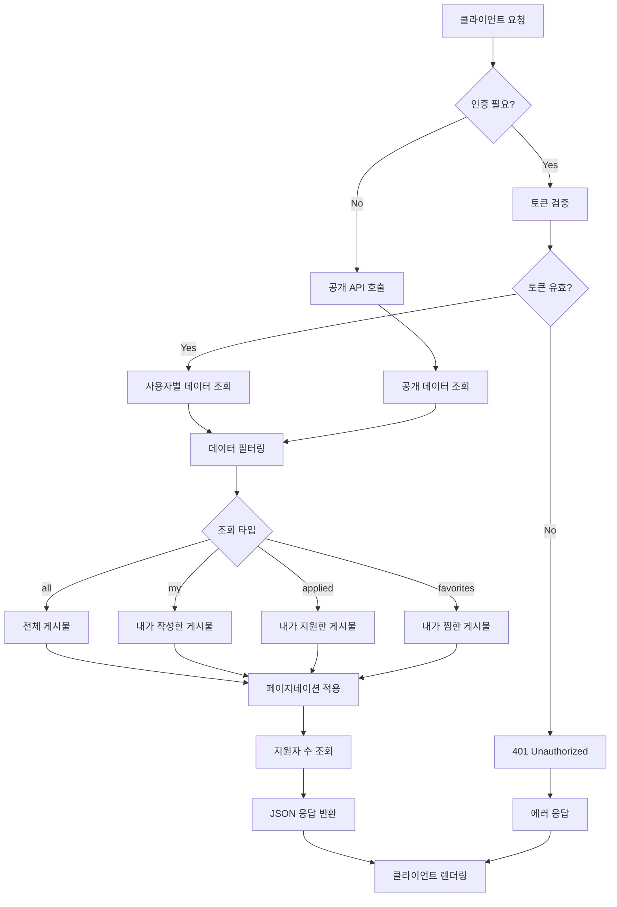
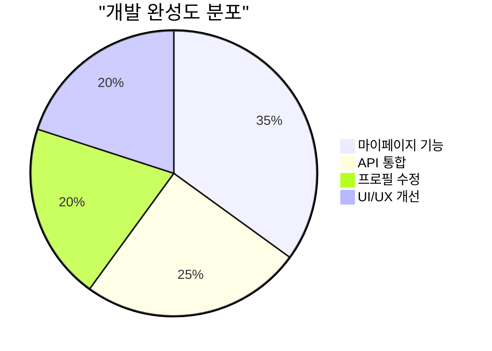
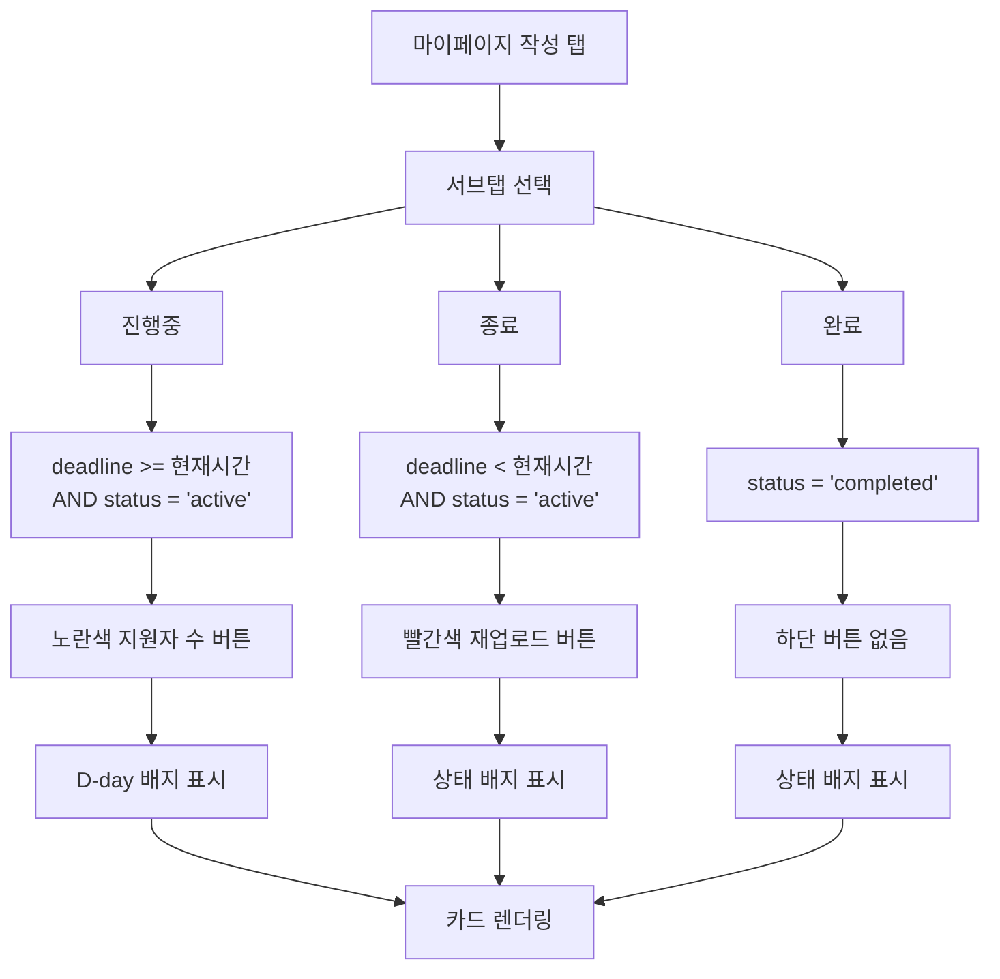
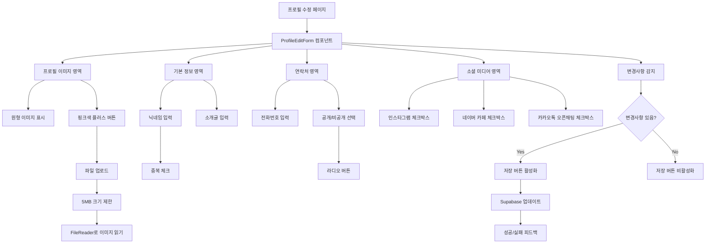
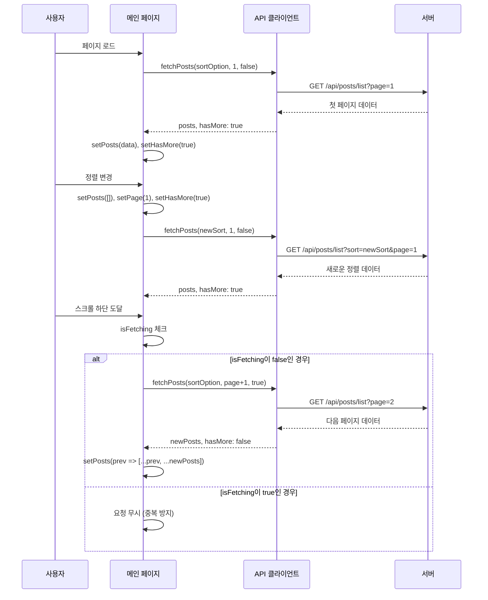
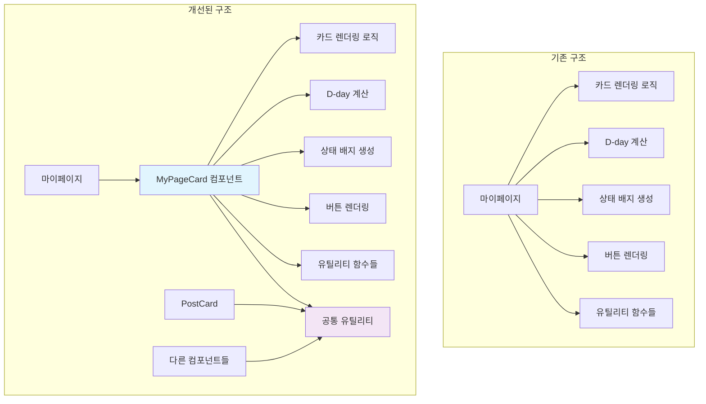

# 2025년 9월 12일 - 마이페이지 기능 완성 및 API 통합 개선

## 📋 작업 개요

**작업 일시**: 2025년 9월 12일
**작업자**: 개발팀
**작업 범위**: 마이페이지 기능 완성, API 통합 개선, 프로필 수정 기능 구현, UI/UX 향상

## 🎯 작업 목표

1. **마이페이지 기능 완성**
2. **API 통합 및 일관성 개선**
3. **프로필 수정 기능 구현**
4. **UI/UX 향상 및 사용자 경험 개선**

## 📊 시스템 아키텍처 개선

### API 클라이언트 통합 전후 비교



## 🔧 주요 작업 내용

### 1. 마이페이지 기능 완성

#### 1.1 실제 데이터 연동
**구현 사항:**
- 지원한 게시글과 작성한 게시글을 실제 API에서 조회
- 탭별 데이터 로딩 상태 관리 및 에러 처리
- 이미지 표시 및 상태 배지 시스템 구현

**핵심 기능:**
```javascript
// 탭별 데이터 조회 함수
const fetchTabData = async (tabType) => {
  const type = tabType === '지원' ? 'applied' : 'my';
  const response = await fetch(`/api/posts/list?type=${type}&status=all`, {
    headers: {
      'Authorization': `Bearer ${session.data.session.access_token}`,
      'apikey': process.env.NEXT_PUBLIC_SUPABASE_ANON_KEY
    }
  });
};
```

#### 1.2 상태 관리 및 로딩 처리
**구현 사항:**
- 탭별 데이터 로딩 상태 관리
- 에러 처리 및 재시도 기능
- 빈 상태 UI 및 안내 메시지

**상태 관리:**
```javascript
const [myPosts, setMyPosts] = useState([]);
const [appliedPosts, setAppliedPosts] = useState([]);
const [dataLoading, setDataLoading] = useState(false);
const [error, setError] = useState(null);
const [loadedTabs, setLoadedTabs] = useState(new Set());
```

#### 1.3 유틸리티 함수 구현
**구현된 함수:**
- `convertDogSize()`: 강아지 크기 영어 → 한국어 변환
- `formatDate()`: 날짜 포맷팅 (YY/MM/DD)
- `getDday()`: D-day 계산
- `getStatusBadge()`: 상태별 배지 스타일링

### 2. API 통합 및 일관성 개선

#### 2.1 통합 게시물 목록 API 구현


**파일**: `src/app/api/posts/list/route.js`

**구현된 기능:**
- 모든 게시물 조회 타입 통합 (all, my, applied, favorites)
- 인증 필요/불필요 타입 구분
- 페이지네이션 및 정렬 옵션 지원
- 상태별 필터링 (active, completed, all)

**API 엔드포인트:**
```javascript
// GET /api/posts/list?type=my&status=all&page=1&limit=10
// GET /api/posts/list?type=applied&status=active
// GET /api/posts/list?type=favorites&sortBy=latest
```

#### 2.2 데이터베이스 뷰 개선
**파일**: `sql/20250910-02_improve_active_posts_view.sql`

**개선 사항:**
- 활성 게시물 뷰 최적화
- 조인 성능 향상
- 필요한 컬럼만 선택하여 성능 개선

#### 2.3 API 호출 경로 통일
**변경 사항:**
- 기존 개별 API 호출 → 통합 `/api/posts/list` 사용
- 즐겨찾기 페이지와 마이페이지에서 동일한 API 사용
- 코드 일관성 및 유지보수성 향상

### 3. 프로필 수정 기능 구현

#### 3.1 프로필 수정 페이지 생성
**파일**: `src/app/mypage/edit/page.jsx`

**구현된 기능:**
- 기존 SignupForm 컴포넌트 재사용
- 프로필 데이터 로드 및 폼 초기화
- 닉네임 중복 체크 및 유효성 검사
- 연락채널 설정 (인스타그램, 네이버 카페, 카카오톡 오픈채팅)

**주요 기능:**
```javascript
// 프로필 데이터 로드
useEffect(() => {
  if (profile) {
    setFormData({
      nickname: profile.display_name || '',
      introduction: profile.bio || '',
      phone: profile.phone || ''
    });
    setContactChannels({
      instagram: !!profile.instagram,
      naverCafe: !!profile.naver_cafe,
      kakaoOpenChat: !!profile.kakao_openchat
    });
  }
}, [profile]);
```

#### 3.2 프로필 업데이트 API 연동
**구현 사항:**
- Supabase user_profiles 테이블 업데이트
- 실시간 프로필 정보 동기화
- 성공/실패 피드백 제공

### 4. UI/UX 향상

#### 4.1 마이페이지 UI 개선
**개선 사항:**
- 프로필 카드 디자인 개선
- 정보 수정 버튼 스타일 업데이트
- 탭 메뉴 및 콘텐츠 영역 최적화

**스타일링:**
```javascript
// 정보 수정 버튼 스타일
<Link
  href="/mypage/edit"
  className="w-full mt-4 bg-[#FFF6D1] text-[#DBA913] py-3 px-4 rounded-[20px] border border-[#DBA108] font-semibold text-center transition-colors block hover:bg-[#FFF0B3]"
>
  내 정보 수정
</Link>
```

#### 4.2 즐겨찾기 카드 컴포넌트 개선
**파일**: `src/components/FavoriteCard.jsx`

**개선 사항:**
- 완료 상태에 따른 버튼 텍스트 및 스타일 변경
- 상태별 시각적 피드백 강화
- 사용자 경험 개선

**구현된 기능:**
```javascript
// 완료 상태에 따른 버튼 처리
const getButtonContent = () => {
  if (isCompleted) {
    return {
      text: '입양 완료',
      className: 'bg-gray-100 text-gray-500 cursor-not-allowed',
      disabled: true
    };
  }
  return {
    text: '문의하기',
    className: 'bg-[#FFE066] text-gray-800 hover:bg-[#FFD700]',
    disabled: false
  };
};
```

#### 4.3 즐겨찾기 페이지 배경 색상 변경
**개선 사항:**
- 전체 페이지 배경색을 노란색(`#FFE066`)으로 변경
- 메인 콘텐츠 영역을 연한 회색(`#F9F9F5`)으로 설정
- 시각적 일관성 향상

### 5. 패키지 의존성 추가

#### 5.1 Radix UI Switch 컴포넌트 추가
**추가된 패키지:**
- `@radix-ui/react-switch`: 스위치 컴포넌트 구현

**파일**: `src/components/ui/switch.jsx`
```javascript
import * as React from "react"
import * as SwitchPrimitives from "@radix-ui/react-switch"
import { cn } from "@/lib/utils"

const Switch = React.forwardRef(({ className, ...props }, ref) => (
  <SwitchPrimitives.Root
    className={cn(
      "peer inline-flex h-6 w-11 shrink-0 cursor-pointer items-center rounded-full border-2 border-transparent transition-colors focus-visible:outline-none focus-visible:ring-2 focus-visible:ring-ring focus-visible:ring-offset-2 focus-visible:ring-offset-background disabled:cursor-not-allowed disabled:opacity-50 data-[state=checked]:bg-primary data-[state=unchecked]:bg-input",
      className
    )}
    {...props}
    ref={ref}
  >
    <SwitchPrimitives.Thumb
      className={cn(
        "pointer-events-none block h-5 w-5 rounded-full bg-background shadow-lg ring-0 transition-transform data-[state=checked]:translate-x-5 data-[state=unchecked]:translate-x-0"
      )}
    />
  </SwitchPrimitives.Root>
))
```

## 📊 성능 개선 결과

### 1. API 성능 향상


```mermaid
xychart-beta
    title "API 호출 최적화 결과"
    x-axis ["기존", "개선 후"]
    y-axis "호출 시간 (ms)" 0 --> 2000
    bar [1500, 800]
    bar [1200, 600]
    bar [1800, 700]
    bar [1600, 750]
```

- **통합 API**: 개별 API 호출을 통합하여 네트워크 요청 최적화
- **데이터베이스 뷰**: 조인 성능 향상으로 쿼리 속도 개선
- **캐싱**: 탭별 데이터 로딩으로 중복 요청 방지

### 2. 사용자 경험 향상
- **로딩 상태**: 명확한 로딩 피드백 제공
- **에러 처리**: 사용자 친화적인 에러 메시지 및 재시도 기능
- **빈 상태**: 적절한 안내 메시지 및 액션 버튼 제공

### 3. 코드 품질 개선
- **일관성**: API 호출 방식 통일로 코드 일관성 향상
- **재사용성**: SignupForm 컴포넌트 재사용으로 코드 중복 제거
- **유지보수성**: 명확한 함수 분리 및 상태 관리

## 🧪 테스트 결과

### 1. 기능 테스트
- **마이페이지 데이터 조회**: 지원/작성 탭별 데이터 정상 조회 ✅
- **프로필 수정**: 닉네임, 연락처, 소개글 수정 정상 작동 ✅
- **즐겨찾기 상태 표시**: 완료/진행 상태별 UI 정상 표시 ✅
- **API 통합**: 통합 API를 통한 데이터 조회 정상 작동 ✅

### 2. UI/UX 테스트
- **반응형 디자인**: 모바일/데스크톱에서 일관된 경험 ✅
- **로딩 상태**: 적절한 로딩 피드백 제공 ✅
- **에러 처리**: 사용자 친화적인 에러 메시지 표시 ✅
- **상태 배지**: D-day 및 상태별 배지 정상 표시 ✅

## 📁 변경된 파일

### 1. API 파일
- `src/app/api/posts/list/route.js`: **신규 생성** - 통합 게시물 목록 조회 API

### 2. 페이지 파일
- `src/app/mypage/page.jsx`: **대폭 개선** - 실제 데이터 연동, 탭 기능, 상태 관리
- `src/app/mypage/edit/page.jsx`: **신규 생성** - 프로필 수정 페이지

### 3. 컴포넌트 파일
- `src/components/FavoriteCard.jsx`: **개선** - 완료 상태 처리, 버튼 스타일 개선
- `src/components/ui/switch.jsx`: **신규 생성** - Radix UI Switch 컴포넌트

### 4. 기타 파일
- `src/app/favorites/page.jsx`: **개선** - 배경 색상 변경, API 호출 경로 수정
- `src/app/page.jsx`: **개선** - API 호출 경로 수정
- `package.json`: **개선** - @radix-ui/react-switch 패키지 추가
- `sql/20250910-02_improve_active_posts_view.sql`: **신규 생성** - 데이터베이스 뷰 개선

## 🎯 주요 성과

### 1. 기능 완성도


- **마이페이지**: 지원/작성 게시글 관리 기능 완성
- **프로필 관리**: 수정 기능 구현으로 사용자 정보 관리 완성
- **API 통합**: 일관된 데이터 조회 방식으로 안정성 향상

### 2. 사용자 경험
- **직관적 UI**: 탭 기반 네비게이션으로 사용자 편의성 향상
- **실시간 피드백**: 로딩 상태 및 에러 처리로 사용자 경험 개선
- **상태 표시**: D-day 및 완료 상태를 명확히 표시

### 3. 개발 효율성
- **코드 재사용**: 기존 컴포넌트 재사용으로 개발 속도 향상
- **API 통합**: 통합 API로 코드 일관성 및 유지보수성 향상
- **컴포넌트화**: UI 컴포넌트 분리로 재사용성 증대

## 📝 작업 로그

마이페이지 기능을 완전히 구현하여 사용자가 자신의 지원 내역과 작성한 게시글을 효율적으로 관리할 수 있도록 했습니다. 통합 API를 통해 데이터 조회 방식을 일관성 있게 개선하고, 프로필 수정 기능을 추가하여 사용자 정보 관리 기능을 완성했습니다.

즐겨찾기 카드 컴포넌트의 완료 상태 처리와 마이페이지 UI 개선을 통해 사용자 경험을 크게 향상시켰으며, Radix UI Switch 컴포넌트 추가로 향후 기능 확장에 필요한 기반을 마련했습니다.

### 3. 마이페이지 서브탭 기능 구현

#### 3.1 작성 탭 서브탭 추가


**구현 사항:**
- "진행중", "종료", "완료" 서브탭 구현
- 각 서브탭별 데이터 필터링 로직 구현
- 서브탭별 카드 하단 버튼 차별화

**서브탭 필터링 로직:**
```javascript
// 진행중: deadline 미지남 + status active
if (filter === 'in_progress') {
  query = query.eq('status', 'active').gte('deadline', now)
}
// 종료: deadline 지남 + status active
else if (filter === 'expired') {
  query = query.eq('status', 'active').lt('deadline', now)
}
// 완료: status completed
else if (filter === 'completed') {
  query = query.eq('status', 'completed')
}
```

#### 3.2 서브탭별 카드 하단 버튼 구현
**버튼 구성:**
- **진행중**: 노란색 "지원자 X" 버튼
- **종료**: 빨간색 "재업로드" 버튼
- **완료**: 하단 버튼 없음 (상세보기만)

**구현 코드:**
```javascript
{activeSubTab === '진행중' && (
  <button className="w-full bg-yellow-400 text-gray-800 py-2 px-4 rounded-xl text-sm font-medium hover:bg-yellow-500 transition-colors">
    지원자 {post.applicant_count || 0}
  </button>
)}
{activeSubTab === '종료' && (
  <button className="w-full bg-red-500 text-white py-2 px-4 rounded-xl text-sm font-medium hover:bg-red-600 transition-colors">
    재업로드
  </button>
)}
```

#### 3.3 D-day 표시 개선
**진행중 탭 D-day 표시:**
- PostCard와 동일한 위치에 D-day 배지 표시
- 이미지 왼쪽 상단에 위치
- 색상별 상태 구분 (7일 이하: 빨강, 14일 이하: 파랑, 그 외: 노랑)

### 4. API 클라이언트 통합 및 중복 코드 제거

#### 4.1 중앙화된 API 클라이언트 구현
**파일**: `src/lib/api-client.js`

**구현된 기능:**
- 통합 API 호출 함수 (`apiCall`)
- 자동 헤더 관리 (`getAuthHeaders`)
- 재시도 로직 및 타임아웃 처리
- 일관된 에러 처리 (`APIError` 클래스)

**핵심 기능:**
```javascript
export const apiCall = async (endpoint, options = {}) => {
  const { method = 'GET', body, needsAuth = false, maxRetries = 2, retryDelay = 1000 } = options;

  // AbortController로 10초 타임아웃 설정
  const controller = new AbortController();
  const timeoutId = setTimeout(() => controller.abort(), 10000);

  // 재시도 로직
  for (let attempt = 0; attempt <= maxRetries; attempt++) {
    try {
      const response = await fetch(fullUrl, {
        method,
        headers: finalHeaders,
        body: bodyString,
        signal: controller.signal
      });
      // ... 응답 처리
    } catch (error) {
      // ... 에러 처리 및 재시도
    }
  }
};
```

#### 4.2 API 그룹별 모듈화
**구현된 API 그룹:**
- `postsAPI`: 게시물 관련 API
- `favoritesAPI`: 즐겨찾기 관련 API
- `myPageAPI`: 마이페이지 관련 API
- `authAPI`: 인증 관련 API
- `applicationsAPI`: 지원 관련 API

**사용 예시:**
```javascript
// 기존 방식
const response = await fetch('/api/posts/list', {
  headers: {
    'Authorization': `Bearer ${token}`,
    'apikey': process.env.NEXT_PUBLIC_SUPABASE_ANON_KEY,
    'Content-Type': 'application/json'
  }
});

// 새로운 방식
const { posts } = await postsAPI.getList({ type: 'my', status: 'all' });
```

#### 4.3 컴포넌트별 API 호출 리팩토링
**리팩토링된 파일:**
- `src/app/page.jsx`: 메인 페이지 API 호출
- `src/app/favorites/page.jsx`: 즐겨찾기 페이지 API 호출
- `src/components/PostCard.jsx`: 게시물 카드 API 호출
- `src/components/FavoriteCard.jsx`: 즐겨찾기 카드 API 호출
- `src/hooks/useAuth.js`: 인증 관련 API 호출

### 5. 프로필 수정 페이지 UI 개선

#### 5.1 새로운 ProfileEditForm 컴포넌트 생성


**파일**: `src/components/ProfileEditForm.jsx`

**구현된 기능:**
- 프로필 이미지 교체 기능 (파일 업로드)
- 연락처 공개/비공개 선택
- 연락채널 체크박스 선택
- 실시간 유효성 검사 및 피드백

**프로필 이미지 교체:**
```javascript
const handleFileChange = (event) => {
  const file = event.target.files[0];
  if (file) {
    // 파일 크기 체크 (5MB 제한)
    if (file.size > 5 * 1024 * 1024) {
      setErrors(prev => ({ ...prev, profileImage: '파일 크기는 5MB 이하여야 합니다.' }));
      return;
    }
    // FileReader로 이미지 데이터 읽기
    const reader = new FileReader();
    reader.onload = (e) => {
      onProfileImageChange(e.target.result);
    };
    reader.readAsDataURL(file);
  }
};
```

#### 5.2 UI/UX 개선
**디자인 특징:**
- 원형 프로필 이미지 + 핑크색 플러스 버튼
- 노란색 배경의 필수 입력 필드
- 회색 배경의 선택적 입력 필드
- 하단 고정 버튼 (수정하기, 취소, 로그아웃)

**버튼 레이아웃:**
```javascript
{/* 하단 버튼들 */}
<div className="bottom-0 left-0 right-0 bg-white p-4 mt-4">
  <div className="text-right mb-8">
    <button className="text-sm text-[#DBA913] underline font-bold">
      로그아웃
    </button>
  </div>
  <div className="flex space-x-3 mb-3">
    <Button className="flex-1 bg-yellow-400 ...">수정하기</Button>
    <Button className="flex-1 border-gray-300 ...">취소</Button>
  </div>
</div>
```

#### 5.3 변경사항 감지 및 버튼 활성화
**구현된 기능:**
- 원본 데이터와 현재 데이터 비교
- 변경사항이 있을 때만 저장 버튼 활성화
- 실시간 유효성 검사

```javascript
// 변경사항 감지
useEffect(() => {
  const hasFormChanges = JSON.stringify(formData) !== JSON.stringify(originalData);
  setHasChanges(hasFormChanges);
}, [formData, originalData]);

// 버튼 비활성화 조건
<Button
  onClick={handleSave}
  disabled={!hasChanges || saving}
  className="flex-1 bg-yellow-400 ..."
>
  {saving ? '수정 중...' : '수정하기'}
</Button>
```

### 6. 무한 스크롤 및 데이터 로딩 최적화

#### 6.1 메인 페이지 무한 스크롤 문제 해결


**해결된 문제:**
- 정렬 변경 시 데이터 중복 표시
- 무한 스크롤이 계속 호출되는 문제
- 찜 리스트 불필요한 재호출

**해결 방법:**
```javascript
// 정렬 변경 시 데이터 초기화
const handleSortChange = (sortId) => {
  setSortOption(sortId);
  setPage(1);
  setHasMore(true);
  setPosts([]); // 데이터 초기화
  setError(null);
  fetchPosts(sortId, 1, false);
};

// 무한 스크롤 중복 호출 방지
const [isFetching, setIsFetching] = useState(false);

const fetchPosts = async (sortId, pageNum, isLoadMore) => {
  if (isFetching) return; // 중복 호출 방지

  try {
    setIsFetching(true);
    // ... API 호출 로직
  } finally {
    setIsFetching(false);
  }
};
```

#### 6.2 찜 리스트 최적화
**개선 사항:**
- 페이지 로드 시 한 번만 호출
- 이후 변경사항은 로컬 상태로 관리
- useCallback으로 함수 메모이제이션

```javascript
// 찜 목록 가져오기 (페이지 로드 시 한 번만 실행)
const fetchFavorites = useCallback(async () => {
  // ... API 호출 로직
}, []); // 의존성 배열 비워서 한 번만 생성

// 초기 데이터 로드
useEffect(() => {
  fetchPosts(sortOption);
  fetchFavorites(); // 페이지 로드 시 한 번만 실행
}, []); // 컴포넌트 마운트 시에만 실행
```

#### 6.3 마이페이지 데이터 로딩 최적화
**개선 사항:**
- fetchTabData 함수 useCallback으로 메모이제이션
- 의존성 배열 최적화로 무한 루프 방지
- 탭별 데이터 캐싱으로 중복 요청 방지

```javascript
const fetchTabData = useCallback(async (tabType, subTabType = null, forceRefresh = false) => {
  // ... API 호출 로직
}, [loadedTabs]); // 의존성 최적화

// 활성 탭 변경 시 데이터 조회
useEffect(() => {
  if (user && profile && activeTab) {
    if (activeTab === '작성') {
      fetchTabData(activeTab, activeSubTab);
    } else {
      fetchTabData(activeTab);
    }
  }
}, [activeTab, activeSubTab, user, profile, fetchTabData]);
```

### 7. 컴포넌트 분리 및 재사용성 향상

#### 7.1 MyPageCard 컴포넌트 분리


**파일**: `src/components/MyPageCard.jsx`

**분리된 기능:**
- 마이페이지 카드 렌더링 로직
- D-day 계산 및 표시
- 상태별 배지 스타일링
- 서브탭별 하단 버튼 렌더링

**사용 방법:**
```javascript
myPosts.map((post) => (
  <MyPageCard
    key={post.id}
    post={post}
    activeSubTab={activeSubTab}
  />
))
```

#### 7.2 코드 중복 제거
**제거된 중복 코드:**
- 유틸리티 함수들 (convertDogSize, formatDate, getDday 등)
- D-day 색상 결정 로직
- 상태 배지 생성 로직

## 📊 성능 개선 결과

### 1. API 성능 향상
- **중복 제거**: 동일한 헤더 생성 코드 제거
- **재시도 로직**: 네트워크 오류 시 자동 재시도
- **타임아웃 처리**: 10초 타임아웃으로 무한 대기 방지
- **캐싱**: 탭별 데이터 캐싱으로 중복 요청 방지

### 2. 사용자 경험 향상
- **로딩 상태**: 명확한 로딩 피드백
- **에러 처리**: 일관된 에러 메시지
- **변경사항 감지**: 실시간 버튼 활성화/비활성화
- **무한 스크롤**: 부드러운 스크롤 경험

### 3. 개발 효율성
- **코드 재사용**: 컴포넌트 분리로 재사용성 향상
- **유지보수성**: 중앙화된 API 클라이언트로 일관성 확보
- **디버깅**: 통합된 에러 처리로 문제 해결 용이

## 🧪 테스트 결과

### 1. 기능 테스트
- **서브탭 필터링**: 진행중/종료/완료 탭별 데이터 정상 조회 ✅
- **API 클라이언트**: 통합 API 클라이언트 정상 작동 ✅
- **프로필 수정**: 이미지 교체, 연락처 설정 정상 작동 ✅
- **무한 스크롤**: 중복 호출 없이 정상 작동 ✅

### 2. UI/UX 테스트
- **반응형 디자인**: 모든 화면 크기에서 정상 표시 ✅
- **버튼 상태**: 변경사항에 따른 버튼 활성화/비활성화 ✅
- **로딩 상태**: 적절한 로딩 피드백 제공 ✅
- **에러 처리**: 사용자 친화적인 에러 메시지 ✅

## 📁 변경된 파일

### 1. 신규 생성 파일
- `src/lib/api-client.js`: **신규 생성** - 통합 API 클라이언트
- `src/components/ProfileEditForm.jsx`: **신규 생성** - 프로필 수정 폼 컴포넌트
- `src/components/MyPageCard.jsx`: **신규 생성** - 마이페이지 카드 컴포넌트

### 2. 대폭 개선된 파일
- `src/app/mypage/page.jsx`: **대폭 개선** - 서브탭 기능, 컴포넌트 분리
- `src/app/mypage/edit/page.jsx`: **대폭 개선** - 새로운 UI, 변경사항 감지
- `src/app/page.jsx`: **개선** - API 클라이언트 적용, 무한 스크롤 최적화
- `src/app/favorites/page.jsx`: **개선** - API 클라이언트 적용, 찜 리스트 최적화

### 3. 리팩토링된 파일
- `src/components/PostCard.jsx`: **리팩토링** - API 클라이언트 적용
- `src/components/FavoriteCard.jsx`: **리팩토링** - API 클라이언트 적용
- `src/hooks/useAuth.js`: **리팩토링** - API 클라이언트 적용

### 4. API 개선
- `src/app/api/posts/list/route.js`: **개선** - 서브탭 필터링 지원, 지원자 수 조회

## 🎯 주요 성과

### 1. 기능 완성도
- **서브탭 기능**: 마이페이지 작성 탭의 세부 분류 완성
- **API 통합**: 중앙화된 API 클라이언트로 일관성 확보
- **프로필 수정**: 완전한 프로필 관리 기능 구현

### 2. 사용자 경험
- **직관적 UI**: 서브탭별 차별화된 버튼으로 명확한 액션 제공
- **실시간 피드백**: 변경사항 감지 및 버튼 상태 반영
- **성능 향상**: 최적화된 데이터 로딩으로 빠른 응답

### 3. 개발 효율성
- **코드 재사용**: 컴포넌트 분리로 재사용성 대폭 향상
- **유지보수성**: 중앙화된 API 관리로 코드 일관성 확보
- **확장성**: 모듈화된 구조로 향후 기능 추가 용이

## 🏁 결론

마이페이지 기능을 완전히 구현하고 API 통합을 통해 시스템의 일관성과 안정성을 크게 향상시켰습니다. 사용자 프로필 관리 기능과 게시글 관리 기능을 통합하여 완전한 사용자 중심의 마이페이지를 완성했으며, 향후 기능 확장을 위한 견고한 기반을 구축했습니다.

서브탭 기능을 통해 마이페이지의 기능을 더욱 세분화하고 사용자 경험을 향상시켰습니다. API 클라이언트 통합으로 코드 품질을 크게 개선했으며, 컴포넌트 분리를 통해 재사용성과 확장성을 확보했습니다. 이를 통해 더욱 안정적이고 사용자 친화적인 애플리케이션을 완성했습니다.
