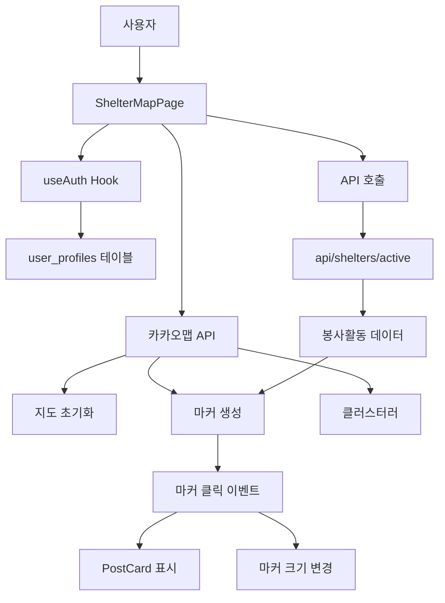
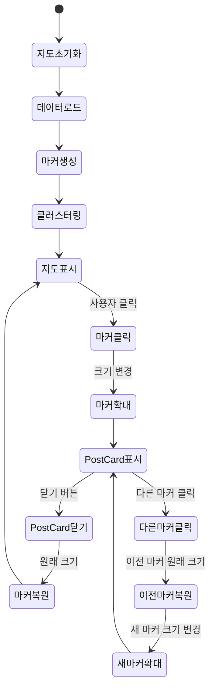
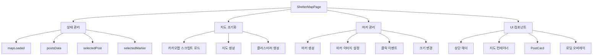
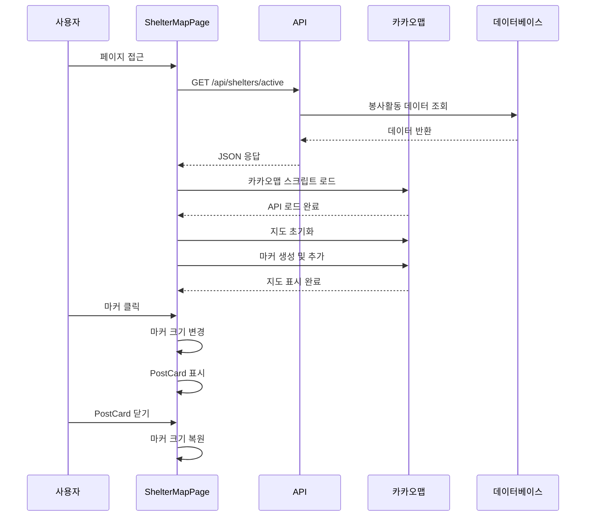

# 20250919 보호소 위치 메뉴 개발 및 카카오맵 통합

## 📋 작업 개요

보호소 위치를 지도에서 확인할 수 있는 메뉴 페이지 개발 및 카카오맵 API 통합 작업을 완료했습니다.

## 🎯 주요 기능

### 1. 시스템 아키텍처



### 2. 마커 상태 관리 플로우



### 3. 카카오맵 API 통합
- **지도 초기화**: 서울 중심으로 지도 표시 (레벨 6)
- **마커 클러스터링**: MarkerClusterer를 사용한 마커 그룹화
- **동적 마커 이미지**: 마감일 기준으로 다른 마커 이미지 표시
  - 7일 이내: `marker3.png` (빨간색)
  - 14일 이내: `marker2.png` (주황색)
  - 14일 초과: `marker1.png` (노란색)

### 4. 마커 상호작용 기능
- **마커 클릭 이벤트**: 클릭 시 PostCard 표시
- **마커 크기 변경**: 선택된 마커는 10px 더 크게 표시 (40px → 50px)
- **단일 선택**: 한 번에 하나의 마커만 선택 가능
- **자동 복원**: 다른 마커 클릭 시 이전 마커 자동으로 원래 크기로 복원

### 5. PostCard 컴포넌트
- **PostCard 디자인**: 기존 PostCard.jsx와 동일한 디자인 적용
- **D-day 배지**: 마감일 기준으로 색상 구분
- **강아지 정보**: 이름, 크기(한국어 변환), 이미지 표시
- **닫기 기능**: PostCard 닫기 시 마커 크기도 원래대로 복원

### 6. 사용자 경험 개선
- **사용자 프로필 표시**: user_profiles 테이블에서 display_name 조회
- **로딩 상태**: 지도 초기화 중 로딩 표시
- **에러 처리**: API 호출 실패 시 에러 메시지 표시
- **반응형 레이아웃**: BottomNavigation과의 겹침 방지

## 🔧 기술적 구현

### 1. 컴포넌트 구조



### 2. 파일 구조
```
src/app/shelter/page.jsx
```

### 3. 주요 상태 관리
```javascript
const [mapLoaded, setMapLoaded] = useState(false);
const [postsData, setPostsData] = useState([]);
const [selectedPost, setSelectedPost] = useState(null);
const [selectedMarker, setSelectedMarker] = useState(null);
```

### 4. useRef를 활용한 마커 관리
```javascript
const mapRef = useRef(null);
const clustererRef = useRef(null);
const mapInstanceRef = useRef(null);
const markersRef = useRef([]); // 마커들을 저장할 ref
```

### 5. 마커 크기 조절 함수
```javascript
const getMarkerImage = (deadline, isSelected = false) => {
  const size = isSelected ? 50 : 40; // 선택된 마커는 10px 더 크게
  // ... 마커 이미지 설정
};
```

### 6. 지도 초기화 로직
```javascript
const initializeMap = () => {
  // 지도 생성
  const map = new window.kakao.maps.Map(mapRef.current, {
    center: new window.kakao.maps.LatLng(37.5665, 126.9780),
    level: 6
  });

  // 클러스터러 생성
  const clusterer = new window.kakao.maps.MarkerClusterer({
    map: map,
    averageCenter: true,
    minLevel: 1,
    gridSize: 60
  });

  // 마커 생성 및 추가
  // ...
};
```

## 🎨 UI/UX 개선사항

### 1. 레이아웃 최적화
- **전체 화면 지도**: 정보 패널 제거로 지도가 화면 전체를 활용
- **BottomNavigation 간격**: `calc(100vh - 80px)`로 하단 네비게이션과 겹침 방지
- **PostCard 위치**: `bottom-24`로 적절한 위치에 표시

### 2. 시각적 피드백
- **마커 크기 변화**: 클릭한 마커가 커져서 선택 상태를 명확히 표시
- **D-day 배지**: 마감일 기준으로 색상 구분 (빨강/주황/노랑)
- **로딩 상태**: 지도 초기화 중 스피너 표시

### 3. 사용자 정보 표시
- **프로필 이름**: user_profiles 테이블에서 display_name 조회
- **활동 개수**: 로드된 봉사활동 개수 표시

## 🐛 해결된 문제들

### 1. 마커 사라짐 문제
- **원인**: React 리렌더링과 Kakao Maps API의 상호작용
- **해결**: useRef로 마커 관리, useEffect 의존성 배열 최적화

### 2. 지도 높이 조정
- **원인**: BottomNavigation과 지도 영역 겹침
- **해결**: `calc(100vh - 80px)`로 정확한 높이 계산

### 3. 마커 클릭 이벤트
- **원인**: 마커 선택 상태 관리 부족
- **해결**: selectedMarker 상태로 이전 마커 추적 및 복원

## 📊 API 연동

### 1. 데이터 플로우



### 2. 데이터 조회
```javascript
const response = await fetch('/api/shelters/active');
const result = await response.json();
setPostsData(result.data);
```

### 3. 데이터 구조
```javascript
{
  id: string,
  title: string,
  deadline: string,
  departure: {
    lat: number,
    lng: number
  },
  dog: {
    name: string,
    size: string,
    image: string
  }
}
```

## 🔄 성능 최적화

### 1. 마커 관리
- **useRef 활용**: 마커 객체를 ref에 저장하여 재생성 방지
- **클러스터링**: MarkerClusterer로 성능 최적화
- **메모리 정리**: 컴포넌트 언마운트 시 마커 정리

### 2. 렌더링 최적화
- **useEffect 최적화**: 불필요한 재실행 방지
- **조건부 렌더링**: 로딩/에러 상태별 UI 분리

## 📝 개발 과정

1. **카카오맵 API 연동**: 스크립트 로드 및 지도 초기화
2. **마커 표시**: 봉사활동 데이터를 기반으로 마커 생성
3. **상호작용 구현**: 마커 클릭 이벤트 및 PostCard 표시
4. **UI 개선**: 레이아웃 최적화 및 사용자 경험 향상
5. **버그 수정**: 마커 사라짐 문제 및 지도 높이 조정

## 🏆 완성된 기능

- ✅ 카카오맵 API 통합
- ✅ 동적 마커 이미지 표시
- ✅ 마커 클릭 이벤트
- ✅ PostCard 컴포넌트 표시
- ✅ 마커 크기 변경 효과
- ✅ 사용자 프로필 표시
- ✅ 반응형 레이아웃
- ✅ 에러 처리 및 로딩 상태

이제 사용자가 지도에서 봉사활동 위치를 직관적으로 확인하고 상세 정보를 볼 수 있는 완전한 기능이 구현되었습니다.
