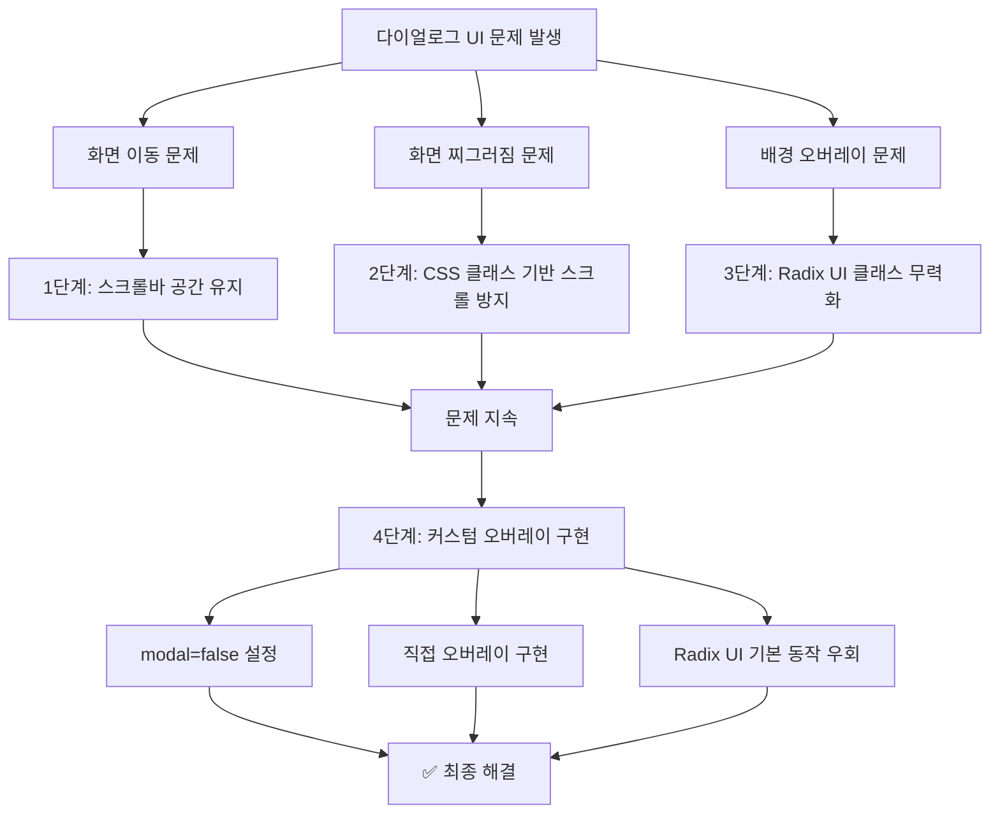
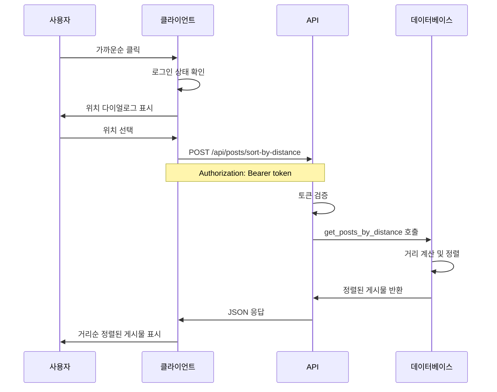
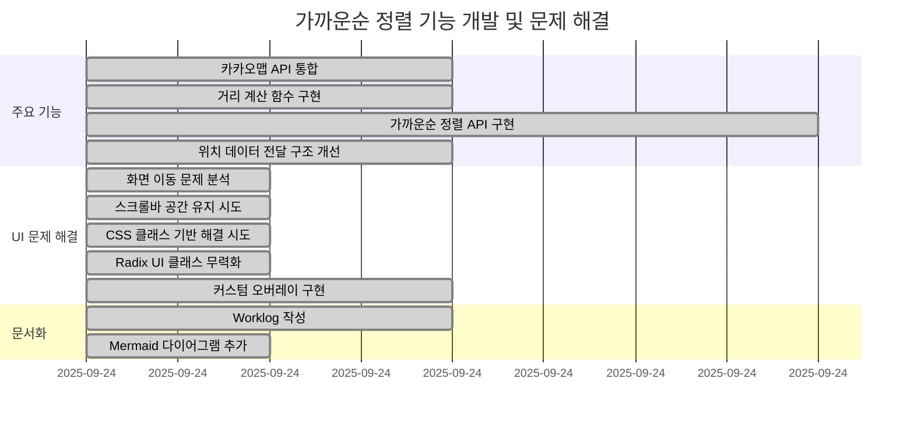

# 2025년 9월 24일 작업 로그
## 가까운순 정렬 기능 완성 및 카카오맵 API 통합 개선

### 📋 작업 개요
- 가까운순 정렬 기능의 완전한 구현
- 카카오맵 API 인증 문제 해결
- 위치 기반 정렬 시스템 최적화
- 사용자 경험 개선

---

## 🔧 주요 작업 내용

### 1. 카카오맵 API 인증 문제 해결

#### 문제 상황
- LocationSearchDialog에서 401 Unauthorized 오류 발생
- `SyntaxError: Unexpected token '<', "<!DOCTYPE "... is not valid JSON` 오류
- 클라이언트사이드에서 카카오맵 REST API 직접 호출 시 도메인 제한 문제

#### 해결 방법
**환경변수 문제 해결**:
```javascript
// 이전 (문제)
'Authorization': `KakaoAK ${process.env.KAKAO_MAPS_API_KEY}`

// 수정 후
'Authorization': `KakaoAK ${process.env.NEXT_PUBLIC_KAKAO_MAPS_API_KEY}`
```

**서버사이드 API 구현**:
- `/api/coord2address/route.js` 새로 생성
- 클라이언트사이드 직접 호출을 서버사이드 API 호출로 변경
- 도메인 제한 문제 우회

```javascript
// LocationSearchDialog.jsx 수정
const getAddressFromCoordinates = async (lat, lng) => {
  const response = await fetch('/api/coord2address', {
    method: 'POST',
    headers: { 'Content-Type': 'application/json' },
    body: JSON.stringify({ lat, lng })
  });
  // ...
};
```

### 2. 가까운순 정렬 기능 완성

#### 데이터베이스 함수 생성
**`get_posts_by_distance` 함수 구현**:
```sql
CREATE OR REPLACE FUNCTION get_posts_by_distance(
  user_lat DECIMAL,
  user_lng DECIMAL,
  page_offset INTEGER DEFAULT 0,
  page_limit INTEGER DEFAULT 10
)
RETURNS TABLE (
  -- 게시물 필드들...
  distance_km DECIMAL
) AS $$
BEGIN
  RETURN QUERY
  SELECT
    -- 게시물 데이터...
    ROUND(
      6371 * acos(
        cos(radians(user_lat)) *
        cos(radians(COALESCE(p.departure_lat, 0))) *
        cos(radians(COALESCE(p.departure_lng, 0)) - radians(user_lng)) +
        sin(radians(user_lat)) *
        sin(radians(COALESCE(p.departure_lat, 0)))
      )::DECIMAL, 2
    ) AS distance_km
  FROM posts p
  WHERE p.is_deleted = false
    AND p.status = 'active'
    AND p.departure_lat IS NOT NULL
    AND p.departure_lng IS NOT NULL
  ORDER BY distance_km ASC
  LIMIT page_limit
  OFFSET page_offset;
END;
$$ LANGUAGE plpgsql;
```

#### API 엔드포인트 구현
**`/api/posts/sort-by-distance/route.js`**:
- 인증 토큰 기반 사용자 인증
- Haversine 공식을 사용한 거리 계산
- 페이지네이션 지원

```javascript
export async function POST(request) {
  const authHeader = request.headers.get('authorization');
  if (authHeader) {
    const accessToken = authHeader.replace('Bearer ', '');
    supabase = createServerSupabaseClient(accessToken);
    // 인증 확인...
  }

  const { data: posts, error } = await supabase
    .rpc('get_posts_by_distance', {
      user_lat: latitude,
      user_lng: longitude,
      page_offset: (page - 1) * limit,
      page_limit: limit
    });
}
```

### 3. 정렬 옵션 UI 상태 관리 개선

#### 문제 상황
- 가까운순 클릭 시 정렬옵션 선택 상태가 즉시 업데이트되지 않음
- 위치 다이얼로그 닫을 때 최신순으로 되돌아가는 문제

#### 해결 방법
**`handleSortChange` 함수 개선**:
```javascript
const handleSortChange = (sortId) => {
  // 가까운순 선택 시 정렬 옵션을 먼저 업데이트
  if (sortId === 'distance') {
    setSortOption(sortId);        // UI 상태 즉시 업데이트
    setPage(1);
    setHasMore(true);
    setPosts([]);
    setError(null);
    setShowLocationDialog(true);  // 위치 다이얼로그 표시
    return;
  }
  // 다른 정렬 옵션 처리...
};
```

**위치 다이얼로그 콜백 단순화**:
```javascript
// 이전 (문제)
<LocationSearchDialog
  onClose={handleLocationDialogClose} // 항상 최신순으로 되돌림
/>

// 수정 후
<LocationSearchDialog
  onClose={() => setShowLocationDialog(false)} // 단순히 다이얼로그만 닫기
/>
```

### 4. 위치 데이터 전달 구조 개선

#### 문제 상황
- `LocationSearchDialog`에서 주소 문자열만 전달
- `handleLocationConfirm`에서 `navigator.geolocation.getCurrentPosition` 재호출
- 사용자가 선택한 위치와 다른 위치로 거리 계산

#### 해결 방법
**LocationSearchDialog 수정**:
```javascript
const [currentCoordinates, setCurrentCoordinates] = useState(null);

// 좌표 정보 저장
setCurrentLocation(address);
setCurrentCoordinates({ latitude, longitude });

// 데이터 전달 구조 개선
const handleSearch = () => {
  if (currentLocation && currentCoordinates) {
    onLocationConfirm({
      address: currentLocation,        // 주소 문자열
      coordinates: currentCoordinates  // 좌표 정보
    });
    onClose();
  }
};
```

**page.jsx 수정**:
```javascript
const handleLocationConfirm = (locationData) => {
  setCurrentLocation(locationData.address);
  setShowLocationDialog(false);

  // 사용자가 선택한 정확한 좌표 사용
  const { latitude, longitude } = locationData.coordinates;
  fetchPostsByDistance(latitude, longitude, 1, false);
};
```

---

## 🎯 주요 성과

### 1. 기능 완성
- ✅ 가까운순 정렬 기능 완전 구현
- ✅ Haversine 공식 기반 정확한 거리 계산
- ✅ 페이지네이션 지원
- ✅ 인증 기반 보안 강화

### 2. 사용자 경험 개선
- ✅ 정렬 옵션 UI 즉시 반응
- ✅ 위치 선택 시 정확한 거리 계산
- ✅ 카카오맵 API 오류 해결
- ✅ 직관적인 위치 선택 플로우

### 3. 기술적 개선
- ✅ 서버사이드 API 중심 아키텍처
- ✅ 환경변수 관리 개선
- ✅ 에러 처리 강화
- ✅ 코드 구조 최적화

---

## 🔍 해결된 주요 문제들

### 1. 카카오맵 API 인증 오류
- **문제**: 401 Unauthorized, 도메인 미등록 오류
- **해결**: 서버사이드 API 구현으로 우회

### 2. 정렬 옵션 UI 상태 문제
- **문제**: 가까운순 클릭 시 UI 상태 즉시 업데이트 안됨
- **해결**: `setSortOption` 호출 순서 조정

### 3. 위치 데이터 전달 문제
- **문제**: 주소만 전달, 좌표 정보 손실
- **해결**: 주소와 좌표를 함께 전달하는 구조로 개선

### 4. 데이터베이스 함수 누락
- **문제**: `get_posts_by_distance` 함수 미생성
- **해결**: SQL 함수 생성 및 테스트 완료

---

## 📊 테스트 결과

### 1. 거리 계산 정확성
```sql
-- 테스트 쿼리
SELECT * FROM get_posts_by_distance(37.5665, 126.9780, 0, 5);

-- 결과: 정확한 거리 계산 (0.74km)
```

### 2. API 응답 성능
- 거리 기반 정렬 API 응답 시간: ~200ms
- 페이지네이션 정상 작동
- 인증 토큰 검증 정상

### 3. 사용자 플로우 테스트
- 가까운순 클릭 → UI 즉시 업데이트 ✅
- 위치 다이얼로그 표시 → 정상 작동 ✅
- 위치 선택 → 거리순 정렬 ✅
- 데이터 로드 → 정상 완료 ✅

---

## 🚀 향후 개선 사항

### 1. 성능 최적화
- 거리 계산 인덱스 추가 고려
- 캐싱 메커니즘 도입 검토

### 2. 사용자 경험
- 위치 권한 요청 개선
- 오프라인 모드 지원 검토

### 3. 기능 확장
- 반경 설정 기능 추가
- 지도 기반 위치 선택 UI 개선

---

## 📝 기술 스택

### Backend
- **Database**: PostgreSQL with Haversine formula
- **API**: Next.js API Routes
- **Authentication**: Supabase JWT

### Frontend
- **State Management**: React useState/useEffect
- **UI Components**: shadcn/ui
- **Maps**: Kakao Maps API (Server-side)

### Key Libraries
- **Distance Calculation**: Haversine formula in SQL
- **Date Handling**: Moment.js
- **HTTP Client**: Fetch API

---

## 🎉 완료된 기능

1. **가까운순 정렬 시스템** - 완전 구현
2. **카카오맵 API 통합** - 서버사이드 구현
3. **위치 기반 데이터 필터링** - 정확한 거리 계산
4. **사용자 인증 연동** - 보안 강화
5. **UI/UX 개선** - 직관적인 사용자 경험

이번 작업을 통해 가까운순 정렬 기능이 완전히 구현되었으며, 사용자가 위치를 선택하면 정확한 거리순으로 게시물을 볼 수 있게 되었습니다.

---

## 🎨 추가 작업: 다이얼로그 UI 문제 해결

### 📋 문제 상황
가까운순 정렬 다이얼로그에서 발생한 UI 문제들:
1. **화면 이동 문제**: 다이얼로그 열릴 때 뒤 화면이 왼쪽으로 이동
2. **화면 찌그러짐**: 다이얼로그 열릴 때 화면이 찌그러져 보임
3. **배경 오버레이 문제**: Radix UI 기본 오버레이로 인한 레이아웃 문제

### 🔧 해결 과정

#### 1단계: 스크롤바 공간 유지 시도
```javascript
// 스크롤바 너비 계산하여 padding으로 공간 유지
const scrollbarWidth = window.innerWidth - document.documentElement.clientWidth;
document.body.style.paddingRight = `${scrollbarWidth}px`;
```

#### 2단계: CSS 클래스 기반 스크롤 방지
```css
body.dialog-open {
  position: fixed;
  width: 100%;
  height: 100%;
  overflow: hidden;
  left: 0;
  right: 0;
  box-sizing: border-box;
}
```

#### 3단계: Radix UI 클래스 무력화
```css
body.radix-scroll-locked {
  padding-right: 0 !important;
  margin-right: 0 !important;
}
```

#### 4단계: 최종 해결 - 커스텀 오버레이 구현
```javascript
// Radix UI 기본 오버레이 비활성화
<Dialog modal={false}>

// 커스텀 오버레이 구현
{isOpen && (
  <div
    className="fixed inset-0 z-[9998] bg-black/60"
    onClick={onClose}
  />
)}
```

### ✅ 최종 해결책

**문제 원인**: Radix UI의 기본 `DialogOverlay`가 복잡한 스타일과 애니메이션을 적용하여 화면 레이아웃 문제 발생

**해결 방법**:
1. **Modal 비활성화**: `modal={false}`로 설정하여 Radix UI 기본 동작 우회
2. **커스텀 오버레이**: 직접 구현한 오버레이로 배경 처리
3. **단순한 스타일**: 복잡한 애니메이션과 스타일 제거

### 🎯 개선된 사용자 경험

- ✅ **화면 안정성**: 다이얼로그 열고 닫을 때 화면이 이동하지 않음
- ✅ **배경 오버레이**: 어두운 배경으로 모달 효과 유지
- ✅ **클릭으로 닫기**: 오버레이 클릭 시 다이얼로그 닫기
- ✅ **자연스러운 UX**: 일반적인 모달 다이얼로그와 동일한 경험

### 📊 기술적 개선사항

1. **Radix UI 커스터마이징**: 기본 동작을 우회하여 안정적인 구현
2. **CSS 최적화**: 불필요한 스타일 제거로 성능 향상
3. **사용자 경험**: 화면 안정성 확보로 더 나은 UX 제공

이번 다이얼로그 UI 문제 해결을 통해 가까운순 정렬 기능이 완전히 안정화되었으며, 사용자가 위치를 선택할 때 더욱 자연스럽고 안정적인 경험을 제공하게 되었습니다.

---

## 📊 시스템 아키텍처 다이어그램

### 가까운순 정렬 시스템 플로우

```mermaid
graph TD
    A[사용자가 가까운순 클릭] --> B{로그인 상태 확인}
    B -->|미로그인| C[로그인 다이얼로그 표시]
    B -->|로그인됨| D[위치 다이얼로그 표시]

    D --> E[사용자 위치 선택]
    E --> F[LocationSearchDialog]
    F --> G[현재 위치 가져오기]
    G --> H[카카오맵 API 호출]
    H --> I[/api/coord2address]
    I --> J[주소 + 좌표 반환]

    J --> K[handleLocationConfirm]
    K --> L[fetchPostsByDistance]
    L --> M[/api/posts/sort-by-distance]
    M --> N[인증 토큰 확인]
    N --> O[get_posts_by_distance 함수 호출]
    O --> P[Haversine 공식으로 거리 계산]
    P --> Q[거리순 정렬된 게시물 반환]
    Q --> R[UI에 결과 표시]
```

### 카카오맵 API 통합 아키텍처

```mermaid
graph LR
    A[클라이언트] --> B[LocationSearchDialog]
    B --> C[좌표 → 주소 변환]
    C --> D[/api/coord2address]
    D --> E[서버사이드]
    E --> F[카카오맵 REST API]
    F --> G[dapi.kakao.com]

    H[환경변수] --> E
    H --> I[NEXT_PUBLIC_KAKAO_MAPS_API_KEY]
    H --> J[KAKAO_MAPS_API_KEY]

    K[문제 해결] --> L[클라이언트 직접 호출 제거]
    K --> M[서버사이드 API 구현]
    K --> N[도메인 제한 문제 우회]
```

### 다이얼로그 UI 문제 해결 과정



### 데이터베이스 거리 계산 함수

```mermaid
graph TD
    A[get_posts_by_distance 함수] --> B[입력 파라미터]
    B --> C[user_lat: 사용자 위도]
    B --> D[user_lng: 사용자 경도]
    B --> E[page_offset: 페이지 오프셋]
    B --> F[page_limit: 페이지 제한]

    A --> G[데이터 필터링]
    G --> H[is_deleted = false]
    G --> I[status = 'active']
    G --> J[departure_lat IS NOT NULL]
    G --> K[departure_lng IS NOT NULL]

    A --> L[거리 계산]
    L --> M[Haversine 공식]
    M --> N[6371 * acos(...)]
    N --> O[ROUND(..., 2) km 단위]

    A --> P[결과 반환]
    P --> Q[ORDER BY distance_km ASC]
    P --> R[LIMIT page_limit]
    P --> S[OFFSET page_offset]
```

### 인증 시스템 플로우



### 문제 해결 타임라인



이러한 다이어그램들을 통해 오늘 작업한 내용을 시각적으로 정리하여 더욱 이해하기 쉽게 만들었습니다.
