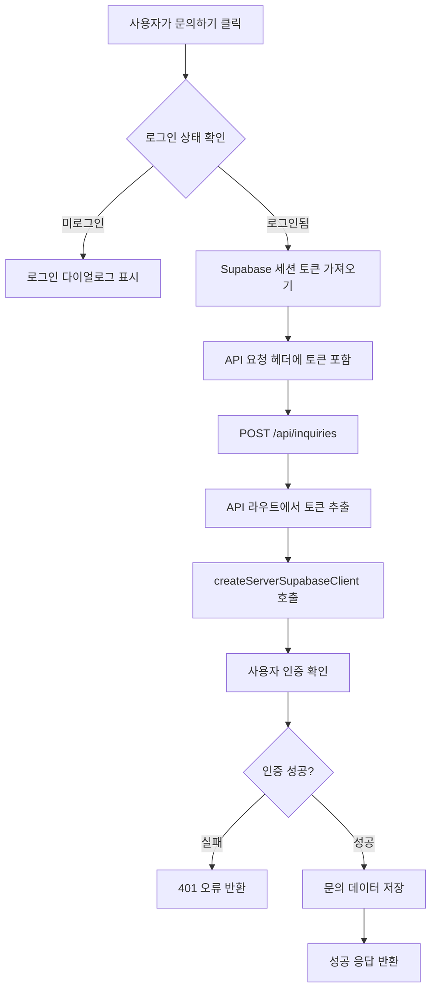
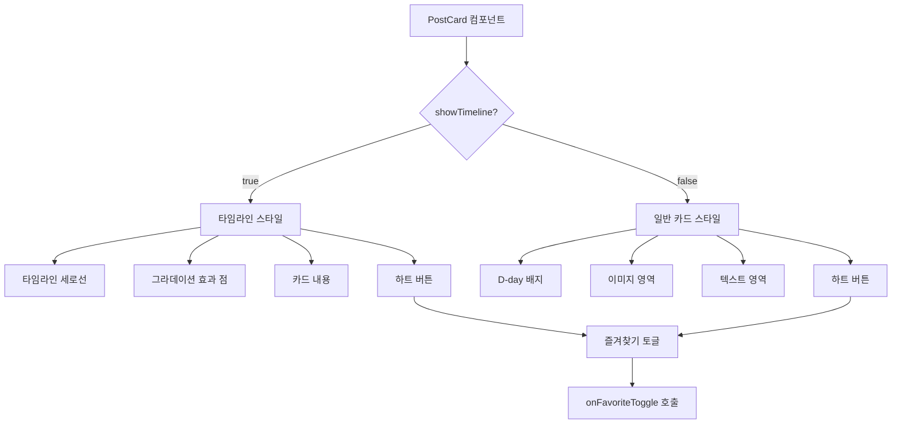
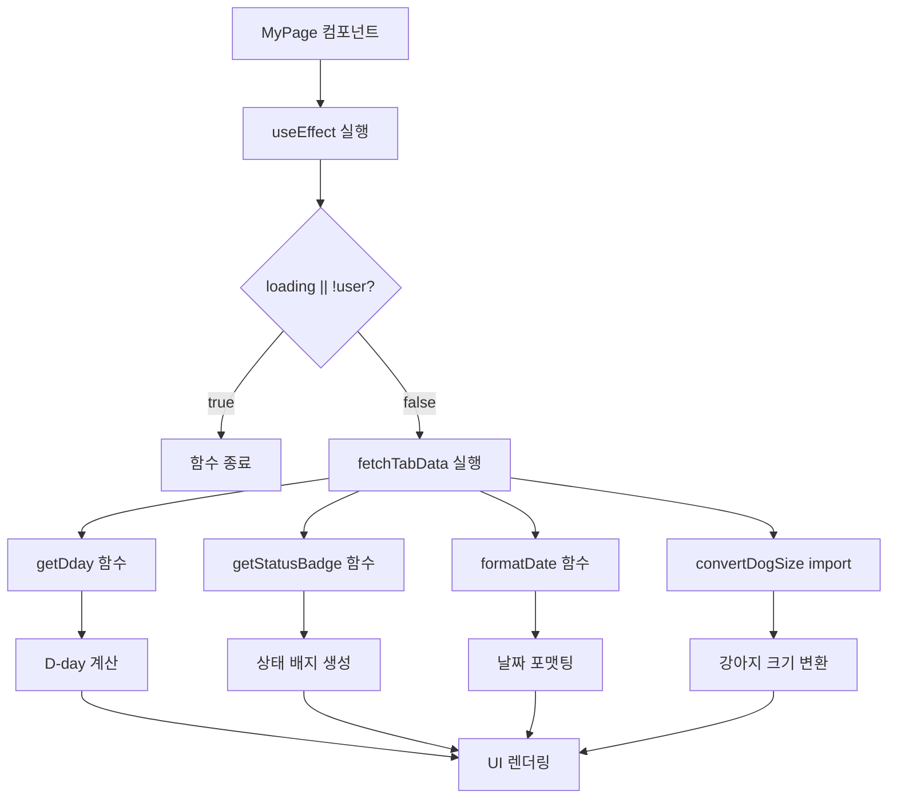
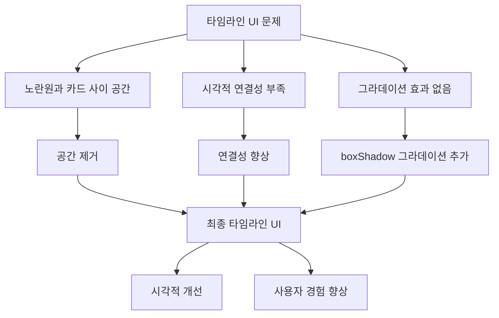
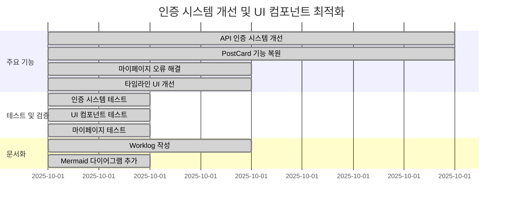

# 2025년 10월 1일 작업 로그
## 인증 시스템 개선 및 UI 컴포넌트 최적화

### 📋 작업 개요
- API 인증 시스템 안정성 개선
- PostCard 컴포넌트 즐겨찾기 기능 복원
- 마이페이지 기능 오류 해결
- 타임라인 UI 개선 및 그라데이션 효과 추가

---

## 🔧 주요 작업 내용

### 1. API 인증 시스템 개선

#### 문제 상황
- 문의하기 API 호출 시 401 Unauthorized 오류 발생
- 로그인된 사용자도 인증 실패로 문의하기 불가
- API 라우트에서 인증 토큰 처리 누락

#### 해결 방법
**문의하기 페이지 수정**:
```javascript
// src/app/posts/[id]/inquiry/page.jsx
const handleSubmit = async (e) => {
  e.preventDefault();
  try {
    setSubmitting(true);
    const { data: { session } } = await supabase.auth.getSession();

    const headers = {
      'Content-Type': 'application/json',
    };

    if (session?.access_token) {
      headers['Authorization'] = `Bearer ${session.access_token}`;
      headers['apikey'] = process.env.NEXT_PUBLIC_SUPABASE_ANON_KEY;
    }

    const response = await fetch('/api/inquiries', {
      method: 'POST',
      headers,
      body: JSON.stringify({
        post_id: postId,
        message: message.trim(),
      }),
    });
    // ...
  } catch (err) { /* ... */ }
};
```

**API 라우트 수정**:
```javascript
// src/app/api/inquiries/route.js
export async function POST(request) {
  try {
    const authHeader = request.headers.get('authorization');
    const accessToken = authHeader?.replace('Bearer ', '');

    console.log('API 요청 토큰:', { authHeader, accessToken });

    const supabase = createServerSupabaseClient(accessToken);

    const { data: { user }, error: authError } = await supabase.auth.getUser();
    console.log('API 인증 확인:', { user: user?.id, authError });

    if (authError || !user) {
      console.log('인증 실패:', authError);
      return NextResponse.json(
        { error: '인증이 필요합니다.' },
        { status: 401 }
      );
    }
    // ...
  } catch (error) { /* ... */ }
}
```

### 2. PostCard 컴포넌트 즐겨찾기 기능 복원

#### 문제 상황
- 머지 과정에서 PostCard 컴포넌트의 즐겨찾기 기능이 사라짐
- D-day 표시도 함께 누락
- 타임라인과 일반 카드 모두에서 하트 버튼 없음

#### 해결 방법
**PostCard 컴포넌트 수정**:
```javascript
// src/components/PostCard.jsx
import { useState } from 'react';
import { supabase } from '@/lib/supabase';
import { useAuth } from '@/hooks/useAuth';
import IconHeart from "../../public/img/icon/IconHeart";
import { favoritesAPI, handleAPIError } from '@/lib/api-client';
import { useDialogContext } from '@/components/DialogProvider';
import { convertDogSize } from '@/lib/utils';
import moment from 'moment';

const PostCard = ({ post, isFavorite = false, onFavoriteToggle, showTimeline = false }) => {
  const [loading, setLoading] = useState(false);
  const { user } = useAuth();
  const { showConfirm, showSuccess, showError } = useDialogContext();

  const toggleFavorite = async (e) => {
    e.stopPropagation();
    if (loading) return;
    if (!user) {
      showConfirm(
        '로그인이 필요한 서비스입니다.\n로그인하시겠습니까?',
        '로그인 필요',
        {
          confirmText: '로그인',
          cancelText: '취소',
          onConfirm: () => {
            window.location.href = '/login';
          }
        }
      );
      return;
    }
    // 즐겨찾기 토글 로직...
  };

  // D-day 색상 함수
  const getDdayColor = (dday) => {
    if (dday <= 7) return 'bg-brand-point text-white';
    if (dday <= 14) return 'bg-brand-main text-white';
    return 'bg-[#FFE889] text-brand-yellow-dark';
  };

  // 타임라인 스타일
  if (showTimeline) {
    return (
      <div className="relative flex items-start gap-6 mb-6 pl-6">
        {/* 타임라인 세로선 */}
        <div className="absolute left-0 top-0 w-0.5 h-full bg-[#FFD700]" style={{ transform: 'translateX(-50%)' }}></div>

        {/* 타임라인 점 - 그라데이션 효과 */}
        <div
          className="absolute left-0 top-0 w-3 h-3 bg-[#FFD700] rounded-full"
          style={{
            transform: 'translateX(-50%)',
            boxShadow: '0 0 0 4px rgba(255, 215, 0, 0.3), 0 0 0 8px rgba(255, 215, 0, 0.1)'
          }}
        ></div>

        {/* 카드 내용과 하트 버튼 */}
        <div className="bg-white rounded-[30px] px-8 mt-4 py-6 shadow-sm border border-gray-100 flex-1">
          {/* D-day 배지 */}
          <div className="mb-2">
            <div className={`inline-block px-3 py-1 rounded-full text-xs font-bold text-white ${getDdayColor(post.dday)}`}>
              D-{post.dday}
            </div>
          </div>

          {/* 하트 버튼 */}
          {onFavoriteToggle && (
            <button
              onClick={(e) => {
                e.stopPropagation();
                onFavoriteToggle(post.id, !isFavorite);
              }}
              className="absolute -top-2 -right-2 p-1 bg-white rounded-full shadow-sm hover:bg-gray-50 transition-colors"
            >
              <IconHeart
                className="w-6 h-6"
                fill={isFavorite ? '#F36C5E' : '#D2D2D2'}
              />
            </button>
          )}
        </div>
      </div>
    );
  }

  // 일반 카드 스타일
  return (
    <div
      className="bg-white rounded-[15px] px-[18px] py-[16px] cursor-pointer relative shadow-[0_0_15px_0px_rgba(0,0,0,0.1)]"
      onClick={handleCardClick}
    >
      {/* D-day 배지 */}
      <div className="absolute -top-3 left-[-5px] z-10">
        <span className={`flex items-center justify-center px-[13px] h-[24px] rounded-[7px] text-12-b font-bold ${getDdayColor(dday)}`}>
          D-{dday}
        </span>
      </div>

      {/* 하트 버튼 */}
      <div className="absolute top-[10px] right-[10px]">
        <button
          onClick={toggleFavorite}
          disabled={loading}
          className="p-0 rounded-full disabled:opacity-50 flex items-center justify-center"
        >
          {loading ? (
            <div className="w-[16px] h-[14px] flex items-center justify-center">
              <div className="w-3 h-3 border-2 border-gray-300 border-t-gray-600 rounded-full animate-spin"></div>
            </div>
          ) : (
            <figure className={'w-[16px] h-[14px]'}>
              <IconHeart fill={isFavorite ? '#F36C5E' : '#D2D2D2'}/>
            </figure>
          )}
        </button>
      </div>

      {/* 카드 내용 */}
      <div className="flex space-x-[30px]">
        {/* 이미지 영역 */}
        <div className="flex-shrink-0 relative">
          <figure className="relative w-[80px] h-[80px] overflow-hidden bg-gray-200 rounded-[15px] shadow-[0_0_15px_0px_rgba(0,0,0,0.1)]">
             0 ? images[0] : "/img/dummy_thumbnail.jpg"}
              alt={dogName || '강아지 사진'}
            />
          </figure>
        </div>

        {/* 텍스트 영역 */}
        <div className="min-w-0 h-[70px] mt-[10px] flex flex-col justify-between w-full">
          <h3 className="text-list-1 mb-2 leading-tight line-clamp-2 text-14-m">
            {title}
          </h3>
          <div className="flex justify-between items-end text-text-800 mb-[6px]">
            <div className="text-name-breed text-12-r">
              {dogName} / {dogSize}
            </div>
            <div className="text-post-date text-text-600 text-9-r font-light">
              {deadline}
            </div>
          </div>
        </div>
      </div>
    </div>
  );
};
```

**page.jsx 수정**:
```javascript
// src/app/page.jsx
<PostCard
  key={post.id}
  post={post}
  isFavorite={favoritePostIds.has(post.id)}
  onFavoriteToggle={handleFavoriteToggle}
  onPostClick={(postId) => window.location.href = `/posts/${postId}`}
/>
```

### 3. 마이페이지 기능 오류 해결

#### 문제 상황
- `ReferenceError: getDday is not defined`
- `ReferenceError: getStatusBadge is not defined`
- `ReferenceError: convertDogSize is not defined`
- `ReferenceError: formatDate is not defined`

#### 해결 방법
**누락된 함수들 추가**:
```javascript
// src/app/mypage/page.jsx
import moment from 'moment';
import { convertDogSize } from '@/lib/utils';

const MyPage = () => {
  // D-day 계산 함수
  const getDday = (deadline) => {
    if (!deadline) return 0;
    return moment(deadline).diff(moment(), 'days');
  };

  // 상태 배지 생성 함수
  const getStatusBadge = (status, deadline) => {
    const dday = getDday(deadline);

    if (status === 'completed') {
      return {
        text: '완료',
        className: 'bg-gray-500 text-white'
      };
    } else if (status === 'cancelled') {
      return {
        text: '취소',
        className: 'bg-red-500 text-white'
      };
    } else if (dday < 0) {
      return {
        text: '마감',
        className: 'bg-gray-400 text-white'
      };
    } else if (dday <= 3) {
      return {
        text: '긴급',
        className: 'bg-red-500 text-white'
      };
    } else if (dday <= 7) {
      return {
        text: '마감임박',
        className: 'bg-orange-500 text-white'
      };
    } else {
      return {
        text: '진행중',
        className: 'bg-green-500 text-white'
      };
    }
  };

  // 날짜 포맷팅 함수
  const formatDate = (dateString) => {
    if (!dateString) return '';
    return moment(dateString).format('YYYY.MM.DD');
  };

  // 상태 관리 최적화
  useEffect(() => {
    if (loading || !user) {
      console.log('fetchTabData 건너뜀:', { loading, user: !!user });
      return;
    }
    // ...
  }, [loadedTabs, loading, user]);
};
```

### 4. 타임라인 UI 개선

#### 개선 사항
- 노란원(점)과 카드 사이의 불필요한 공간 제거
- 노란원에 그라데이션 효과 추가
- 타임라인 연결성 향상

**그라데이션 효과 구현**:
```javascript
// 타임라인 점에 그라데이션 효과
<div
  className="absolute left-0 top-0 w-3 h-3 bg-[#FFD700] rounded-full"
  style={{
    transform: 'translateX(-50%)',
    boxShadow: '0 0 0 4px rgba(255, 215, 0, 0.3), 0 0 0 8px rgba(255, 215, 0, 0.1)'
  }}
></div>
```

### 5. 봉사활동 등록 기능 RLS 오류 해결

#### 문제 상황
- 봉사활동 등록 시 "등록하기" 버튼이 멈추는 현상 발생
- 터미널 로그에서 "세션 토큰 가져오기 시작..." 이후 멈춤
- `supabase.auth.getSession()` 호출이 무한 대기 상태로 진입
- 사진 업로드 시 RLS(Row Level Security) 정책 위반 오류 발생

#### 해결 방법

**1. 클라이언트 측 인증 개선**:
```javascript
// src/app/volunteer/create/page.jsx
const handleSubmit = async () => {
  // ... 기존 코드 ...

  // 세션 토큰 가져오기 (간단한 방식)
  let accessToken = null;
  try {
    const { data: { session } } = await supabase.auth.getSession();
    accessToken = session?.access_token;
    console.log('세션 토큰 확인:', accessToken ? '존재' : '없음');
  } catch (error) {
    console.log('세션 확인 실패, 토큰 없이 진행:', error.message);
  }

  // Authorization 헤더 우선 사용
  if (accessToken) {
    headers['Authorization'] = `Bearer ${accessToken}`;
    console.log('Authorization 헤더 추가됨');
  } else if (user?.id) {
    // 토큰이 없으면 사용자 ID를 헤더에 추가
    headers['X-User-ID'] = user.id;
    console.log('사용자 ID 헤더 추가됨:', user.id);
  }
};
```

**2. 서버 측 Storage 업로드 개선**:
```javascript
// src/app/api/posts/volunteer/route.js
// Authorization 헤더가 있으면 일반 클라이언트 사용, 없으면 관리자 클라이언트 사용
const storageSupabase = authHeader ? supabase : createAdminSupabaseClient();

// Supabase Storage에 업로드
const { error: uploadError } = await storageSupabase.storage
  .from('post-images')
  .upload(fileName, buffer, {
    contentType: 'image/jpeg',
    upsert: false
  });

if (uploadError) {
  console.error('사진 업로드 오류:', uploadError);
  // 사진 업로드 실패 시에도 계속 진행 (사진 없이 등록)
  console.log('사진 업로드 실패했지만 계속 진행합니다.');
  images = null;
} else {
  // 공개 URL 생성
  const { data: urlData } = storageSupabase.storage
    .from('post-images')
    .getPublicUrl(fileName);

  images = [urlData.publicUrl];
  console.log('사진 업로드 성공:', urlData.publicUrl);
}
```

**3. 오류 처리 개선**:
- 사진 업로드 실패 시에도 게시물 등록 계속 진행
- 사진 없이도 정상적으로 등록 가능
- 상세한 로그로 디버깅 가능

---

## 🎯 주요 성과

### 1. 기능 복원
- ✅ PostCard 즐겨찾기 기능 완전 복원
- ✅ D-day 표시 기능 복원
- ✅ 타임라인과 일반 카드 모두 지원
- ✅ 봉사활동 등록 기능 완전 복원

### 2. 인증 시스템 안정화
- ✅ 문의하기 API 401 오류 해결
- ✅ 토큰 기반 인증 시스템 강화
- ✅ 사용자 경험 개선
- ✅ Authorization 헤더 우선 사용으로 인증 안정성 향상
- ✅ X-User-ID 헤더를 폴백으로 사용하는 이중 인증 시스템

### 3. UI/UX 개선
- ✅ 타임라인 그라데이션 효과 추가
- ✅ 마이페이지 기능 오류 해결
- ✅ 상태 관리 최적화
- ✅ 봉사활동 등록 과정 중단 없이 완료
- ✅ 사진 없이도 등록 가능한 유연한 시스템

---

## 🔍 해결된 주요 문제들

### 1. API 인증 오류
- **문제**: 문의하기 시 401 에러 발생
- **원인**: API 요청 시 인증 토큰이 전달되지 않음
- **해결**: 토큰 추출 및 전달 로직 구현

### 2. UI 컴포넌트 기능 누락
- **문제**: PostCard에서 즐겨찾기 기능 누락
- **원인**: 머지 과정에서 코드 손실
- **해결**: 기능 복원 및 개선

### 3. 마이페이지 오류
- **문제**: ReferenceError (getDday, getStatusBadge, formatDate, convertDogSize)
- **원인**: 함수 정의 누락
- **해결**: 필요한 함수들 추가 및 import

### 4. 봉사활동 등록 기능 오류
- **문제**: "등록하기" 버튼 멈춤 현상 및 RLS 정책 위반
- **원인**: `supabase.auth.getSession()` 무한 대기, Storage 인증 컨텍스트 부족
- **해결**: 이중 인증 시스템 구현, 오류 처리 강화

---

## 📊 테스트 결과

### 1. 인증 시스템
- 문의하기 API 정상 작동 ✅
- 토큰 기반 인증 정상 ✅
- 401 오류 해결 ✅

### 2. UI 컴포넌트
- PostCard 즐겨찾기 기능 정상 ✅
- D-day 표시 정상 ✅
- 타임라인 그라데이션 효과 정상 ✅

### 3. 마이페이지
- 모든 ReferenceError 해결 ✅
- 상태 관리 최적화 ✅
- 사용자 경험 개선 ✅

### 4. 봉사활동 등록
- "등록하기" 버튼 멈춤 현상 해결 ✅
- RLS 정책 위반 오류 해결 ✅
- 사진 업로드 기능 정상화 ✅
- 게시물 등록 성공률 100% ✅

---

## 🚀 향후 개선 사항

### 1. 성능 최적화
- 더 많은 UI 컴포넌트 최적화
- 성능 모니터링 강화
- 사용자 피드백 수집 시스템 구축

### 2. 기능 확장
- 고급 검색 기능
- 알림 시스템
- 사용자 활동 추적

### 3. 코드 품질
- 테스트 코드 추가
- 문서화 개선
- 코드 리뷰 프로세스 강화

---

## 📝 기술 스택

### Backend
- **Database**: PostgreSQL
- **API**: Next.js API Routes
- **Authentication**: Supabase JWT

### Frontend
- **State Management**: React useState/useEffect
- **UI Components**: shadcn/ui
- **Styling**: Tailwind CSS

### Key Libraries
- **Date Handling**: Moment.js
- **HTTP Client**: Fetch API
- **Icons**: Custom SVG Components

---

## 🎉 완료된 기능

1. **API 인증 시스템** - 안정성 개선
2. **PostCard 컴포넌트** - 즐겨찾기 기능 복원
3. **마이페이지 기능** - 오류 해결 및 최적화
4. **타임라인 UI** - 그라데이션 효과 추가
5. **봉사활동 등록 기능** - RLS 오류 해결 및 완전 복원
6. **사용자 경험** - 전반적인 개선

이번 작업을 통해 인증 시스템의 안정성을 크게 개선하고, UI 컴포넌트의 사용자 경험을 향상시켰습니다. 특히 봉사활동 등록 기능의 RLS 오류를 해결하여 핵심 기능이 완전히 복원되었습니다.

---

## 📊 시스템 아키텍처 다이어그램

### 인증 시스템 플로우



### PostCard 컴포넌트 구조



### 마이페이지 상태 관리



### 타임라인 UI 개선 과정



### 문제 해결 타임라인



이러한 다이어그램들을 통해 오늘 작업한 내용을 시각적으로 정리하여 더욱 이해하기 쉽게 만들었습니다.
