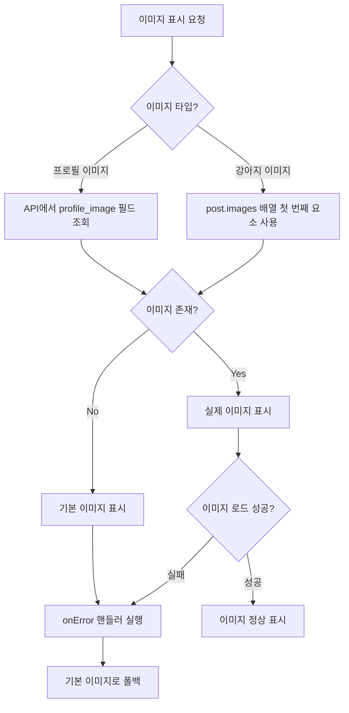
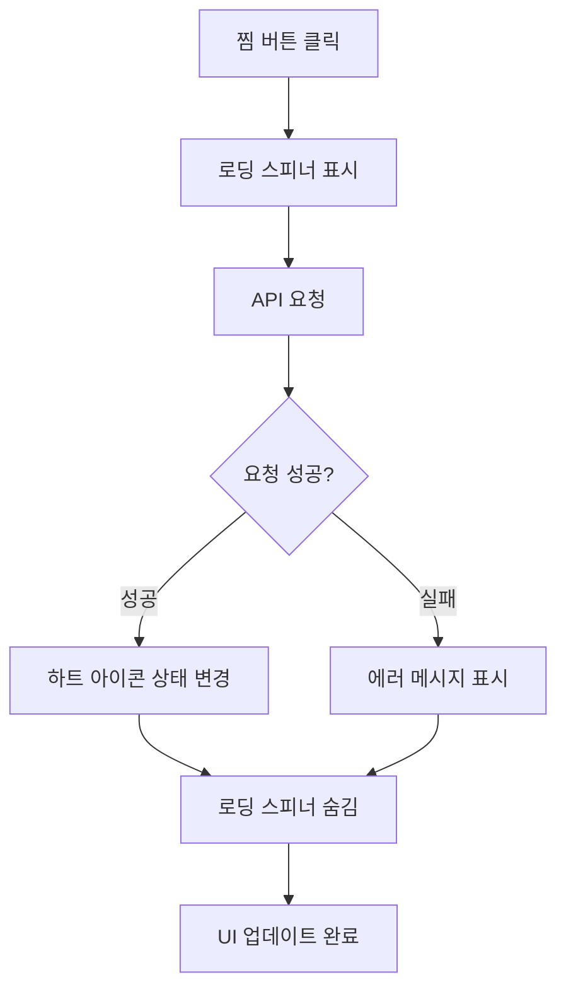
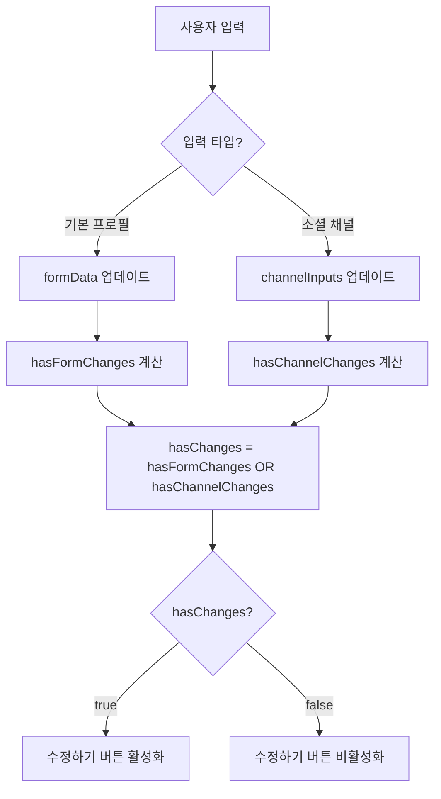

# 2025년 10월 2일 작업 로그
## 이미지 표시 개선 및 UX 최적화

### 📋 작업 개요
- 프로필 이미지 및 게시물 이미지 표시 문제 해결
- 찜 기능 사용자 경험 개선
- 프로필 편집 기능 최적화
- UI 피드백 시스템 개선

---

## 🔧 주요 작업 내용

### 1. 프로필 이미지 표시 문제 해결

#### 문제 상황
- 게시물 상세 페이지에서 프로필 이미지가 기본 이미지로 표시됨
- API에서 `profile_image` 필드를 포함하지 않아 실제 프로필 이미지 데이터 누락
- 지원자 목록에서도 동일한 문제 발생

#### 해결 방법
**API 수정**:
```javascript
// src/app/api/posts/[id]/route.js
user_profiles!posts_user_id_fkey(
  id,
  auth_user_id,
  display_name,
  phone_visible,
  phone,
  profile_image  // 추가
)

// src/app/api/inquiries/route.js
user_profiles!applications_user_id_fkey (
  display_name,
  phone,
  profile_image  // 추가
)
```

**프론트엔드 수정**:
```javascript
// 게시물 작성자 프로필
 {
    e.target.src = '/img/default_profile.jpg';
  }}
/>

// 지원자 목록 프로필
 {
    e.target.src = '/img/default_profile.jpg';
  }}
/>

// 지원자 상세 모달 프로필
 {
    e.target.style.display = 'none';
    e.target.nextSibling.style.display = 'block';
  }}
/>
<User className="h-5 w-5 text-gray-600" style={{display: 'none'}} />
```

### 2. 게시물 강아지 이미지 표시 수정

#### 문제 상황
- 게시물 상세 페이지에서 강아지 이미지가 기본 이미지로 표시됨
- `post.dog_image` 필드 사용 (존재하지 않는 필드)
- 실제 데이터는 `post.images` 배열의 첫 번째 요소

#### 해결 방법
```javascript
// 수정 전


// 수정 후
 {
    e.target.src = '/img/dummy_thumbnail.jpg';
  }}
/>
```

### 3. 찜 기능 Toast 피드백 제거

#### 문제 상황
- 찜 추가/삭제 시 불필요한 toast 메시지가 표시됨
- 사용자 경험을 방해하는 중복 피드백

#### 해결 방법
**메인 페이지 수정**:
```javascript
// src/app/page.jsx - 성공 메시지 제거
// toast.success(isFavorited ? '즐겨찾기에 추가되었습니다.' : '즐겨찾기에서 제거되었습니다.');

// 에러 메시지는 유지
toast.error('로그인이 필요합니다.');
toast.error('찜 상태 변경에 실패했습니다.');
```

**PostCard 컴포넌트 수정**:
```javascript
// src/components/PostCard.jsx - toast 메시지 제거
// toast.error('로그인이 필요합니다.');
// toast.error('처리 중 오류가 발생했습니다.\n다시 시도해주세요.');

// 단순히 return으로 변경
if (!session?.access_token) {
  return;
}
```

### 4. 게시물 상세 페이지 찜 기능에 로딩 스피너 추가

#### 문제 상황
- 메인 페이지와 달리 게시물 상세 페이지 찜 기능에 로딩 스피너 없음
- 일관성 없는 사용자 경험

#### 해결 방법
```javascript
// 로딩 상태 추가
const [favoriteLoading, setFavoriteLoading] = useState(false);

// 함수 수정
const handleFavoriteToggle = async () => {
  try {
    setFavoriteLoading(true);
    // ... 기존 로직 ...
  } finally {
    setFavoriteLoading(false);
  }
};

// UI 수정
<button
  onClick={handleFavoriteToggle}
  disabled={favoriteLoading}
  className="... disabled:opacity-50 disabled:cursor-not-allowed"
>
  <figure className="mt-[2px]">
    {favoriteLoading ? (
      <Loader2 className="size-[30px] animate-spin text-gray-400" />
    ) : (
      <IconHeart className="size-[30px] block" fill={isFavorite ? '#F36C5E' : '#D2D2D2'}/>
    )}
  </figure>
</button>
```

### 5. 프로필 편집 소셜 채널 변경사항 감지 수정

#### 문제 상황
- 소셜 채널(인스타그램, 네이버카페, 카카오톡오픈채팅) 수정 시 수정하기 버튼이 활성화되지 않음
- `hasChanges` 상태가 `formData`만 확인하고 `channelInputs`는 무시

#### 해결 방법
```javascript
// 변경사항 감지 로직 개선
useEffect(() => {
  const hasFormChanges = JSON.stringify(formData) !== JSON.stringify(originalData);

  // 소셜 채널 변경사항 확인
  const originalChannels = {
    instagram: profile?.instagram || '',
    naverCafe: profile?.naver_cafe || '',
    kakaoOpenChat: profile?.kakao_openchat || ''
  };
  const hasChannelChanges = JSON.stringify(channelInputs) !== JSON.stringify(originalChannels);

  setHasChanges(hasFormChanges || hasChannelChanges);
}, [formData, originalData, channelInputs, profile]);
```

### 6. 닉네임 피드백 중복 출력 문제 해결

#### 문제 상황
- 닉네임 변경 시 input 하단에 피드백이 여러개 중복 출력
- `nicknameValidation` 메시지와 `errors.nickname` 메시지가 동시 표시

#### 해결 방법
```javascript
// 통합된 피드백 영역으로 수정
<span className={`text-9-r ${
  errors.nickname
    ? 'text-brand-point'
    : nicknameValidation?.isValid
      ? 'text-[#2BA03E]'
      : 'text-brand-point'
}`}>
  {errors.nickname
    ? errors.nickname
    : nicknameChecking
      ? '확인 중!'
      : nicknameValidation?.message || ''
  }
</span>
```

---

## 🎯 주요 성과

### 1. 이미지 표시 문제 완전 해결
- ✅ **프로필 이미지**: 게시물 작성자, 지원자 목록, 모달에서 실제 프로필 이미지 표시
- ✅ **강아지 이미지**: 게시물의 실제 첨부 이미지 정상 표시
- ✅ **에러 핸들링**: 이미지 로드 실패 시 기본 이미지로 폴백

### 2. 사용자 경험 개선
- ✅ **조용한 찜 기능**: 불필요한 toast 메시지 제거로 깔끔한 UI
- ✅ **일관된 로딩**: 메인 페이지와 상세 페이지 동일한 로딩 스피너
- ✅ **즉시 피드백**: 소셜 채널 수정 시 즉시 수정하기 버튼 활성화

### 3. UI/UX 최적화
- ✅ **중복 제거**: 닉네임 피드백 중복 출력 문제 해결
- ✅ **우선순위 기반**: 에러 메시지가 검증 메시지보다 우선 표시
- ✅ **직관적 인터페이스**: 명확하고 일관된 사용자 피드백

---

## 📊 해결된 주요 문제들

### 1. 이미지 표시 오류
- **문제**: 프로필 이미지와 강아지 이미지가 기본 이미지로 표시
- **원인**: API에서 이미지 필드 누락, 잘못된 필드명 사용
- **해결**: API 수정, 올바른 필드명 사용, 에러 핸들링 추가

### 2. 찜 기능 UX 문제
- **문제**: 불필요한 toast 메시지로 사용자 경험 방해
- **원인**: 성공/실패 모든 경우에 toast 표시
- **해결**: 성공 메시지 제거, 에러 메시지만 유지

### 3. 로딩 상태 불일치
- **문제**: 메인 페이지와 상세 페이지 찜 기능 로딩 상태 불일치
- **원인**: 상세 페이지에 로딩 스피너 미구현
- **해결**: 동일한 로딩 스피너 구현

### 4. 변경사항 감지 누락
- **문제**: 소셜 채널 수정 시 수정하기 버튼 비활성화
- **원인**: `hasChanges` 계산에서 `channelInputs` 누락
- **해결**: 소셜 채널 변경사항도 감지하도록 로직 개선

### 5. 피드백 중복
- **문제**: 닉네임 입력 시 여러 피드백이 동시 표시
- **원인**: `nicknameValidation`과 `errors.nickname` 별도 처리
- **해결**: 통합된 피드백 영역으로 우선순위 기반 표시

---

## 🔧 기술적 개선사항

### 1. API 데이터 구조 개선
- 프로필 이미지 필드 추가로 완전한 사용자 정보 제공
- 지원자 목록에서도 프로필 이미지 포함

### 2. 에러 핸들링 강화
- 이미지 로드 실패 시 안전한 폴백 처리
- 모든 이미지 컴포넌트에 `onError` 핸들러 추가

### 3. 상태 관리 최적화
- 소셜 채널 변경사항을 포함한 완전한 변경 감지
- 로딩 상태를 통한 사용자 피드백 개선

### 4. 사용자 경험 일관성
- 모든 페이지에서 동일한 찜 기능 동작
- 일관된 로딩 스피너와 피드백 시스템

---

## 🎉 최종 결과

- ✅ **완전한 이미지 표시**: 모든 이미지가 정상적으로 표시됨
- ✅ **깔끔한 찜 기능**: 조용하고 직관적인 찜 토글
- ✅ **일관된 UX**: 모든 페이지에서 동일한 사용자 경험
- ✅ **즉시 반응**: 모든 변경사항이 즉시 UI에 반영
- ✅ **안정적인 동작**: 에러 상황에서도 안전한 폴백 처리

이번 작업을 통해 이미지 표시 문제를 완전히 해결하고, 사용자 경험을 크게 개선했습니다. 특히 찜 기능의 조용한 동작과 일관된 로딩 상태로 더욱 세련된 인터페이스를 구현했습니다.

---

## 📊 시스템 아키텍처 다이어그램

### 이미지 표시 개선 플로우



### 찜 기능 UX 개선



### 프로필 편집 변경사항 감지



---

## 🎯 완료된 기능

1. **이미지 표시 시스템** - 완전한 이미지 표시 구현
2. **찜 기능 UX** - 조용하고 직관적인 찜 토글
3. **프로필 편집** - 완전한 변경사항 감지
4. **로딩 상태** - 일관된 사용자 피드백
5. **에러 핸들링** - 안전한 폴백 처리

이번 작업을 통해 사용자 인터페이스의 안정성과 사용성을 크게 향상시켰습니다.
